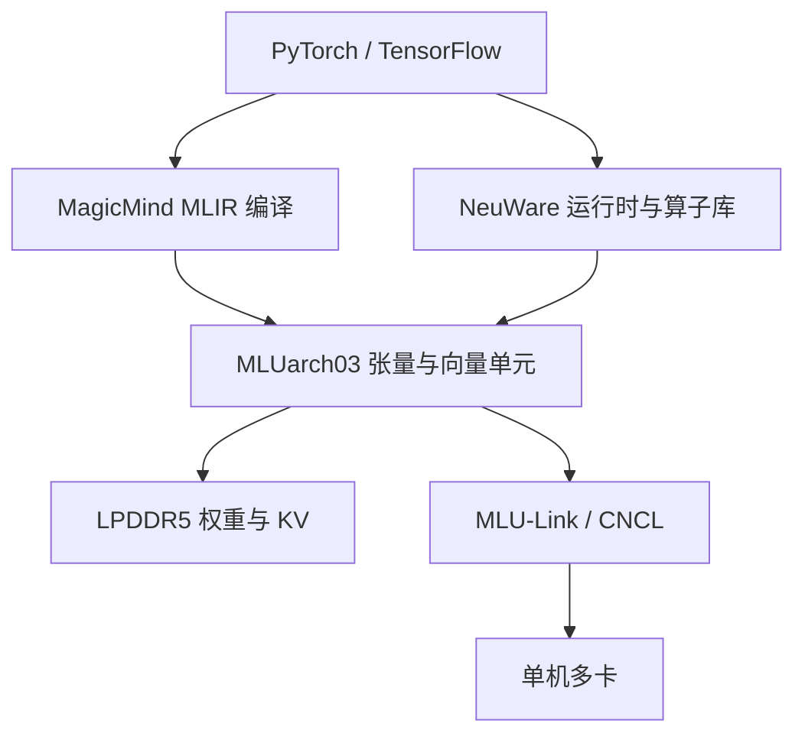

# 寒武纪 MLU

    
芯粒拼出不同功耗与内存的板卡，软件上用同一套 NeuWare 与基于 MLIR 的 MagicMind 把图编译到 MLU；互联不走 PCIe 绕一圈，而走 MLU-Link。

    <footer>—— 寒武纪思元 370 系列与 MLU370-X4 / X8 / S4 产品页；基础软件平台（NeuWare、MagicMind、CNCL）公开说明</footer>

寒武纪云端加速器以 **MLU**（Machine Learning Unit）为架构名，商用芯片以「思元」编号。公开材料最完整的一代是 **思元 370**：7 nm、MLUarch03、公司称首款采用 chiplet 的云端 AI 芯片，约 390 亿晶体管，芯片 INT8 峰值 **256 TOPS**，并配 LPDDR5 与 **MLU-Link**。板卡切成高密度推理（S 系列）与训推一体（X 系列）。本篇只引用厂商产品页上的规格与软件组件，不把第三方对思元 590 的对标表（HBM 容量、FP16 TFLOPS 各说各话）写进正文当事实。昇腾路线见 [昇腾 910](/llm/ascend-910)；二者软件栈不互通。

## 问题

国产加速卡要同时回答三件事：单卡能否覆盖视觉/语音/小规模 Transformer 的吞吐；多卡训练或分布式推理时芯片间有没有比 PCIe 更宽的通路；模型从 PyTorch 过来要经过哪一层编译，而不是假设 CUDA 核能重编译。思元 370 产品页把答案写成：chiplet 灵活拼规格、LPDDR5 提高访存能效、MLU-Link 提供每芯片额外 200 GB/s 级直连、MagicMind 用 MLIR 做推理图编译并与 TensorFlow / PyTorch 融合。

LLM 服务还多一问：LPDDR5 的容量与带宽是否撑得住权重 + KV。X8 公开 **48 GB / 614.4 GB/s**，X4 **24 GB / 307.2 GB/s**，S4/S8 在 24/48 GB、307.2 GB/s、75 W。这与 HBM 类 GPU 不在同一带宽量级。decode 会更早撞内存墙；厂商叙事里的视频编解码路数（1080p 百路级）是媒体推理卖点，不要写进 LLM tokens/s。

### 公开板卡规格（产品表）

共同：MLUarch03、7 nm、精度 FP32 / FP16 / BF16 / INT16 / INT8 / INT4、PCIe Gen4 ×16。

- **MLU370-S4/S8**：半高半长、75 W；192 TOPS INT8，72 TFLOPS FP16/BF16，18 TFLOPS FP32；24 或 48 GB LPDDR5，307.2 GB/s。定位高密度云端推理。
- **MLU370-X4**：单槽 150 W；256 TOPS INT8，96 TFLOPS FP16/BF16，24 TFLOPS FP32；24 GB，307.2 GB/s。
- **MLU370-X8**：双槽 250 W，**双芯**思元 370；产品表峰值列与 X4 同档的 256 TOPS INT8 / 96 TFLOPS FP16，但内存与带宽翻倍（48 GB，614.4 GB/s），MLU-Link 4 口、聚合 **200 GB/s** 双向，文档称约 PCIe 4.0 的 3.1 倍，支持单机八卡。编解码资源按双芯加倍。规划算力时以产品表为准，不要自行把「双芯」乘成 512 TOPS 再当官方峰值。

思元 370 系列页写「首次采用 chiplet 将 2 颗 AI 计算芯粒封装为一颗 AI 芯片」，用不同芯粒组合做出 S/X 规格。Supercharger 与多算子硬件融合是 MLUarch03 的卷积/算子叙述，对 LLM 线性层是否同等受益，要以 MagicMind 实际融合为准，不要把卷积模块广告抄到 Transformer SLA。

## 方法

软件分层：驱动与运行时、算子库、工具链合称基础软件平台（NeuWare 语境）。训练侧与 PyTorch / TensorFlow 对接；推理侧 **MagicMind** 被写成基于 MLIR 图编译、可部署到寒武纪全系产品的引擎。通讯库 **CNCL** 配合 MLU-Link 做多芯集合。用户路径通常是：框架训练或导入 → MagicMind 编译优化 → 运行时在 MLU 上执行。没有对应算子时，不会自动出现 CUDA 式的社区 Triton 核，只能等厂商库或改图。

多芯：MLU-Link 为芯片提供绕过主机的直连。X8 产品页强调八卡并行加速比优于「只靠 PCIe」。张量并行的逐步流量应画在 MLU-Link 上；跨机仍走主机网络，与 GPU 的 NVLink / 以太网分层同一逻辑，带宽数字不同。

### 精度开关与 LLM 现实

产品表列了 INT4 与 INT8 峰值。媒体和检测模型走 INT8 是寒武纪传统主场；LLM 若只有 INT8 表头、没有与 GPTQ/Marlin 同级的公开 4-bit 服务核，decode 仍可能在 FP16/BF16 带宽墙上。BF16/FP16 96 TFLOPS（X4/X8 表）相对当代 GPU 的 Tensor Core 不是同一量级——这是 370 作为 2022 年训推一体卡的定位，不是 2026 年万亿参数训练卡。后续思元 590 等旗舰在新闻与年报中出现，**完整 HBM 规格应以当时寒武纪产品文档为准**，本篇不引用互相矛盾的第三方峰值。

## 机制

Chiplet 让一次流片覆盖多种板卡：计算芯粒数、LPDDR 通道、功耗封顶不同，软件仍看同一 MLUarch。LPDDR5 相对 GDDR 的卖点是能效与在板卡功耗预算内把更多瓦特留给计算；代价是绝对带宽低于 HBM2e。KV 缓存大的 LLM decode 会先暴露这一点：同样 24 GB，614 GB/s 与 2 TB/s 的逐步扫描时间不在一个档。

MagicMind 的 MLIR 路径把图级融合（算子合并、内存规划、精度换入）收成部署物。这与 TensorRT / XLA 同类：形状越静越好。动态 batch、动态序列若未进编译配置，会反复重编译或走低效实现。CNCL + MLU-Link 则决定 AllReduce 是否真的没经过主机；只插满八张 X8 却用主机 NCCL 式走 PCIe，会把产品页上的 200 GB/s 浪费掉。

产品页有「在常见 4 个模型上单卡与某 350 W GPU 相当」的测试注记，环境钉在特定 CPU 与 SDK 版本，模型是视觉/经典网络语境。不要把该句外推为 Llama-70B 对 H100。引用必须带测试脚注。

## 边界与工程取舍

### 软件栈与下一代规格的引用纪律

CUDA 生态（vLLM 主线核、FlashAttention、EXL2）默认不在 MLU 上。迁移成本在算子覆盖与量化工具链，不在把 `.safetensors` 拷过去。视频编解码是 370 的差异化能力，LLM 文本网关用不到。75 W S 卡适合高密度小模型或非自回归负载；70B 级自回归优先看 X8 的 48 GB 是否够切分后的权重+KV，不够就多卡 MLU-Link，再不够就该换 HBM 类加速器。

与昇腾 CANN 相比，都是「图编译 + 厂商集合通信 + 框架插件」。模型仓库、算子清单、调试工具完全两套。集群混布两种卡，调度器要按设备类型拆池，不能靠一份 ONNX 走天下——MagicMind 与 ATC/OM 不是同一编译物。

何时用 MLU370：已在寒武纪软件栈内、视觉/多模态编解码或中小模型推理、需要国内供应链。何时不用：要以公开 CUDA 量化核打满 HBM 带宽的大模型 decode、或需要厂商未公布规格的下一代芯片数字来做容量规划——那应等官方数据表，而不是研报。

出处：寒武纪官网思元 370 系列介绍；MLU370-X8 / X4 / S4-S8 产品规格表（架构、功耗、LPDDR5、峰值精度、MLU-Link）；系列页对 MagicMind（MLIR）、训推一体软件栈、MLU-Link 200 GB/s、chiplet 与 LPDDR5 的说明。CNCL 见 X8 页多卡测试叙述。后续芯片以官方新品页为准。

## 小结

- 思元 370 / MLUarch03 是公开规格最完整的寒武纪云端一代：INT8 峰值按芯片 256 TOPS，板卡用 chiplet 切 S/X 功耗与内存。
- 内存是 LPDDR5 而非 HBM，decode 带宽墙比同容量 GPU 更早出现。
- 软件合同是 NeuWare + MagicMind（MLIR）+ CNCL；多卡走 MLU-Link。
- 产品表含 INT4/INT8/BF16，LLM 服务能否吃满取决于算子与量化工具，不取决于表头存在该列。
- 不引用互相冲突的第三方 590 峰值；与昇腾软件不互通。
- 出处：寒武纪思元 370 与 MLU370 板卡官方产品页。
