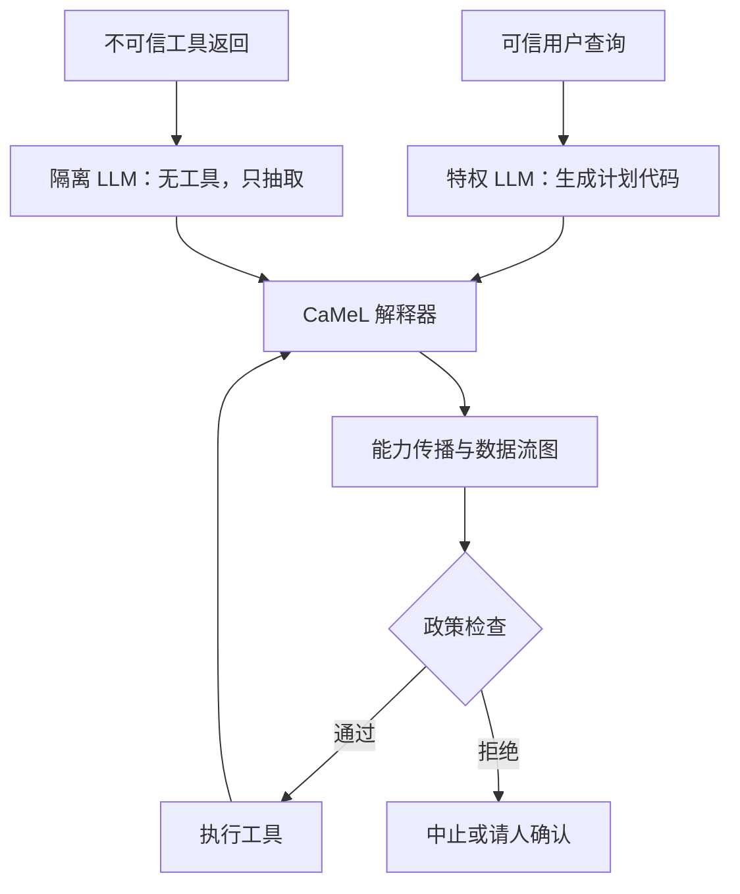

# CaMeL 间接注入防御

    
从可信用户查询抽出控制流与数据流，使检索到的不可信数据无法改写程序走向；再用能力标签在工具调用处执行政策，挡住未授权的数据外流。

    <footer>—— Debenedetti 等，Defeating Prompt Injections by Design，arXiv:2503.18813</footer>

代理一旦通过工具读邮件、云盘或网页，就进入 [间接注入](/llm/indirect-injection) 的威胁模型：对手不控制用户框，却能把指令写进模型稍后会读到的数据。多数缓解靠提示、分隔符或对抗训练，论文指出它们**不提供保证**，新攻击下会失效。Debenedetti、Shumailov、Carlini、Tramèr 等人提出 **CaMeL**（CApabilities for MachinE Learning）：在模型外加一层系统，借鉴控制流完整性、访问控制与信息流控制。特权模型只见可信查询并生成计划代码；隔离模型处理不可信文本且**没有工具**；自定义解释器维护数据流图，给每个值打上来源与可读者一类能力，工具执行前用政策函数检查。在 AgentDojo 上，带可证明安全约束时约 77% 任务仍能完成，无防御系统约 84%。本篇写威胁模型与设计。不提供注入载荷、利用步骤或如何绕过政策。

## 问题

用户说「把上次会议纪要里 Bob 要的文档发给他」。计划看起来安全：找纪要、抽出邮箱与文件名、取文件、发送。若纪要被对手改过，即使用户本人无恶意，处理该文件的模型仍可能把**参数**改成错误收件人或错误文件。Willison 的 Dual LLM 模式已经把规划与不可信文本分开：特权 LLM 不见脏数据，隔离 LLM 无工具。CaMeL 论文的关键补充是：控制流被保护之后，**数据流仍可被篡改**——计划仍是「发送」，发送的对象却被换成对手。这与经典软件里查询结构不变、参数被污染的注入同类。只隔离规划不够。

威胁模型（论文第 3 节）针对来自不可信数据源的注入：对手构造代理工具会读到的状态（共享文档、邮件等），试图让轨迹里出现该提示不允许的工具与参数。用户提示视为可信；用户不会从不可信来源粘贴整段提示；记忆若存在则假定未被对手写入。明确非目标包括：不改变控制流与数据流的纯文本扭曲（例如摘要被写成不实内容但未外泄），以及把系统做成完全无需人介入的全自动体。能力系统把部分安全决策从反复弹窗里收回，以降低疲劳，但不能消灭歧义查询上的确认。

### 安全游戏量的是越权动作，不是「模型是否听话」

论文把问题收成 PI-SEC：给定提示的允许动作集合 $\Omega$，对手提交初始工具状态，若轨迹中出现集合外的（工具，参数，当时内存），对手获胜。防御的目标是：即使底层模型对注入敏感，系统层仍不执行越权调用。因此评测必须看工具轨迹，而不是看助手是否口头拒绝。AgentDojo（Debenedetti 等，2024）提供动态环境与安全评测；CaMeL 声称在该基准的安全评测上「按设计」解决，并付出一定效用。不要把 77% 写成「注入已消失」，它是**在政策约束下仍可完成的任务比例**。

能力一词在本文是安全文献里的 metadata 标签（谁能读、从哪来），不是「模型有多强」。与机器学习里的 capability 评价同名异义。引用时写清。

## 方法

系统组件：隔离 LLM（把非结构化脏数据解析成结构化字段）；特权 LLM（把用户查询写成受限伪 Python 计划）；工具（预定义 API）；安全政策（工具调用时何为允许）；能力（每个值的来源与允许读者）；CaMeL 解释器（执行计划、传播能力、在调用前检查政策）。特权 LLM 只在可信查询上规划，因此脏数据不能改循环结构、不能新增任意工具名——这是控制流完整性在代理里的对应物。隔离 LLM 可见脏文本，但任何「请调用发送」都无法直接变成副作用。

解释器为每个值维护依赖图。从云盘读出的文件带上「来自该存储、由哪些身份共享」一类标签；由隔离 LLM 抽出的字符串继承其输入的污点。发送类工具的政策可以要求：收件人必须已是该文档的允许读者，否则中止并请用户显式批准。即使用户任务本身合法，若 Bob 尚无读权限，也会确认——因为邮箱字段可能不可信。政策是相对工具写的函数，而不是再喂给模型的一段自然语言。论文强调**不改底层 LLM 权重**。

### 政策写在解释器里，才能成为保证的来源

若政策仍只存在于系统提示，模型被注入后可以忽略它。CaMeL 把检查放在解释器：政策返回不允许则**不调用**工具。保证相对于「政策被忠实施行」与「特权 LLM 只在可信输入上规划」这些假设；它不是对任意旁路（例如用户自己把脏文本贴进提示）的证明。实现上需要自定义解释器，而不是把计划丢给标准 CPython——标准解释器不会传播能力标签。开源见 google-research/camel-prompt-injection。工程代价是：计划语言是 Python 子集，模型必须写得出；政策要由开发者针对每个工具编写，空政策等于没有数据流保护。

## 机制

机制分两层，缺一不可。控制流：计划在脏数据进入之前冻结，后续步骤不能被网页或邮件里的祈使句改写成另一套工具序列。数据流：即使步骤名字仍是「发送」，参数上的能力必须满足政策。Dual LLM 只做第一层；第二层对应信息流控制——值携带可读者集合，跨边界流动要检查。用户确认被当成能力系统的补丁：当静态政策无法判断（歧义、权限升级），问人，而不是让隔离 LLM 的输出直接成为外发参数。

与提示工程防御的关系：分隔与 [Spotlighting](/llm/spotlighting-defense) 降低模型把数据当指令的概率，仍是概率性的。CaMeL 不依赖模型「认出」注入。二者可叠加：隔离 LLM 仍可用标记降低抽错字段的概率，但最终闸门在政策。论文也承认：不改变外发动作的撒谎式摘要，不在防御范围内；UI 可以用数据流图标明「这段话来自哪封邮件」，把判断交给用户。

AgentDojo 的 77% / 84% 是论文报告的效用对照，且带「可证明安全」口径。换一套政策、换模型、换任务分布，数字都会动。引用写 arXiv:2503.18813，不要把演示站的交互剧情当成基准表。

### 人在环是功能，不是失败

完全自动且零确认，与细粒度政策冲突：查询含糊时，正确的控制流本身不确定。CaMeL 把确认从「每一步都问」收到「政策无法证明安全时才问」，以降低脱敏。产品若关掉确认以求演示流畅，等于把保证退回 Dual LLM 甚至单模型。评测应报告：任务成功率、越权调用是否为零（在政策语义下）、确认次数。只报成功率会隐藏安全闸门被拆除。

## 边界与工程取舍

### 可信查询假设一破，保证就不成立

若对手已经控制用户框或记忆文件，特权 LLM 会为恶意目标生成计划，CaMeL 不声称能防。工具政策写错（过宽的允许读者、把外发地址当公开）会让数据流检查形同虚设。解释器缺陷（未跟踪的隐式流、通过编码绕过标签——此处只作类别，不给做法）属于实现安全，需要代码审计，不是再加一句提示。效用损失来自：计划代码生成失败、政策过严导致合法任务要确认或中止、隔离 LLM 抽字段抽错。77% 说明仍有相当比例任务在约束下可完成，不是无摩擦。

与 [harness](/llm/agent-harness-design) 的衔接：CaMeL 是工具调用前的政策解释器，沙箱是副作用发生的地点。二者叠层：即使发送被政策允许，邮件网关仍应在隔离网络；即使沙箱挡住宿主机，未授权外发仍要靠能力检查。本篇停留在设计与公开评测合同，不讨论如何构造能骗过抽取器的文档。

出处：Debenedetti 等，*Defeating Prompt Injections by Design*，arXiv:2503.18813；AgentDojo：Debenedetti 等，arXiv:2406.13352。Dual LLM 模式见 Willison 2023 公开文章。对照 Abadi 等 CFI、Denning 信息流控制。无攻击配方。

## 小结

- CaMeL 用特权规划 + 无工具抽取 + 带能力的解释器，按设计限制间接注入的越权工具调用。
- Dual LLM 保护控制流；能力与政策保护数据流。
- AgentDojo 上以效用换可证明的政策遵守；假设用户查询可信。
- 不覆盖纯文本误导，也不替代沙箱与密钥隔离。
- 出处：arXiv:2503.18813；评测环境 AgentDojo。
