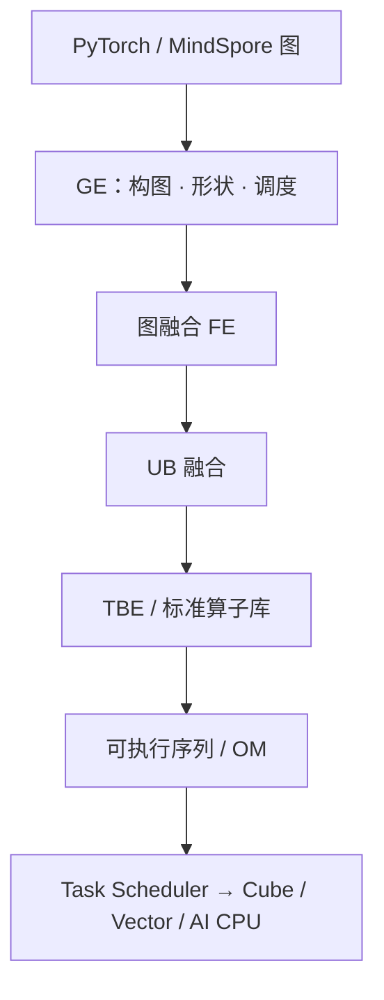

# CANN 图编译

图引擎把框架来的计算图编成可在昇腾上执行的指令：算子融合、内存规划、动态 shape 与调度都在这一层做完。

<footer>—— 对照 CANN Graph Engine 公开文档，以及 CloudMatrix384 论文对 CANN / GE 的描述</footer>

CANN（Compute Architecture for Neural Networks）是昇腾的异构计算架构：上接 PyTorch / TensorFlow / MindSpore，下接达芬奇硬件。图编译是其中把「一层层 Python 算子」收成「能喂 Cube / Vector 的整图」的路径。公开组件包括图引擎（GE）、前端融合（FE）、UB 融合、TBE / Ascend C 算子、Runtime 与 ACL。融合分两档：**图融合**（与硬件无关的数学合并）和 **UB 融合**（对着 Unified Buffer，消灭 UB→DDR/HBM→UB 的往返）。MindIE 推理最终也要落到这张编好的图上，见 [MindIE](/llm/mindie)。本篇写编译契约，不列举每一条可开关的 Pass 名字——那张表在对应 CANN 版本的《图融合和 UB 融合规则参考》里，且默认开启、允许关闭。

## 问题

昇腾不是 GPU：没有「随便写个核就能吃满 SM」的假象。MatMul 必须变成 Cube 几何，SiLU 必须能跟在 FixPipe 或 Vector 后面，KV 布局可能还要在 ND 与 NZ 之间转换。若逐算子下发，每层 RMSNorm 都把激活写回 HBM 再读出来，[达芬奇](/llm/davinci-cube-vector) 的片上 Buffer 等于不存在。图编译要解决的是：在整网视野里改图、选核、规划内存，使执行序列接近「一条异构流水」，而不是「一串碎核 + 主机同步」。

第二问题是动态性。在线推理的 batch、序列长度会变。GE 提供动态 shape、图编译缓存（`ge.graph_compiler_cache_dir` 与 `ge.graph_key`）、算子编译缓存等公开选项。编译太勤，TTFT 会被编译时间打穿；缓存键太粗，会拿错形状的核。这是服务化与编译器接缝，不是纯算法。

### 图融合与 UB 融合不是同一 Pass

图融合由 FE 按规则改图：多个数学上可合并的算子换成一个或几个，**与硬件无关**——例如把能代数化简的子图收起来。UB 融合是硬件相关：算子 1 的结果已在 UB，算子 2 若单独跑，要把结果落到 DDR/HBM 再搬回 UB。合并后结果留在 UB，省一次出、一次入。关掉 UB 融合去「对精度」，往往会把性能一起关掉；只关某一条规则时，用官方 `fusion_switch_file` 或 `ge.optimizationSwitch`，两套同时配则以 `optimizationSwitch` 为准。

`OPTION_EXPORT_COMPILE_STAT` 一类选项可打出 `fusion_result.json`，记录图融合/UB 融合的匹配次数与生效次数。排查「为什么没融合」应先看这份结果，而不是猜硬件坏了。

## 方法

从框架图到装置上的执行，公开流水可以收成：框架导出 → GE 构图与整图优化 → 算子选择（ACLNN / TBE 标准库或自定义）→ 图融合与 UB 融合 → 内存与流水调度 → 生成可加载的离线模型（OM）或在线执行序列 → Runtime 下发 Task Scheduler。训练与推理都走这条家族，细节因 GE 版本而异。开发者能控制的旋钮包括：融合开关、拓扑排序模式（文档写明面向在线推理）、H2D 与计算重叠、多图并行编译、AI Core 数量提示。

自定义算子走 TBE 或 Ascend C：先写计算与调度描述，Tiling 按 Cube/Vector 的形状切块，IR 经过类似 TVM 的中间表示，再 CodeGen。没有对应 Cube 实现的 MatMul 变体会落到慢路径或 AI CPU。LLM 要先保证 Linear、SDPA/MLA、RMSNorm、RoPE 在白名单或已融合，再谈连续批，见 [NPU 友好算子](/llm/npu-friendly-ops)。

### 与 vLLM / MindIE 的接法

两条落盘方式。原生 MindIE LLM：权重与调度在昇腾栈内，图编译发生在模型加载与热路径形状变化时。vLLM + 昇腾后端：Python 侧仍是 vLLM 的调度语义，底层核与图由 CANN 插件提供。不要假设 vLLM 的 CUDA Graph 捕获等于 GE 的整图：前者捕获的是已实例化的 GPU 核序列，后者是在编译期改写昇腾图。动态 shape 在两边都贵，解决办法同样是分档静态化（长度桶）而不是每 token 重编译。

多机时，图编译不替代 HCCL。集合通信算子出现在图里，由通信库执行；GE 可以把通信与计算重叠编进调度，但不能发明一条比 UB/HCCS 更快的边。910C 双 Die 的亲和要在图的设备映射里声明，见 [910C](/llm/ascend-910c-dual-die)。

## 机制

图融合提高算术强度：少启动、少中间张量。UB 融合降低字节：中间结果不进 HBM。两者叠加才接近 Cube 峰值。内存规划把生命周期不重叠的张量放进同一块 Buffer，否则 64 GB/Die 会被碎片吃掉。动态 shape 迫使重新 tiling：Cube 的 16 几何、Vector 的切分、双缓冲深度全部重算，所以缓存键必须包含形状。

离线模型（OM）机制：把已经编译的图固化，推理进程加载后少做前端优化。适合形状稳定的服务；不适合每个请求一种动态控制流。在线 GE 则每次或每类形状走一遍优化，用磁盘缓存摊销。选型是 SLA 问题：TTFT 是否允许第一次编译。

CANN 文档按商用版 / 社区版、大版本号组织。Pass 默认开关会变。把某一版 `fusion_switch_file` 抄到下一版当「调优经验」可能反向关断新规则。以安装树里的《图融合规则参考》为准。

### 精度与融合的冲突

融合可能改变累加顺序或把激活提前到 FixPipe 的低精度路径，logits 会与 GPU 参考微偏。MindIE 把精度测试放进 Tools，正是承认这件事。调试时应按官方方法关指定 Pass 做 A/B，而不是全局关闭融合再抱怨性能。INT8 量化与图编译耦合：校准若在未融合图上做，部署图却融合了，尺度可能对不上。量化感知应在**最终图**上做。

## 边界与工程取舍

CANN 图编译不能补上不存在的算子：缺口只能写 TBE/Ascend C 或改模型，见后续「算子与落差」一类专题。它也不能把动态 MoE 路由变成规则稀疏——内容相关 gather 仍可能碎核。不要用 `torch.compile` 的 GPU 日志推断昇腾 GE 的融合。不要把 GE 缓存目录当跨节点共享的内容寻址存储：键的定义以文档为准，机器间复制要谨慎。

对 LLM 服务，把常见 `maxSeqLen` 与 batch 做成有限枚举，让图编译变成部署步骤而不是每秒步骤。投机解码、连续批改变的是运行时形状，必须落入已编译的桶，否则回退逐算子。

出处：昇腾 CANN GE API（算子/图编译选项、融合开关）；《图融合和 UB 融合规则参考》；CloudMatrix384 论文对 CANN 作为框架与硬件中介、GE 整图优化的概述；Atlas 公开教材中的离线模型与 TBE 流程。不编造未公开的内部 IR 助记符与未文档化 Pass。

## 小结

- CANN 图编译用 GE 把框架图变成达芬奇上的融合执行序列。
- 图融合改数学子图；UB 融合保数据在 Unified Buffer，少进 HBM。
- 动态 shape 要靠长度桶与编译缓存，不能每 token 重编译。
- 融合影响精度，应用版本内的开关与 `fusion_result.json` 做对照，不要全局关闭。
- 自定义缺口走 TBE/Ascend C；集合通信仍走 HCCL。
- 出处：昇腾 CANN 公开开发文档与 GE 说明。
