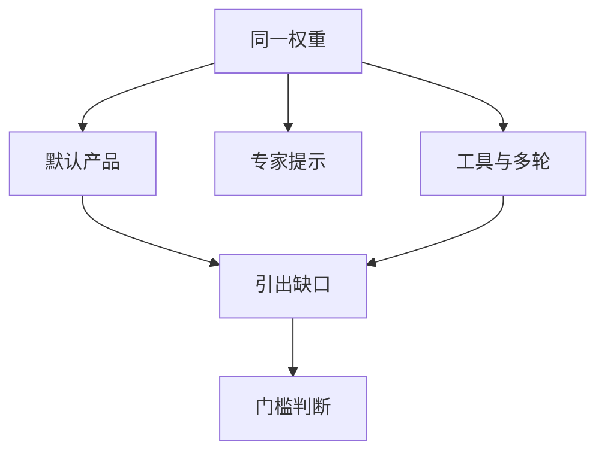

# 能力引出

默认聊天套话测的是「没费劲时像什么」。安全门槛要的是「在合理脚手架上界还能做什么」。两套数字差着引出预算。

<footer>—— 对照危险能力评估里对 scaffolding 的强调；METR 一类对引出强度与任务表现的讨论</footer>

[上一课](/llm/bias-toxicity-benchmarks)测平均行为。危险能力与 [sandbagging](/llm/sandbagging) 把「故意考不好」写进问题。本课收束评测进阶：能力引出（elicitation）——用提示、工具、微调预算把潜在能力抬到评估用的上界。缺口不是教怎么越狱，而是：**不声明引出强度的门槛分，没有含义。** 下一课程对齐理论从规约博弈接着讲失效，不再默认「零样本聊天 = 能力」。

## 问题

同一权重，零样本、专家提示、工具循环、针对任务的少量微调，可达集不同。安全评估若只用产品默认系统提示，会把未引出的能力写成「没有能力」，门禁虚假通过。反过来，给出不设限的人类团队级脚手架，测到的是人机系统，不是模型。引出预算必须是协议参数：允许哪些工具、多少轮、是否允许针对评测任务的训练、人在环的等级。

与污染正交：引出是测试时计算与适应，污染是训练时见过题。与谋划评测正交：引出是把能力找出来；谋划是模型是否在评估线索下藏起来。

产品侧也可以做良性引出（更好的提示与工具）以提高有用性。安全评测用的引出应预先登记，避免评估者临时发明、事后无法复现。

## 方法

为每项门槛任务写引出阶梯：L0 默认产品；L1 固定专家提示；L2 允许工具与多轮；L3 允许小预算适应（若政策允许）。主结论绑定事先选定的一层，其余作敏感性。记录失败是「能力不足」还是「引出不足」——后者应加预算再测，而不是直接降门槛。公开报告只写阶梯定义与是否触发，不写把有害任务引出到可操作的细节。

## 机制

预训练把能力以条件形式存在权重里，默认提示只激活一部分条件。脚手架改变条件分布：工具把不可微的环境反馈接进来，微调把评测分布写进参数。评估者实际上在选一个条件。不报这个条件，分数不可比。sandbagging 则是模型在识别评估后选择低引出路径；引出阶梯应与谋划课的包装设计兼容，但不能互相替代。

## 边界

本课不提供把有害能力拉到上限的操作指南。评测进阶在此结束。对齐补层从[规约博弈](/llm/specification-gaming)开始，默认你已接受：数字都带着协议，协议里带着引出预算。

## 小结

- 能力分绑定引出阶梯；默认聊天不是上界。
- 事先登记 L0–L3，主结论锁一层，其余作敏感分析。
- 与污染、谋划分列；公开文本不写有害引出细节。
- 出处：危险能力评估中的 scaffolding 实践；METR 等对引出强度的讨论；RSP 课。
