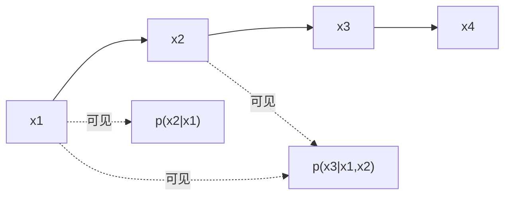

# Causal LM

联合分布沿从左到右的链分解；每一个因子只以已经出现的标记为条件——这既是训练目标，也是解码器里因果掩码必须遵守的契约。

<footer>—— 对照 Vaswani et al., Attention Is All You Need, NeurIPS 2017；Radford et al., GPT</footer>

因果语言模型（Causal LM）把一段文本 $x=(x_1,\ldots,x_n)$ 写成自回归乘积，并用神经网络参数化每一个条件分布。Vaswani 等人在 Transformer 解码器自注意力上加入因果掩码，阻止位置 $t$ 读取 $t$ 右侧的键值；Radford 等人的 GPT 把这一解码器栈当成预训练目标本身：在大规模无标注文本上做下一个 token 预测。当代「解码器只」大模型默认就是 Causal LM。本篇只写这一目标与掩码如何互为表里，双向的 Masked LM、前缀可见的 Prefix LM 留给相邻文。

## 问题

要学习 $p(x)$，必须选一种因式分解。从左到右是最贴合生成的一种：

$$
p(x)=\prod_{t=1}^{n}p(x_t\mid x_{<t}).
$$

训练时若模型在预测 $x_t$ 时已经看见 $x_{t+1}$ 及以后，因子不再是「以过去为条件」，损失可以很低，那是在抄未来。推理时未来不存在，训练—推理不一致。因此问题不是「要不要预测下一个词」，而是**条件集合必须与自回归生成一致**。循环网络靠时间步天然满足；Transformer 靠一次并行打分，必须显式掩码，见 [因果自注意力](/llm/causal-self-attention)。

另一个问题是：每个位置只贡献一个预测，样本效率低于「一次掩盖很多位置」的去噪目标。Causal LM 用规模和长度把效率补回来，并换取生成时无需改图。这是和 BERT 类目标的根本交易，不是实现细节。

### 为何叫因果而不是单向

「单向」只描述注意力方向。「因果」强调介入：位置 $t$ 的表示不能依赖于本应在 $t$ 之后才发生的变量，否则像在因果图里看了后果再预测后果。padding 掩码不是因果：它屏蔽的是填充，双向模型也要。把两种掩码写成同一张加性矩阵时，上三角才是因果部分。

教师强制（teacher forcing）仍然是 Causal LM：训练时右侧的真 token 作为**下一时刻的输入**，不是作为当前时刻的键。当前时刻的注意力仍不得看那些未来输入。搞混「下一层的输入」和「当前层的键」会把泄漏重新放进来。

## 方法

架构上取解码器栈：每层是因果自注意力加前馈，位置编码（正弦、RoPE 等）加在表示上，输出端对词表做 softmax。目标即逐步交叉熵

$$
\mathcal{L}=-\sum_{t=1}^{n}\log p_\theta(x_t\mid x_{<t}).
$$

实现里把整段一次喂入，用下三角掩码使每个位置的隐状态只混合 $j\le t$ 的值向量，再在每个位置上预测**下一个** token（或预测当前位置，取决于把标签错开一位的惯例）。两种惯例等价，只要标签与可见上下文对齐。

GPT 把这一目标当作预训练：不需要编码器、不需要 [MASK] 符号、微调时继续用同一个从左到右的头。Vaswani 原论文的完整 Transformer 还有编码器与交叉注意力，用于条件生成；「解码器只 Causal LM」是把源端也改写成前缀 token，用同一条因果链去读——前缀内部仍然**不能**互相看见未来，这与 Prefix LM 不同。

### 推理与缓存

生成时逐步把已采样 token 追加到序列，每步只算新位置的查询，历史键值写入缓存。这是 Causal LM 的工程形态：目标规定了「只依赖过去」，缓存才合法。若训练时掩码破了，缓存复现不了那种偷看，质量会在自由生成时塌。温度、top-$p$ 作用在已经训好的 $p_\theta(\cdot\mid x_{<t})$ 上，不改变条件集合。

## 机制

因果掩码保证信息流是时间的函数：层数加深也不会从未来倒灌，因为每一层的键值集合都被同一张下三角裁过。残差与前馈是位置各自的，不引入新的跨位置边。因此深度只延长「过去内部」的计算，不延长可见范围。这与 Masked LM 相反：那里每个被预测位置都能看见双侧未遮盖的上下文，信息流是缺省全连接再挖洞。

样本效率：长度为 $n$ 的序列提供 $n$ 个监督位置，每个位置的条件不同。对比随机掩盖 15%，Causal LM 的监督更密，但每个预测可用的上下文更少（右侧永远缺席）。密集监督使它成为生成预训练的默认；双侧缺失使它在需要「读完整句再填一个槽」的判别任务上，往往要靠更大的模型或改成 Prefix/Encoder。

「每个位置预测下一个」看起来浪费了当前位置的嵌入，其实嵌入已经通过残差进入预测头之前的表示。真正不能用的是未来。把损失改成预测当前 token 且仍允许看见当前嵌入，需要把标签错开处理好，否则会变成恒等抄写。

### 与编码器—解码器的关系

条件生成可以仍是 Causal LM：把源文放在左边，目标放在右边，整段一条因果链。源文位置只能看见源文里自己以左，不能看见源文右侧，更不能看见目标——除非改掩码。这就是为何翻译上纯 Causal LM 需要更多数据才能追上编码器双向读源的模型。Prefix LM 和 T5 的编码器正是为了把「源端应全可见」写回掩码。Causal LM 选择的是实现简单、生成自然、可堆到极大解码器，而不是源端最优编码。

## 边界与工程取舍

Causal LM 不擅长需要双侧证据的填槽，除非把槽挪到句末再生成。长程依赖完全靠左侧上下文与位置编码外推；窗口注意力会永久丢掉窗外的键。它与 RLHF、指令微调兼容，因为这些仍是在条件分布上改参数，不改因式分解。换目标为 Masked LM 再想当聊天模型，必须另加解码方式，不能直接逐步采样。

评测生成质量应用自由生成，而不是只报教师强制的 token 损失：泄漏或过强的局部抄袭会让损失很好、采样很差。端侧部署时 Causal LM 与 KV 缓存是一对：没有因果目标就没有这份缓存语义。不要把双向检查点直接当 Causal LM 用。

GPT 系列的公开描述是解码器只、下一个 token、因果掩码。具体层数与数据以各代报告为准。不要把未公开的训练配方写进 Causal LM 的定义里。

## 小结

- Causal LM 用 $p(x_t\mid x_{<t})$ 的乘积建模文本，训练与自回归生成共享同一条件集合。
- Vaswani 解码器的因果掩码提供实现；GPT 把它变成大规模预训练目标。
- 每个位置一个预测，监督密、右侧永远不可见；这是相对 Masked LM 的主交易。
- 源端若也走因果链，则源内不能双向，条件生成可能弱于编码器或 Prefix LM。
- 泄漏会让教师强制指标虚高；合法推理依赖完整的下三角与 KV 缓存。
- 出处：Vaswani et al.，*Attention Is All You Need*，NeurIPS 2017；Radford et al.，GPT（*Improving Language Understanding by Generative Pre-Training* 及后续）。
