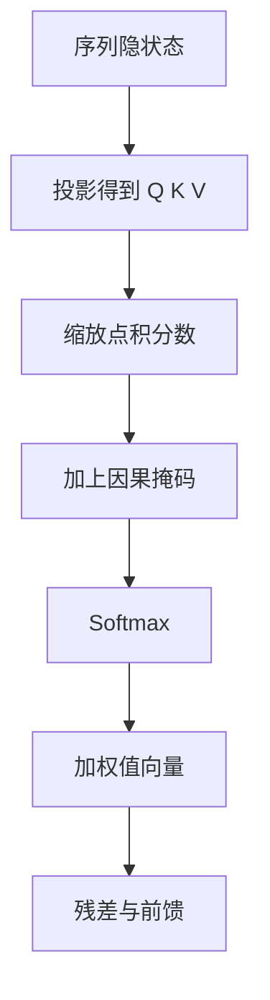

# Self-Attention 与因果掩码

我们还修改了解码器栈中的自注意力子层，阻止当前位置关注后续位置，以保持自回归生成所需的时序约束。

<footer>—— Vaswani et al., Attention Is All You Need, NeurIPS 2017</footer>

自注意力里查询、键、值来自同一条序列，每个位置都可以按内容去读其他位置。若训练目标是从左到右逐 token 预测，这种全连接会泄密：位置 $t$ 在训练时若能读到 $t+1$ 及以后的键值，模型只需抄答案，而推理时那些未来位置并不存在。Vaswani 等人在解码器自注意力上加因果掩码（causal mask），把「能读谁」限制为当前及以左。当代解码器只语言模型把整网都建成这种掩码自注意力，编码器里的双向自注意力则故意不掩。相邻的交叉注意力处理的是另一条序列，掩码规则不同，不应混为一谈。

## 问题

自回归分解写为

$$
p(x_1,\ldots,x_n)=\prod_{t=1}^{n} p(x_t \mid x_{<t}).
$$

条件部分只允许依赖严格过去（实现里通常包含当前位置的表示，但不包含未来 token）。训练若用普通自注意力，分数矩阵 $S\in\mathbb{R}^{n\times n}$ 的上三角会把未来泄漏进当前隐状态，再经后续层扩散到整段。教师强制看起来仍在预测下一个词，损失可以很低，那是因为模型在抄后面的上下文，而不是在学左到右的条件分布。

推理无法复制这种作弊：生成第 $t$ 个词时，右边是空的。训练与推理的不一致会表现为：教师强制指标很好，自由生成立刻崩溃。因果掩码要强制两种制度对齐——训练时每个位置看见的键值集合，必须是推理时逐步展开所能看见的集合。

### 泄漏如何穿过残差流

泄漏不是只发生在第一层。若第一层位置 $t$ 已经混入了 $t+k$ 的值，第二层的查询即使自己做了掩码，键已经污染，信息仍能绕过。因此掩码必须出现在每一个自注意力子层，而不是只加在输入嵌入上。位置编码、词嵌入本身不含「未来词」，危险来自注意力对未来值向量的读取。

padding 掩码和因果掩码常被写成同一张加性掩码。前者屏蔽填充位置，双向、单向都需要；后者屏蔽未来，只用于自回归分支。两者都是在 softmax 之前把非法 logits 打到负无穷附近。搞混它们会在变长 batch 里出现要么看填充、要么意外切断合法前缀的 bug。

## 方法

对自注意力的分数 $S=QK^\top/\sqrt{d_k}$，构造下三角允许矩阵。一种写法是

$$
M_{ij}=\begin{cases}
0 & \text{若 } j \le i,\\
-\infty & \text{若 } j > i.
\end{cases}
$$

然后

$$
A=\mathrm{softmax}(S+M),\qquad Y=AV.
$$

$j>i$ 的位置经过 softmax 后权重为 0，值 $V_j$ 对输出 $Y_i$ 无贡献。对角线保留，当前位置可以读自己的键值；若任务定义要「严格过去、不含当前」，把对角也打成 $-\infty$ 即可，语言模型里几乎不这么做，因为当前表示还要参与混合。

### 训练可并行、解码仍是逐步的

掩码只约束信息流，不强迫按时间步串行训练。给定完整序列，一次前向就能得到所有位置的预测：位置 1 只看见 1，位置 $n$ 看见 $1\ldots n$。这是 Transformer 相对 RNN 的关键优势——仍满足自回归语义，但训练是高度并行的矩阵乘。解码阶段无法预知未来 token，必须逐步追加；KV 缓存正是把已经算过的键值留下，避免对前缀重复投影。缓存不改变掩码语义，只是把「$j\le i$」这一事实变成「只存储到当前步」。

## 机制

因果掩码把完全图改成有向无环的前缀图。位置 $i$ 的感受野是 $\{1,\ldots,i\}$，层数增加不会打开未来，只会让前缀内部的混合更深。与卷积因果（kernel 只覆盖左侧）不同，注意力的左侧是全连接的：距离 $i-1$ 与距离 $1$ 的位置在连通性上平等，远近由分数决定而不是由核半径决定。

数值实现上 $-\infty$ 在半精度里常被换成一个大负数，例如 $-10^4$ 量级，以免 `exp` 下溢成 NaN。必须保证被掩位置的权重在浮点意义下真的是 0；若大负数不够大，长序列上「未来」会以极小权重泄漏，累积多层后可测。FlashAttention 一类核把掩码融合进分块 softmax，语义仍是下三角，只是不物化完整的 $S$。

前缀语言模型、填充后再预测的 UL2 式目标，会使用局部非因果段：一段双向可见，再接到因果解码。那是把掩码矩阵改成块状，而不是取消因果。讨论「Self-Attention 与因果掩码」时，默认对象仍是标准下三角；块状掩码是同一机制的分区变体。

### 双向自注意力作为对照

编码器里的自注意力不掩未来，位置 $i$ 可以读全句，适合理解、分类、作为序列到序列里的源端记忆。那不是「忘了加掩码」，而是任务的条件分布以整句为条件。把 BERT 式双向模型直接拿来做从左到右生成，会遇到与泄密对称的问题：训练看见了右边，推理没有右边。因果与双向是两种合法的自注意力，由分解方式决定，不是一种比另一种更先进。

## 边界与工程取舍

因果自注意力的代价仍是前缀长度的二次方：位置 $n$ 必须对 $n$ 个键打分。KV 缓存把解码步的增量算力降到与当前长度线性，但存储也随长度线性增长。滑动窗口、注意力汇点（attention sink）是在掩码允许集合上再加限制或归纳偏置，属于长上下文的另一些条目；它们改变的是「过去里哪些还留着」，不是「能不能看未来」。

实现细节里，训练常用一条 `triu` 掩码广播到 batch 与头维；推理若走缓存，相当于每步只追加一行查询，键值是增长的前缀，掩码退化为「全部历史都合法」。两种路径必须数值对齐，否则出现训练-推理差。位置编码（RoPE 等）作用在 $Q,K$ 上，与掩码正交：掩码管可见性，位置编码管可见位置之间的相对几何。

「当前位置可以看自己」并不等于「预测时已经看见要预测的那个词」。标准做法是用 $t$ 的隐状态去预测 $t+1$ 的 token，输入侧是到 $t$ 为止的词。若错误地把目标词嵌进当前位置再做含对角的注意力，会构成另一种泄密。数据管线与掩码要一起审计。

## 小结

- 因果掩码把自注意力的可见集合限制为当前及以左，使训练时的条件信息与自回归推理一致。
- 掩码加在 softmax 之前，非法位置权重为 0；每个自注意力层都要加，否则泄漏会经残差扩散。
- 训练仍可对全序列并行计算；解码逐步追加，KV 缓存只实现同一掩码语义，不改变谁能看见谁。
- 编码器双向自注意力是另一种合法设定，服务于以整句为条件的任务，不能直接当生成模型用。
- padding 掩码与因果掩码应叠在同一张 logits 掩码上，但含义不同。
- 半精度需用足够负的掩码常数或融合核，避免未来位置以极小权重泄漏。
- 出处：Vaswani et al., *Attention Is All You Need*, NeurIPS 2017。
