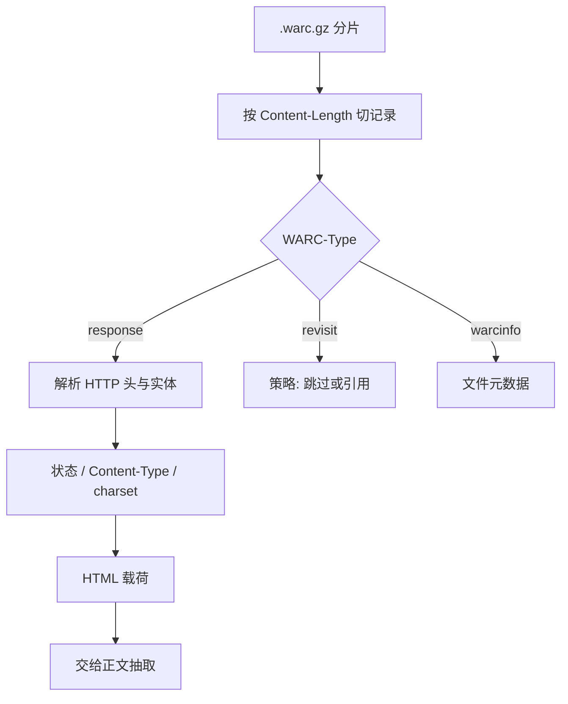

# Common Crawl WARC 解析

WARC 把一次抓取收成带类型的记录流：响应正文、元数据与重访声明分槽存放；解析错记录边界，后面所有抽取都在读垃圾。

<footer>—— ISO 28500 WARC；Common Crawl 数据格式说明</footer>

预训练网页的第一批字节通常不是 HTML 文件，而是 Common Crawl 定期发布的 WARC 容器。WARC（Web ARChive）是 ISO 28500 规定的记录序列：每条记录有头部块、内容块，用空行与 `Content-Length` 界定。Crawl 还提供 WAT（元数据）与 WET（已抽取纯文本）衍生集。解析 WARC 的任务是：在 PB 级 gzip 分片上正确切开记录，选出 `response`（及需要的 `conversion`），把 HTTP 载荷交给后续 HTML 抽取。本篇只写容器与记录，不写 [trafilatura 正文抽取](/llm/html-extract) 的 DOM 启发式；那是下一站。

## 问题

WARC 文件是流，不是随机访问的 HTML 目录。一条记录的头部是 UTF-8 字段：`WARC-Type`、`WARC-Target-URI`、`WARC-Date`、`WARC-Record-ID`、`Content-Type`、`Content-Length`。`Content-Length` 计的是头部结束后的字节数，必须精确消费，否则后续记录全部错位——这是解析器最严重的失败模式。HTTP 响应记录的内容块里，先是 HTTP 头，再空行，才是实体（HTML、PDF、压缩包）。只按 WARC 长度切开还不够，还要再解析 HTTP，处理分块传输残留、截断与非 200 状态。

Crawl 为省空间大量使用 `revisit`：内容与某次先前抓取相同，本条可能没有完整载荷。把它当空页丢弃会少数据，当完整 HTML 读会空指针。压缩是另一层：分片通常是 `.warc.gz`，记录级 gzip 与文件级 gzip 混用时，要用能处理 concatenated gzip 的读取器。错误的解码会在语言识别阶段表现为乱码页，被启发式误杀或污染。

### 记录类型与该读谁

`warcinfo` 描述本文件元数据，不是网页。`request` 是发出的 HTTP 请求。`response` 是抓取到的响应，预训练主输入。`metadata` 与 WAT 中的衍生 JSON 描述链接、表单等。`conversion` 是某些流程里对原文的转换结果。`continuation` 把超长记录切开，解析器必须按 `WARC-Segment-Number` 拼回，否则正文缺块。Common Crawl 的月度 dump 以 `response` 为主力；若直接用 WET，则跳过 HTML 解析，也跳过「自己决定抽取器」的权利——WET 的文本已经是 Crawl 的抽取器产物，质量上限被锁住。

CDX 索引让你可以按 URL 前缀抽样，而不顺序扫完全部 WARC。做配方实验时应先用 CDX 抽子集验证解析与抽取，再提交全量作业。全量扫描的成本在对象存储 GET 与解压，不在 Python 正则。

## 方法

解析器（warcio、fastwarc 等）按规范读头部，用 `Content-Length` 切内容，提供迭代器。生产上应用 C++ 级或至少流式解析器，避免把整个 gzip 放进内存。对 `response`：检查 HTTP 状态；只对合适的 `Content-Type`（HTML、XHTML，有时纯文本）继续；按 charset 从 HTTP 头或 HTML meta 解码，失败则记 `undecodable` 而不是用 latin-1 硬解。截断记录（Crawl 有最大长度）应打标：后续抽取会看到残缺 DOM，质量规则应更严或直接丢弃。`revisit` 若带 `WARC-Refers-To`，可选择跳过或解析其 payload 策略字段，不要假设有 HTML。

与 [分布式清洗](/llm/distributed-clean) 衔接：每个 WARC gzip 作为 splittable 输入不总成立——gzip 不可任意切。作业以文件为 split：一个 worker 消费一个或多个 `.warc.gz`。输出每条成功响应一行：URL、时间、状态、原始 HTML 或立刻抽取的文本、记录 ID。记录 ID 应用作精确去重与 resume 的稳定键，比 URL 更唯一（同一 URL 多次抓取）。保留 `WARC-Date` 以便按时间切配方或做增量。

### WAT / WET 与 WARC 的取舍

WET 是已经去掉 HTML 的纯文本，作业便宜，但抽取器不可控，导航噪声可能仍在。WAT 含链接图与元数据，适合做 PageRank 一类信号，不含正文。完整 WARC 最贵、最灵活。研究配方常：WET 做第一版配比，确认 LID 与过滤后再切回 WARC + 自选抽取器。无论哪条路，都要记录 dump 月度 ID（例如 `CC-MAIN-YYYY-WW`），不同月份的抓取策略与重复率不同，不能混称「Common Crawl」。

## 机制

边界机制全靠长度：头部用 CRLF 行，空行结束头部，随后恰好 `Content-Length` 字节。实现若用「读到下一个 `WARC/`」当边界，遇上载荷里出现该字符串会错切。HTTP 层同样靠头里的长度或（错误地）连接关闭；Crawl 的记录已把整段 HTTP 放进 WARC 内容，应用 HTTP 解析器而不是再按套接字语义猜。编码机制：字节到 Unicode 必须有来源（声明或探测），探测失败应丢弃或进隔离，避免把二进制当文本送进 LID。

`revisit` 的机制是内容寻址：相同载荷不重复存。语料管道若要「该 URL 在该月是否存在」，revisit 仍算一次出现；若要正文，必须回指或跳过。把 revisit 计数进「文档数」会虚高。截断机制：超大页只存前 $N$ 字节，抽取器看到的 DOM 不完整，脚本与注释比例会畸变，启发式可能误判。

同一 URL 在连续多次 dump 中反复出现，是增量去重必须对准的键。只用记录 ID 会把每月快照都当新文档。应用规范化 URL + 内容哈希：URL 同、内容同则丢；URL 同、内容变则当新版。WARC 解析阶段就应写出这两个键。

### 与 robots、截断、多媒体

Crawl 遵守当时的 robots 与地方政策，不等于你二次分发时无约束；使用条款与过滤要单独看。非 HTML（PDF、图片、视频）会作为 `response` 出现，`Content-Type` 过滤应在解析器完成，不要把 PDF 字节送进 HTML 解析器。多媒体进预训练是另一条配方。压缩炸弹与超深嵌套 gzip 应设上限。解析器必须对坏记录可跳过并计数：一个坏记录毁掉整个分片，在 PB 作业里不可接受。

## 边界与工程取舍

自己写 WARC 解析器几乎总是错的，应调用成熟库并钉版本。库对 WARC 1.0 / 1.1 的字段差异、对畸形 `Content-Length` 的处理不同，要用官方样例与一小份 CC 分片做回归。对象存储上顺序读大 gzip 比随机读友好，作业调度应按文件大小均匀。加密与登录墙之后的页本来就没有正文，解析成功不等于有可训练文本。

不要把 WARC 解析与质量过滤写在同一函数里以致无法单独测边界。先保证记录切对、HTTP 解对、编码对，再交给抽取。指标：记录数、response 比例、HTTP 200 比例、可解码比例、revisit 比例、截断比例。缺这些数，后面的「清洗掉 30%」无法解释是解析失败还是真过滤。

WET 看起来省事，会把 Common Crawl 抽取器的偏见锁进你的模型。导航剥离不足、编码错误、语言混杂，都会变成「数据天性」。若论文比较抽取器，必须从 WARC 出发；若只想复现某公开语料，应直接用他们发布的文本，而不是重新解析一遍还声称同一配方。

## 小结

- Common Crawl 的主容器是 WARC 记录流；切分必须遵守 `Content-Length`，不能靠魔数扫描。
- 预训练通常取 `response` 的 HTML 实体；`revisit` 与截断要单独策略，不能当完整页。
- HTTP 状态、Content-Type、charset 是解析的一部分，不是抽取器的事后补丁。
- gzip 分片以文件为 split；记录 ID、规范化 URL、内容哈希应在解析时写出。
- WET / WAT 是衍生集：便宜但抽取器与正文不可控。
- 坏记录跳过并计数；解析指标与清洗指标分开记账。
- 出处：ISO 28500 WARC；Common Crawl 格式文档与月度 dump 说明；warcio / fastwarc 实现。
