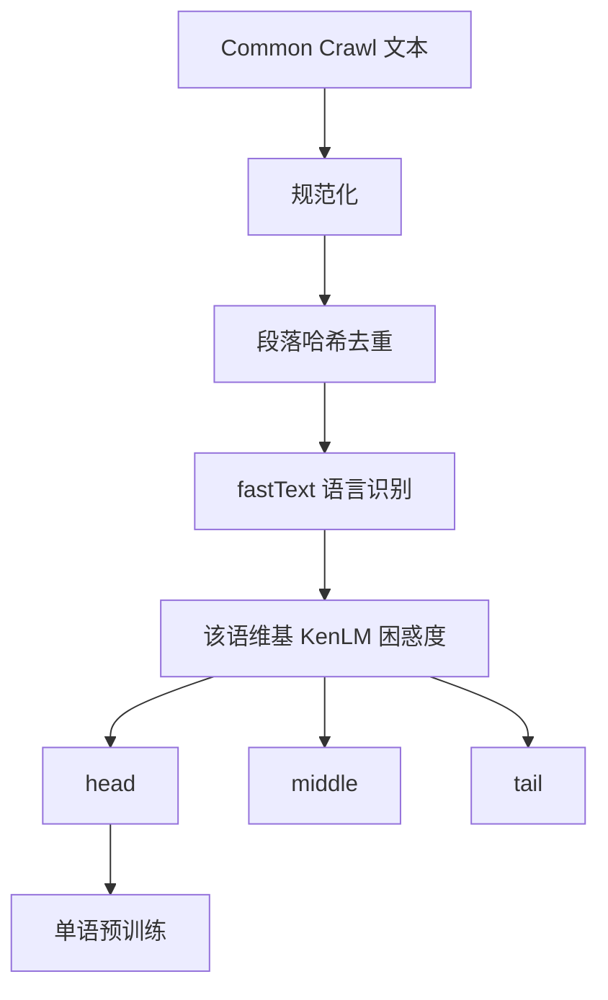

# CCNet 管道

    
从网页抓取里切出单语数据：先按语言分开，再按相对维基百科的困惑度分成头、中、尾，头档才接近「能当语料」的文本。

    <footer>—— Wenzek et al., CCNet: Extracting High Quality Monolingual Datasets from Web Crawl Data, LREC 2020</footer>

Wenzek 等人的 CCNet 把 Common Crawl 收成可训练的单语集合，并给了后来几乎所有公开网页配方一份可复制的骨架：规范化与去重、fastText 语言识别、用目标语维基训练的 KenLM 打困惑度，再按分位数切成 head / middle / tail。XLM-R 一类多语言模型吃的不是「全部 Crawl」，而是 CCNet 头档里像维基的那一层。Soldaini 的 Dolma、Penedo 的 FineWeb、Li 等人的 DCLM，都在这条骨架上替换抽取器、去重粒度或分类器，但「先单语化、再用参照语料打分」没有被推翻。

## 问题

原始抓取不能直接当单语预训练数据。一页里中英夹杂、模板是英语、主文是印地语；镜像与转载让同一段落在快照间复制；大量页在字符集上合法，却不是该语言的连贯写作。需要一条不靠人工标注、却能在百种语言上跑通的管道。监督从哪来？CCNet 的回答是：语言识别用公开的 lid 模型；质量用该语言维基百科训练的 $n$-gram 语言模型的困惑度当代理——越像维基，越可能是干净的书面语。

这个代理有偏见，却可规模化。维基偏百科文体，论坛、对话、代码注释会被打到尾部；低资源语言的维基很小，KenLM 估计噪声大。Wenzek 等人没有假装这是无偏质量，而是把输出分层：头档给需要干净单语的表示学习，中尾档留给对照实验。问题因而从「如何得到完美网页」变成「如何得到可分层、可复现的单语快照」。

### 单语化先于质量

若先按英文质量分类器打分再切语言，非英语页会被系统性压分，语种配比在过滤之后崩溃。CCNet 把 lid 放在去重之后、KenLM 之前：每条文档先进入一个语言桶，再在桶内用该语言的维基 LM 打分。这样，印地语的头档是「像印地语维基」，而不是「像英语维基的印地语翻译腔」。lid 错误会制造假单语。英语模板加上短主文，fastText 可能判成英语，该页的非英语主文被送进错误的 KenLM，困惑度失真。CCNet 的质量分层以 lid 为条件，lid 精度就是分层精度的上限。

段落级去重是另一处关键。CCNet 对规范化后的段落做哈希，跨快照去掉重复跨度，而不是只做文档级 md5。网页转载常改标题、留正文，文档哈希会漏；段落哈希能砍掉模板句，也误伤名言与许可证。Wenzek 等人接受这种偏严，因为他们的目标是单语表示学习的干净信号，而不是最大化 token 数。

## 方法

管线可以写成四段。第一，从 Crawl 的 WET 或自行抽取的文本出发，做 Unicode 规范化、空白折叠。第二，段落哈希去重，减少快照间与站点间的复制。第三，fastText 语言识别，得到语言标签与置信度，丢掉低置信与混合页。第四，对每种目标语言，用该语维基训练 KenLM，对文档算平均困惑度，按分位数切 head / middle / tail。头档进入 XLM-R 一类训练；论文同时放出各层，便于后来者做消融。

KenLM 是字符或词 $n$-gram 的平滑 LM，推理便宜，适合全库打分。参照必须是该语言的维基（或同等清洁的书面语），否则困惑度没有跨语言可比性——不能用英语 KenLM 去给所有语言打分。文档得分通常是段落困惑度的均值或长度加权；极短文档方差大，应先用长度门挡掉。

### 头中尾不是三个数据集那么简单

分位数切分依赖当年快照的得分分布。同一阈值在 2018 与 2024 的 Crawl 上对应不同的绝对困惑度：生成式垃圾变多后，分布右移，头档也可能被「通顺但空洞」挤占。CCNet 的公开数据是特定快照上的分层，复现时必须重算分位数，而不是沿用论文里的绝对分数。头档占比是配方参数：切得太窄，多样性不够；切得太宽，模板腔回来。XLM-R 用头档证明了「像维基的网页」足以训多语言表示；它没有证明尾档无用——尾档里仍有方言与口语，只是不该冒充高质量书面语。

困惑度低不等于信息密度高。反复出现的天气预报、股市简讯、标准合同，对维基 KenLM 可能很「像」，但对学习世界知识近乎零。CCNet 解决的是「像不像该语言的干净文本」，不是「值不值得占 token 预算」。后者要留给分类器或领域配比。

## 机制

设文档 $d$ 在语言 $\ell$ 的维基 LM 下困惑度为 $\mathrm{PPL}_\ell(d)$。CCNet 用 $\mathrm{PPL}_\ell$ 的经验分位数定义质量层，训练分布是 $p_{\mathrm{crawl}}(d\mid \ell)$ 在低困惑度区域上的条件。这与后来 Llama 的维基分类器、FineWeb-Edu 的教育价值头，是同一类「参照条件化」：参照定义质量。维基参照让头档向陈述句、实体密集、少营销腔靠拢；对话与代码被推到中尾。对交叉熵预训练，这意味着模型在头档上更快学会书面句法，但口语与程序句法要靠别的桶补。

段落去重改变频率而不是支撑：一条只出现一次的模板句仍可能留下，一万次复制被压成一次。结合语言分桶，去重必须在语言内部做——跨语言共享的数字表、URL、代码片段不应让所有语种互相连坐。Wenzek 等人的实践是单语管道，跨语言语义重复要另开一刀，不能指望 CCNet 顺便完成。

### 与后续配方的继承关系

Dolma 的网页部分显式走 CCNet 风格的清洗与过滤，再混入代码、论文、论坛等桶。FineWeb 把抽取换成 Trafilatura，启发式换成 Gopher / RefinedWeb 规则，去重换成更重的 MinHash，但「从 Crawl 得到单语网页」的叙事仍是 CCNet 的。DCLM 则把 KenLM 换成基于对照数据的 fastText 质量分类器，因为维基困惑度对「教育价值 / 指令风格」不敏感。理解 CCNet，是为了看清后来每一刀替换的是哪一段，而不是把所有网页数据集当成互不相干的名字。

## 边界与工程取舍

KenLM 头档救不了烂抽取。输入若是导航残留，低困惑度只说明模板像该语言的功能词堆砌。CCNet 原始描述较多使用 Crawl 的纯文本导出；今日复现应把 Trafilatura 一类抽取接在 lid 之前，否则分层衡量的是 WET 的噪声结构。低资源语言的维基过小，KenLM 会过拟合条目体例，把该语言的新闻与文学打到尾部。此时应换参照（新闻、书籍）或放弃困惑度、改用启发式加人工抽检。

多脚本与代码混合页是 lid 的盲区。CCNet 为表示学习服务，默认丢掉低置信混合页是合理的；对代码预训练则应把代码块送进代码桶，而不是让 fastText 在「英语 vs 未知」之间摇摆。生成文本兴起之后，维基 KenLM 对「通顺空文」的区分力下降，这正是 DCLM 与 FineWeb-Edu 改用分类器的原因——不是 CCNet 错了，而是负例分布变了。

复现 CCNet 时，KenLM 的 $n$、词表、是否按文档长度归一，都会移动分位数。报告「用了 CCNet」必须落到：哪些 Crawl 快照、lid 模型版本、维基快照日期、head 的分位切点。否则 XLM-R 的数据与你的数据只是同名。

## 小结

- CCNet 把 Crawl 收成单语分层数据：去重、lid、维基 KenLM 困惑度、头中尾切分。
- 质量代理是「像该语言的维基」，可规模化，但偏向百科书面语。
- 先分语言再打分，避免英语质量定义吞掉其他语种。
- 分位数切点依赖快照年代；生成垃圾变多后头档也会被空洞通顺文挤占。
- Dolma / FineWeb / DCLM 替换的是抽取、去重与打分器，骨架仍是 CCNet。
- 低资源维基、混合页、烂抽取是这条管道的已知边界。
- 出处：Wenzek et al.，*CCNet*，LREC 2020；下游对照 Conneau et al. XLM-R；配方后继见 Soldaini Dolma、Penedo FineWeb、Li et al. DCLM。
