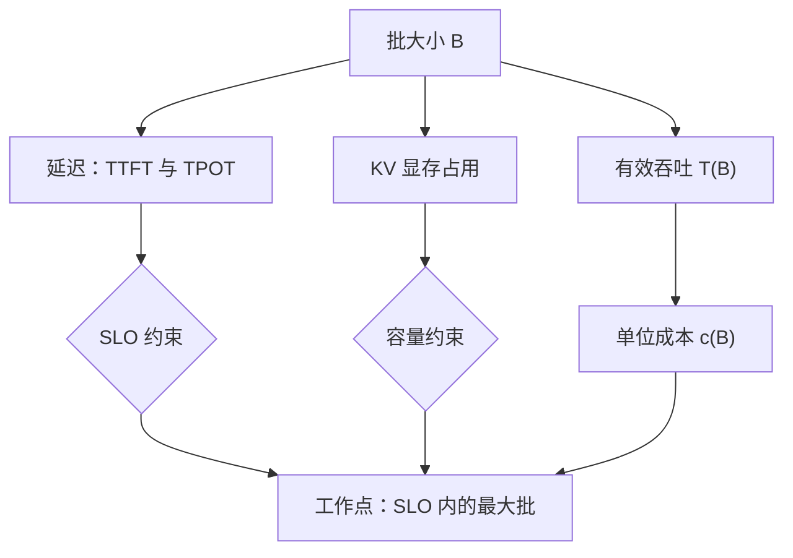

# 批大小的经济学

批不改变模型，只改变你为空闲带宽付多少钱；它是推理经济学里最大的单一旋钮，也是最先撞上延迟墙的一个。

<footer>—— 据 Pope et al., 2022 与本仓库连续批处理课的吞吐口径整理</footer>

[上一课](/llm/ce-per-million-benchmarks)把单价钉成画像加权的自测基准，其中并发口径一钉留了悬念：为什么同一个模型，批从 1 到饱和，单价能差一个数量级。本课写批的边际账——批怎么把钱省出来、在哪停下，以及没打满怎么记账。

## 问题

自建集群的时租是固定的，产出的 token 却随批变：批越大，同样的租时产出越多，单价越低。但批不是免费午餐——批越大，每请求的排队与生成延迟越高，KV 显存占用线性上涨，SLO 顶住后批就不能再加。缺口是一个边际账：批的工作点在哪、离 SLO 上限还有多少、没打满的租时算谁的。不记账的两种错：一是按批 1 的延迟印象运营，集群常年半空转，单价虚高一倍还以为「模型贵」；二是照抄别人家的最大批，自己的 SLO 一压就雪崩。

### 单价函数

时段成本固定为 $F$，批 $B$ 下的有效吞吐为 $T(B)$，则单位 token 成本

$$c(B) = \frac{F}{T(B)},\qquad T(B) \approx \min(\alpha B,\ T_{\max})$$

decode 段每步要把全部权重与 KV 从显存搬一遍，算术强度随批近似线性上升，直到带宽打满；[连续批处理课](/llm/sch-continuous-batching-deep)的 token 间并行给了 $T(B)$ 的形状，MoE 的批行为另有专家路由的修正，见 [MoE 推理批处理](/llm/moe-inference-batching)。打满率 $u$ 把它与采购口径接上：单价 $= $ 时租价 $\div\ (u \cdot T_{\max})$——上一课利用率口径的那笔账，在这里兑现成批的工作点。

## 方法

找工作点的流程：先钉 SLO（TPOT 与 TTFT 的分档沿用服务调度的指标口径），再从低批起步、按固定步长加压，同时记录吞吐、TPOT、TTFT、KV 水位四条线，停在第一条越线之前。离线与在线分池：能容忍小时级延迟的流量走批量接口或夜间池，把在线池的批空间让出来；两池的账分开记，混在一池里,离线流量会把在线的尾延迟顶穿。

## 机制

批为什么先赚后亏：decode 每步搬运的权重量与批无关，步时延几乎不变，而每步产出的 token 数随批成倍——带宽账被摊薄，这是「赚」的全部来源；过了容量点，KV 装不下就得抢占与重算（[抢占与请求迁移](/llm/sch-preemption-migration)的机制），重算的 token 白付一遍，单价不降反升。延迟是硬边界：SLO 给了批的上限，工作点是「SLO 内的最大批」而不是「吞吐峰值批」——后者往往就在违约线上。没打满的账要显式记为空转成本：时租照付、token 没产出，这份损失属于容量规划（弹性伸缩能不能救），不属于模型选型——把空转归罪于模型，是采购会上最常见的张冠李戴。

同卡同模型，批 1 的 decode 吞吐约是带宽饱和批的十分之一到几分之一（取决于权重搬运与 KV 占用之比）；批量接口之所以能给五折上下的折扣，正是因为它把批打满、把延迟换成时延容忍。

## 边界

$c(B)$ 的形状随硬件代际漂移：新一代卡算力涨得比带宽快，带宽饱和来得更早，批的边际收益区间变窄——上代硬件的批经验不能平移。批的收益在 MoE 上要打折扣：专家路由让有效批按专家数摊薄。最后，批经济学不覆盖 prefill 主导的流量：输入重的画像（上一课的检索型）里，批的杠杆让位给前缀共享——那是下一课的账。

## 小结

- 单价函数 $c(B)=F/T(B)$：decode 带宽饱和前，批把权重搬运摊薄，这是批省钱的全部分析。
- 工作点钉在「SLO 内的最大批」，不是吞吐峰值批；容量点后抢占与重算让单价回升。
- 没打满要记为空转成本，归容量规划管，不归模型选型管。
- 离线与在线分池，批量折扣是把延迟换成单价的产品形态。
- 出处：Pope et al., 2022；吞吐形状与工作点口径见本仓库连续批处理课，MoE 修正见 MoE 推理批处理课。
