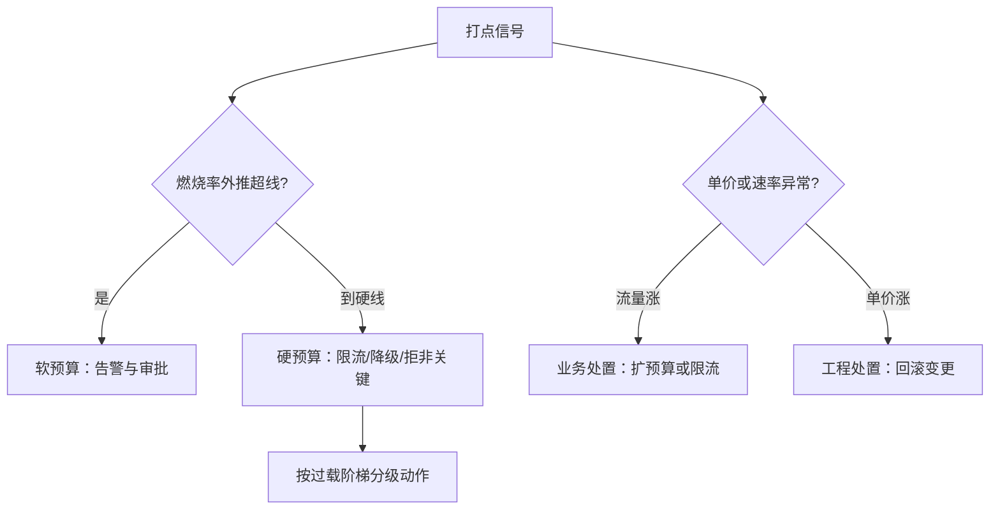

# 预算与告警

预算是数量控制，计量计费是价格控制；两者管的是同一种失控，执行语义却完全不同，混用会同时得到两者的缺点。

<footer>—— 据 Weitzman, Prices vs. Quantities, 1974 的工具对照与本仓库过载治理课整理</footer>

[上一课](/llm/ce-cost-observability)把每请求成本变成分钟级的打点信号，并留了一句「动作在下一课」。信号要接上执行器才有约束力：预算给成本画上限，告警在逼近时敲钟。本课写预算的分层、执行的语义，以及超支时最容易被搞错的那次诊断。

## 问题

没有预算，成本随流量线性放大，事故性超支随时发生：客户端 bug 的重试风暴、Agent 的循环调用、一次营销流量峰，都能让日成本翻几倍。有了预算但执行粗暴，是另一场事故：到线硬切断，SLO 承诺内的业务跟着断。缺口是分层预算与分档执行——谁的超支、超到哪一档、触发什么动作，全部事先写死。缺这层设计的结局可预测：一次超支事故后管理层一刀切限额，业务侧绕过计量，账从此对不上。

### 分层与分档

预算分三层：租户、功能、全局——下层超支先在层内处置，全局线只被下层失效击穿。执行分两档：软预算触告警与审批（继续跑，人介入），硬预算触自动动作（限流、降级到小模型、拒绝非关键流量），动作的梯度沿用[过载与降级课](/llm/sch-overload-degradation)的阶梯与[优先级与公平课](/llm/sch-priority-fairness)的租户公平语义——预算执行就是资源执行的账面版。告警规则两条：燃烧率外推，当前消耗速率乘剩余时间对撞预算余额，让「月底才响」变成「超支前半天就响」；异常检测分型，单租户速率突增与单功能单价突增是两种病，见下一节。

## 方法

上预算的次序：先给存量画像定基线——上一课的双口径聚合跑稳两周，预算才有可信的分母；再分层设线——租户线按业务价值谈，功能线按单位成本乘目标用量算，全局线按毛利约束倒推；然后钉执行语义——每档动作、豁免清单、审批通道写成文档，硬线动作演练过才上线；最后留缓冲——计量有延迟，硬线的触发点要提前于真实上限，把超支窗口吃掉。Weitzman 的对照落成组织设计：价格工具（内部计量计费，用量方自担边际成本）配数量工具（硬限额封总量）；只用数量工具的组织，超支压力全堆在平台方。

## 机制

超支的第一反应必须先分型：流量涨还是单价涨。流量涨是业务问题——用量大了，处置是扩预算、限流或向用量方收费；单价涨是工程回归——提示改动让输出翻倍、路由变更把流量推进大模型、缓存命中率崩了，处置是回滚变更。把单价回归当流量问题处理（「加预算吧」）是最贵的误诊：回归在流血，预算在垫付。误诊的根源是只看总账不分型，而分型正是上一课把速率与单价分开聚合的理由——观测课的设计在预算课兑现。硬预算有竞态：计量与扣减之间有窗口，分布式计数有延迟，硬线附近请求可能超量通过，触发点必须提前、缓冲必须显式。

组织的提醒：预算会博弈——团队把用量记到别处、把实验折进生产流量。归属规则要可审计，预算执行报表要公开；治理工具的漏洞不补，最后人人都在学规则而不是省成本。

## 边界

硬切断对 SLO 内流量构成违约，合同化的服务（收束前会写成条款）必须区分「超额部分拒」与「承诺部分必保」。预算线太紧会诱发降质（偷偷换小模型保预算），质量门禁要与预算联动。告警疲劳与延迟告警同构：线多误报多，真超支没人看——燃烧率外推只对大口径开，小口径走离线报表。最后，预算约束的是成本不是价值：单位经济（下下课）里赚钱的流量不该被一刀切，预算课管守门，值不值是单位账的事。

## 小结

- 预算三层（租户/功能/全局）、执行两档（软告警审批、硬自动动作），动作梯度沿用过载阶梯。
- 告警两规则：燃烧率外推提前触达；异常分型——流量涨是业务问题，单价涨是工程回归。
- 超支第一反应是分型再处置，把单价回归当流量问题是误诊。
- 硬预算有计量竞态，触发点提前、缓冲显式；价格工具与数量工具配着用。
- 出处：Weitzman, 1974 的价格与数量对照；降级阶梯与租户公平语义见本仓库过载与降级课、优先级与公平课。
