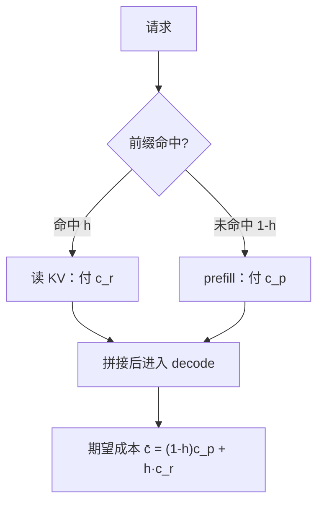
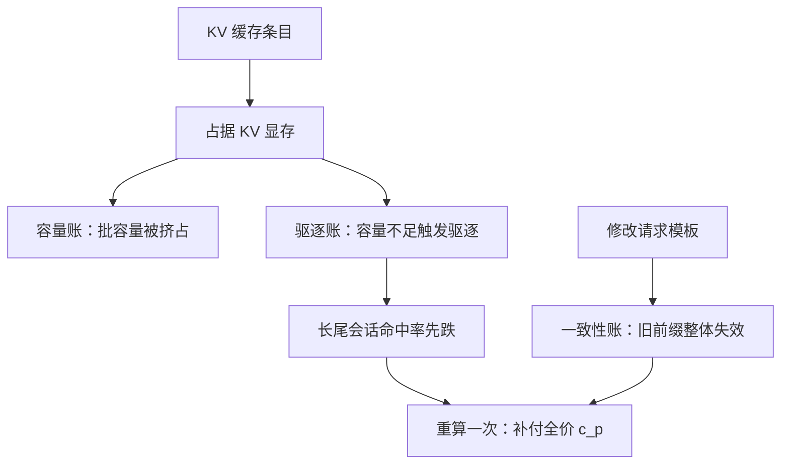

# 缓存命中经济学

缓存把一次昂贵的计算换成一次便宜的读取；省多少不取决于缓存本身，取决于你的前缀里有多少是重复的。

<footer>—— 据开放 API 提示缓存计费口径与本仓库前缀缓存课、KV 成本模型课整理</footer>

[上一课](/llm/ce-batch-economics)把批写成单价函数，工作点钉在 SLO 允许的最大批，并指出输入重流量里批的杠杆让位——让给本课。进入课程的优化杠杆单元，第一个杠杆直接改请求形状：前缀缓存把重复的 prefill 变成一次读取。本课写它的期望成本账。

## 问题

「有缓存所以省」是一句没有数字的话。缓存的收益由命中率决定，命中率由前缀结构决定：系统提示是否所有请求共享、知识段是否按库稳定、用户动态内容是否被错误地放在了前面。结构错了，缓存条目存了一堆永不复用的 KV，占着显存还把批容量挤小——缓存从杠杆变成税。缺口是把缓存写成期望成本函数，让「前缀怎么排」从工程直觉变成可以算的题。

### 命中账

未命中每 token 付 prefill 单价 $c_p$，命中付读取价 $c_r$（公开计费口径约为 prefill 的四分之一或更低，物理上对应「不再算、只搬运」）。设命中 token 比例为 $h$，则每 token 期望成本

$$\bar{c} = (1-h)\,c_p + h\,c_r = c_p - h\,(c_p - c_r)$$

收益 $h\,(c_p - c_r)$ 对 $h$ 线性，斜率是价差：命中率从零到六成的收益，是价差乘以零点六。这条线性关系是设计的前半；后半是 $h$ 从哪来。[前缀缓存课](/llm/kv-prefix-cache)讲过共享的结构（跨请求的公共前缀、会话续接、树形组织），[上下文缓存分层课](/llm/lc-context-cache-tiers)把库级、会话级、请求级的层与账分开；本课只取结论：$h$ 由「公共前缀占请求的比例」上界封顶，工程的全部工作是逼近这个上界。

数字实例：设 $c_p = 3$ 美元/百万 token、$c_r = 0.75$ 美元/百万 token（约为四分之一），价差 2.25。命中率 $h = 0.6$ 时，每百万输入 token 省下 $0.6 \times 2.25 = 1.35$ 美元，期望成本从 3 美元降到 1.65 美元——省多少完全由 $h$ 和价差这两个数决定。

## 方法

把前缀当缓存键来设计：稳定段（系统提示、工具定义、领域知识库的固定段）放最前，易变段（检索结果、用户输入、时间戳）放最后；会话多轮把历史整体续接而不是每轮重排。三步落地：先量——按前缀指纹统计现有流量的可共享比例，得到 $h$ 的理论上界；再排——把请求模板按「公共段长度」重写，逼近上界；后守——容量与驱逐策略保住已命中的条目，驱逐率的账单独立记，因为驱逐打掉的是已经付过设计成本的收益。

直觉类比：把前缀想成图书馆排架——人人都查的那本大字典放在最外面，谁来都翻同一份；若把每个读者各异的借书单插进字典中间，后面的人翻到的页码就全对不上。「公共段在前、易变段在后」做的正是让这份共享字典尽可能长。

## 机制

缓存的三笔隐藏账决定了它不是纯赚。容量账：缓存条目占 KV 显存，挤占批空间——上一课的单价函数里 $T_{\max}$ 会因此下移，容量紧张时缓存要与批抢显存，这是真实的权衡而非实现瑕疵。驱逐账：容量不足触发驱逐，命中率先跌的是长尾会话，重算一次付全价 prefill。一致性账：模板一改，旧前缀全部失效，改模板要按「缓存代际」排期——这也是设计成本。为什么「系统提示放最前」永远是对的：命中结构由前缀的公共子串决定，公共段越靠前、越长，跨请求共享越彻底；把时间戳插在系统提示中间，等于亲手把公共串切断。

常见误区：初学者容易以为缓存条目越多越赚。实际上每条缓存都是一块占着显存的 KV——存一堆永不复用的条目，等于用批容量替它们交房租；而驱逐掉一个正被共享的长前缀，下次命中失败还要补付全价 prefill。

计费口径的提醒：公开 API 的缓存折扣价是定价策略，物理省下的是 prefill 算力与时延；自建集群的收益表用 $h\,(c_p - c_r)$ 按自己的实测单价算，不要拿零售折扣当物理常数。

## 边界

缓存只省 prefill，一个字节的 decode 都不省——输出重的流量里缓存杠杆同样让位，让给模型谱系上的操作（下两课）。命中率是流量结构的函数：单租户模板统一的流量命中高，多租户杂讯大的流量命中天然低，跨业务比较命中率没有意义。最后，缓存改变的是请求形状而不是模型能力，质量的门禁照走：模板重排是行为变更，必须重跑评测再放量。

## 小结

- 期望成本 $\bar{c}=(1-h)c_p+h\,c_r$：收益对命中率线性，斜率是 prefill 与读取的价差。
- 命中率由前缀的公共子串上界封顶；稳定段前置、易变段后置、会话整体续接是逼近上界的标准动作。
- 缓存有容量、驱逐、一致性三笔隐藏账，模板变更要按缓存代际排期。
- 缓存只作用于 prefill；输出重流量与 decode 的账在别的杠杆里。
- 出处：计费折扣按开放 API 公开口径整理；共享结构与分层记账见本仓库前缀缓存课、上下文缓存分层课、KV 成本模型课。
