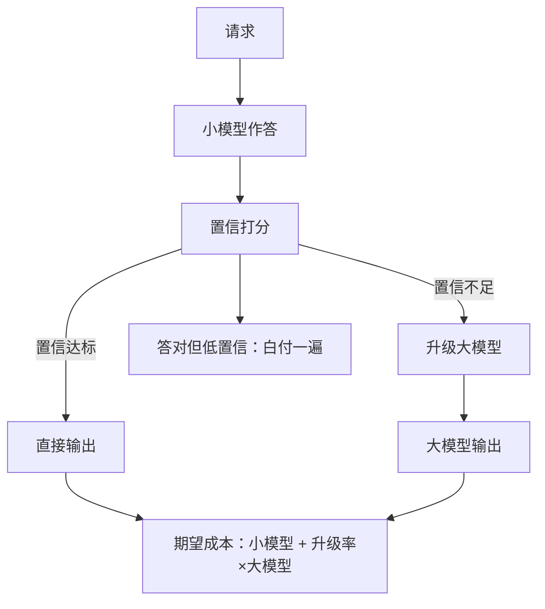
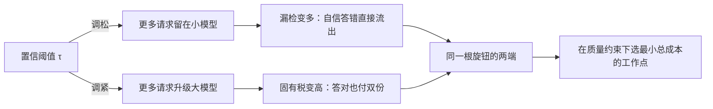

# 模型级联的成本

级联是顺序的路由：先便宜后贵；代价是每一次升级，都把小模型和大模型两段成本各付一遍。

<footer>—— 据 FrugalGPT（Chen, Zaharia, Zou, 2023）的级联（cascade）口径整理</footer>

[上一课](/llm/ce-routing-cost)把路由写成期望成本，路由器在请求进门前一次定档，定错了没有回头路。级联补上回头路：小模型先答，置信不足再升级大模型。本课写级联的账——它的收益结构、它比路由多出来的两笔成本，以及升级率这个新杠杆。

## 问题

级联的直觉很顺：「大部分流量被小模型消化，只有少数难请求花钱升级」。真实账里有三处与直觉不符。其一，升级流量付双份：小模型跑完了 prefill 与 decode，大模型从头再来，升级率越高，浪费的占比越大。其二，打分不是免费的：自一致性要多次采样、验证器要额外前向，这些成本常被漏记。其三，最贵的失败根本不升级——小模型答错且自信的请求直接流出去，成为质量事故。缺口是把升级率与漏检率同时放进期望成本与质量约束里，而不是只盯着「省了百分之几」。

术语翻译：「升级率 $\alpha$」就是被送上大模型的请求占比。$\alpha = 0.2$ 意味着每 100 个请求里有 20 个先完整跑了一遍小模型的 prefill 和 decode，再从头跑一遍大模型的——这 20 份计算付了两遍钱，是级联账里最容易被漏记的浪费。

### 级联的账

设升级率为 $\alpha$（进入大模型的请求占比），小模型每请求成本 $c_s$（含打分），大模型每请求成本 $c_l$，则

$$E[c] = c_s + \alpha\, c_l$$

每个请求都先付 $c_s$，被升级的再付 $c_l$。质量约束写成 $q(\alpha, \tau) \ge q_0$，其中 $\tau$ 是置信阈值：$\tau$ 松则 $\alpha$ 小、省钱多、质量跌；$\tau$ 紧则趋向全走大模型。级联的优化目标就是带约束的最小化：$\min E[c]\ \text{s.t.}\ q \ge q_0$，两个自由度——调 $\tau$ 在同一条曲线上滑动，换小模型（或换打分器）把整条曲线移动。

## 方法

搭级联的四步：选可打分的任务——级联要求「答得好不好」可验证或可打分（代码可执行、抽取可比对、分类有置信），主观长文的置信基本不可靠；选打分器——自一致性、logprob 阈值、外部验证器各有成本，按任务挑最便宜的够用者；标定 $\tau$——在评测集上画 $(\alpha, q)$ 曲线，工作点钉在质量悬崖之前（与成本-质量曲线课的读图口径一致）；记账——把升级流量的双份成本、打分器成本、串行延迟一起算进每请求账。延迟特别提一句：升级流量走两段推理，尾延迟被拉长，SLO 分层里这类流量要单列。

直觉类比：级联像医院的分诊制度——全科医生（小模型）先看，拿不准的转专科（大模型）。分诊医生过于自信会把重病放走（漏检变成事故），过于谨慎则人人转专科，挂号费白花还得再排一次队（固有税与双份延迟）。旋钮拧在哪一格，是个算账问题。

## 机制

升级率为什么是杠杆而不是结果：路由课的错路不对称在级联里换了个形态——漏检（难请求自信地答错）不花大模型的钱，直接变成线上事故，所以 $\tau$ 的调参方向同样是压漏检；但 $\tau$ 压得越紧，「答对却被升级」的比例越高，这部分是级联的固有税：答案本来正确，双份成本照付。固有税与漏检是同一根旋钮的两端，级联的工程不是消除其一，是在质量约束下选最小总成本的点。层级超过两段的收益递减也要看清：每多一层，漏检概率是各层漏检的叠加，而固有税逐层累加——三层级联只在价差极端悬殊且打分便宜时才值得。

量级的提醒：小模型单价为大模型的十分之一、升级率两成时，期望成本 $= 0.1c_l + 0.2c_l = 0.3c_l$，省七成；价差若只有三成，同升级率下是 $0.9c_l$，再扣打分器与双份延迟，级联常常只赚个寂寞——先算账再上线。

## 边界

级联的适用面比路由窄：任务必须可打分，否则阈值 $\tau$ 无从标定。升级流量的延迟是结构性的，实时强约束场景要把「最坏路径」当设计路径。级联不消除错误：它把「大模型全答」的质量下限换成「漏检率 × 事故成本」的新下限，这道换算必须显式写进质量合同（收束前会回到它）。最后，级联与缓存互相牵扯：升级后的大模型调用通常前缀不同，命中率低于直连大模型的稳态，两本账合算。

常见误区：初学者容易以为「有小模型兜底、大模型把关」就不会出错。实际上最危险的错误恰恰不升级——小模型自信地答错时，请求根本到不了大模型。级联只是换了质量风险的形态：漏检率要单独监控、单独写进质量合同，而不是默认被把关掉了。

## 小结

- 期望成本 $E[c]=c_s+\alpha c_l$：升级流量付双份，升级率是级联独有的杠杆。
- $\tau$ 的两端是漏检与固有税；调参方向压漏检，工作点钉在质量悬崖之前。
- 任务必须可打分，级联才成立；层级超过两段收益递减。
- 延迟按最坏路径设计，升级流量的双份 prefill 与缓存损失要入账。
- 出处：级联口径见 FrugalGPT（Chen, Zaharia, Zou, 2023）；读图与工作点口径见本仓库成本-质量曲线课。
