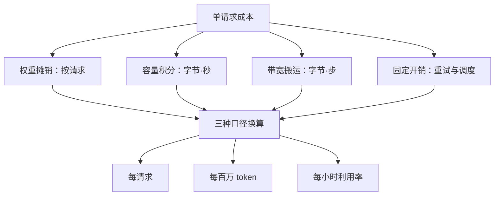
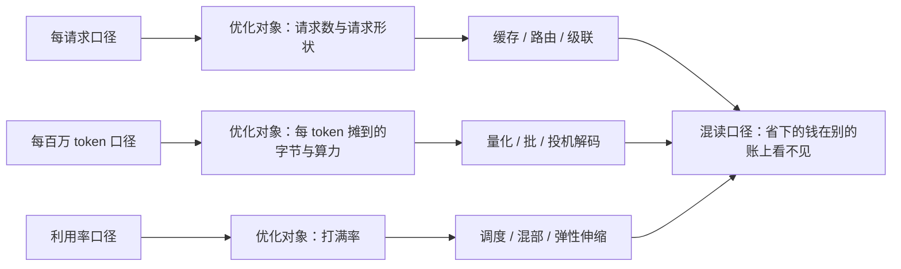

# 成本的组成与口径

成本从来不是账单上的一个数，而是几笔不同质的账；把哪一笔当成了「成本」，决定了你优化的对象和省下来的钱。

<footer>—— 据 Pope et al., Efficiently Scaling Transformer Inference, MLSys 2023 与本仓库 KV 成本模型课的记账口径整理</footer>

[上一课](/llm/pf2-map)把预训练实践配方收成一张图：开工前定地基、训练中守过程、收束管交付与复盘，三条不变量是判据先行、口径同源、旋钮可指认。成本工程沿用同一条纪律：先钉口径，再谈杠杆。本课是「推理成本工程」课程的第一课：把账本身拆开——推理的成本由哪些项组成、用哪种口径说出来才算数。后课默认这些口径已经钉死，直接在口径上谈杠杆与治理。

## 问题

三个数都被人叫作「成本」：API 账单上的月费、GPU 的时租、报价表上的每百万 token。它们不同质：月费是结算口径，时租是资源口径，每百万 token 是业务口径。缺口不是找一个更准的数，而是先把组成拆开、把口径钉死。不拆开的错法很常见：把时租除以当天生成的 token 数得出「单价」，第二天流量掉一半，单价翻倍，于是得出「模型变贵了」的误判——变的是利用率，不是价格；照着这个误判去换模型或砍服务，省不下任何东西。

数字实例：设一张卡一天的租金固定为 48 美元。高峰日生成 100 万 token，「单价」算出来是 48 美元/百万；次日流量减半，时租照付，「单价」就变成 96 美元/百万——价目表上一个字都没改，变的只是利用率。

### 四笔不同质的账

单请求成本写成四项之和：

$$c_{\rm req} = \frac{c_{\rm w}}{N_{\rm req}} + c_{\rm mem}\int_0^T M(t)\,dt + c_{\rm bw}\,B + c_{\rm fix}$$

权重摊销按请求摊，容量积分按字节·秒计，带宽搬运按字节·步计，固定开销（调度、采样、网络、重试）按次计。[KV 成本模型课](/llm/kv-cost-model)已把四笔账的单位钉过：混报就无法优化——把容量账摊进带宽账，驱逐策略的收益就在报数里凭空消失。本课只补一句：每一项的驱动变量不同，权重的 $N_{\rm req}$、容量的会话时长、带宽的序列长度、固定的重试率，各自对应完全不同的旋钮。

## 方法

口径是账到业务语言的换算。三种口径各答一个问题：每请求口径答「一次服务多少钱」，定价与免费层看它；每百万 token 口径答「单位产出多少钱」，选型与基准看它；利用率口径答「买来的资源用了几成」，容量与采购看它。换算公式只有一条，但必须带窗口：

$$c_{\rm Mtok} = \frac{\text{窗口内总成本}}{\text{窗口内计费 token 总量}}\times 10^6$$

写法上，每一笔账要同时记数值、单位与测量窗口。缺窗口的单价不可比：高峰时段与深夜空转的单价可以差十倍，而它们出自同一张卡、同一个模型。这也是[百万 token 成本课](/llm/cost-per-mtok)反复强调的：对外报价与对内芯片·秒/token 是两套口径，不能互换。

直觉类比：同一趟出租车可以报三个数——这一单收了 30 元（每请求口径），除以里程是 3 元/公里（每百万 token 口径），再加上「今天有载客的时间占几成」（利用率口径）。三个数都正确，答的是三个不同的问题，谁也代替不了谁。

## 机制

口径决定优化对象，这是本课程全部杠杆的坐标系。每请求口径上，优化对象是请求数与请求形状——缓存、路由、级联都在这里起作用；每百万 token 口径上，优化对象是每个 token 摊到的字节与算力——量化、批、投机解码在这里；利用率口径上，优化对象是打满率——调度、混部、弹性伸缩在这里。混用口径的错误各有形态：用利用率口径的单价去评缓存优化，会看见「单价没降」，因为缓存省下的是 prefill 算力，省出的容量被新请求挤占，打满率反而上升——账上每请求成本降了，时租口径纹丝不动，两笔都对，混着读必然读错一个。

例：一张卡时租固定，当天只有一成时间在算，「每百万 token 成本」是打满时的十倍。报单价必须同时报测量窗口与打满率，否则这个数什么都不能比较。

## 边界

定价不是成本：API 的折扣价、批量价、缓存折扣价是商业口径，与自建集群的单价不同质，跨口径比较要先换算成同一单位。口径还要带版本戳：模型换代、tokenizer 更换、硬件代际切换都会让旧数字失效，成本数字只对当时的配置负责。最后，四笔账里没有质量项——本课程把质量做成独立的合同约束，放在收束前的[成本与质量的合同](/llm/ce-cost-quality-contract)课里，那里会引用本课的口径。

常见误区：初学者容易拿 API 折扣价直接对比自建集群的单价。定价是商业口径，含利润、补贴与批量折扣；芯片·秒/token 是物理口径，含利用率假设。两者不同质，跨口径比较前必须先换算到同一单位、同一测量窗口，否则比出来的「便宜」没有意义。

## 小结

- 推理成本是四笔不同质的账：权重摊销、容量积分、带宽搬运、固定开销，驱动变量各不相同。
- 三种口径各有用途：每请求答定价、每百万 token 答选型、利用率答采购，换算必须带测量窗口。
- 口径决定优化对象：请求形状、单位字节、打满率分别对应本课程三个单元的杠杆。
- 混报口径的误判可预测：利用率波动会被误读成价格变化，容量收益会在带宽账里消失。
- 出处：Pope et al., 2022（阶段拆分与芯片·秒口径）；四笔账单位沿用本仓库 KV 成本模型课，不另造文献。
