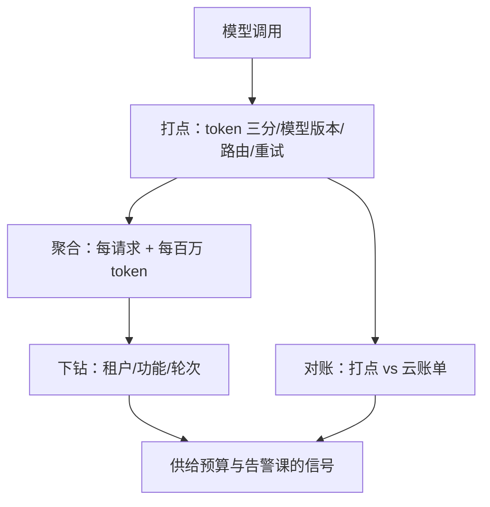
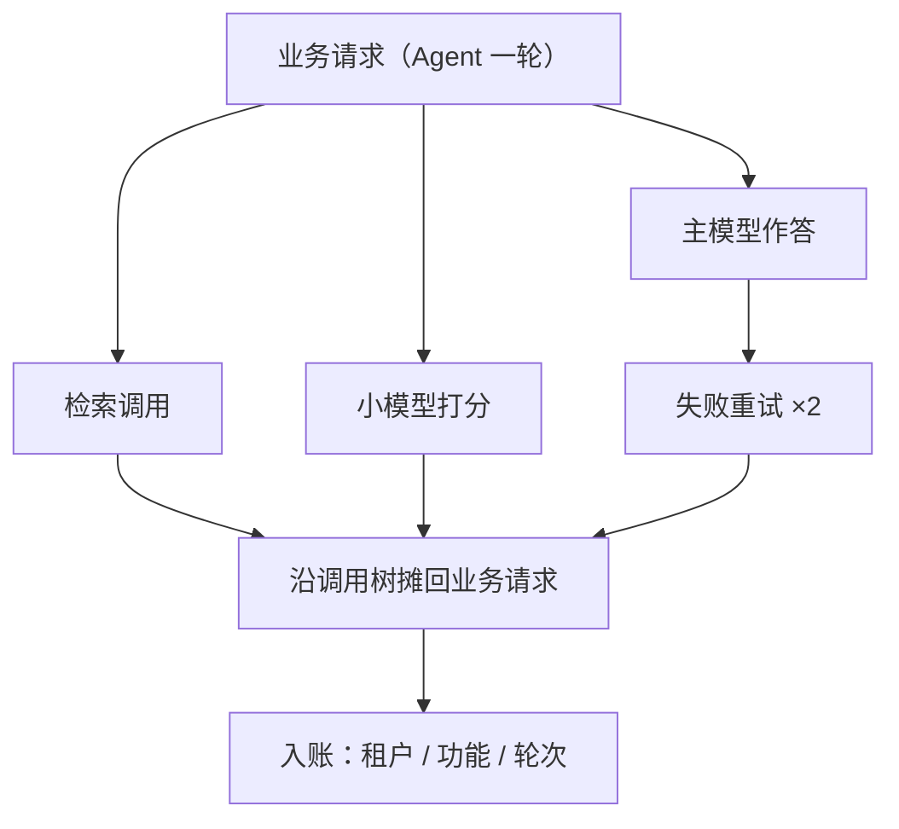

# 成本观测

账单回答「上月花了多少」，打点回答「此刻哪一个功能在烧钱」；治理只能建立在后者上。

<footer>—— 据本仓库 Agent 可观测课与服务指标课的口径整理</footer>

[上一课](/llm/ce-reserved-vs-spot)把租法按可中断性分层，优化杠杆单元到此收齐。进入治理单元：杠杆要落在数字上才转得动，而数字要靠仪表。本课写成本观测——把每请求成本做成与延迟同级的线上指标，让成本回归在分钟级被看见，而不是月底在账单上被发现。

## 问题

云账单滞后一天以上，且只有总量与少数维度。可成本回归的形态全是细粒度的：一次提示改动让平均输出长度翻倍，一次路由变更让流量全进大模型，一个客户端 bug 触发重试风暴——每一项都在账单上只是「这个月贵了」，等你对上月账时，钱已经烧完了几周。缺口是把成本的打点下沉到每次模型调用，带齐维度，即时聚合。不做观测直接上杠杆的错法也可预测：优化效果说不清（没有基线口径）、回归发现不了（没有分钟级信号）、超支找不到责任方（没有维度下钻）。

术语翻译：「打点」就是在代码里每次调用模型的前后各记一条记录，把 token 数、模型版本、重试次数等字段写进指标系统。它是埋在程序里的微型收银机——云账单是月底寄来的汇总单，打点是每一笔当场开的小票；治理靠小票，不靠汇总单。

### 打点协议

每次模型调用记一条：token 数三分——输入、输出、缓存命中各记各的（上一课基准协议的四钉在产线的对应物）；模型与版本；路由决策与降级路径；批参数；重试次数与原因码。聚合走双口径：每请求成本与每百万 token 成本并列，正是第一课的口径学；标签挂业务维度——租户、功能、会话轮次。两道接合特别要写对：多级调用要摊销，Agent 一次业务请求内部多次模型调用，成本必须沿调用树摊回业务请求再入账（[Agent 可观测课](/llm/agent-observability)的 trace 结构直接可用）；账单要对账，打点聚合与云账单按日比对，偏差超阈值先查漏打点再查口径漂移。

## 方法

落地的次序：先钉口径再埋点——单价、窗口、归属规则写进打点字典，口径漂移比丢点更毒，因为它是静默的；再分层聚合——按调用、业务请求、租户三层预聚合，线上看近线窗口，离线补全量；最后接信号——聚合结果供下一课的预算与告警消费，本课只保证数准、数全、数快。采样策略单独说：成本长尾集中在少数超长请求，随机采样会系统性低估成本——要么全量打点，要么按 token 加权采样，均匀采样在成本指标上永远是错的。

数字实例：设 1 万个请求里，9900 个各花 1000 token，100 个超长请求各花 100 万 token——1% 的请求占了约九成 token。随机抽 1% 的请求，有相当概率一个长请求都抽不到，那样估出的总成本不到真实值的一成；按 token 加权采样才不会系统性低估。

## 机制

为什么必须是打点而不是账单：治理动作（预算、告警、回滚）需要分钟级信号与维度下钻，账单两者都没有——这是机制性的，不是厂商做得不好：结算要折扣、抵扣、分账全部落地，天然滞后。打点的价值在「成本与延迟同级」：延迟回归靠 p99 告警当场抓住，成本回归凭什么只能等月底？同一套可观测基础设施、同一套告警语义，成本只是又一个指标族。归属规则是机制的另一半：检索、打分、验证器、重试算谁的——规则不钉死，维度下钻就变成部门吵架；[Agent 成本与延迟课](/llm/agent-cost-latency)的摊销口径是现成的参照。

对账的经验阈值：打点聚合与云账单的日偏差超过百分之一二就该查——常见原因是缓存折扣没按实际档位记账、批量接口的价没有分池、以及重试被记成正常调用。对账查出的口径漏洞，比打点本身抓的回归还多。

## 边界

打点有成本：全量打点的存储与写入不可忽略，但成本指标的长尾性质决定了不能盲目采样——按 token 加权是底线。跨服务归属有灰区：共享检索池的租户分摊、打分器的复用摊销，规则只能「钉死并公开」，不存在客观正确的分法。观测不等于治理：本课的仪表只回答「在哪、多少」，动作在下一课——预算与告警——落地；把仪表当治理，是成本工程里最常见的半途而废。

常见误区：初学者容易以为把云账单导进表格就是「成本观测」。账单滞后一天以上、只有总量维度，连「哪个功能在烧钱」都答不了；观测指的是程序内部的打点与分钟级聚合。对称的另一个误区是把仪表当治理——看见超支曲线，不等于有人会去动杠杆。

## 小结

- 打点维度五要素：token 三分、模型版本、路由路径、批参数、重试原因；聚合走每请求与每百万 token 双口径。
- 多级调用沿调用树摊回业务请求，账单对账按日做、偏差超阈值查口径。
- 成本长尾决定采样策略：全量或按 token 加权，均匀采样必低估。
- 成本与延迟同级：同一套可观测设施、同一套告警语义。
- 出处：trace 结构与摊销口径见本仓库 Agent 可观测课、Agent 成本与延迟课，对账阈值按工程实践整理。
