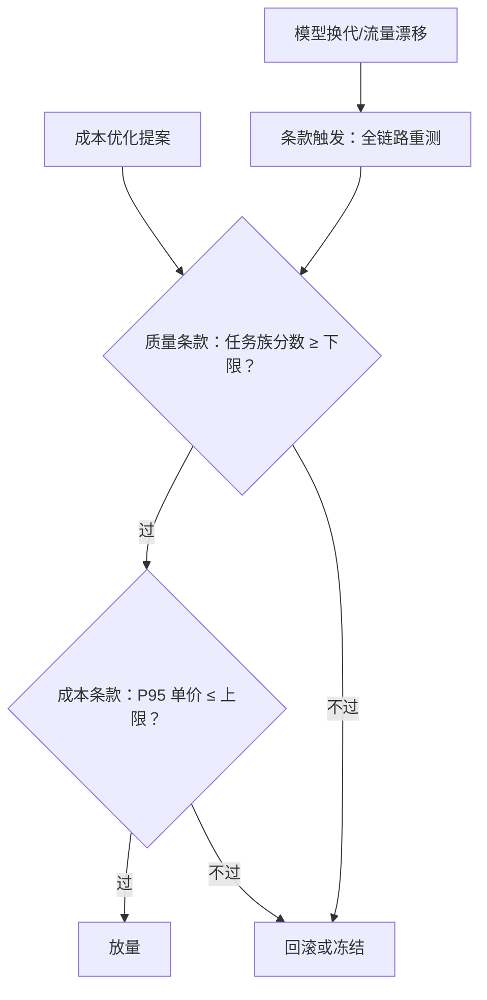
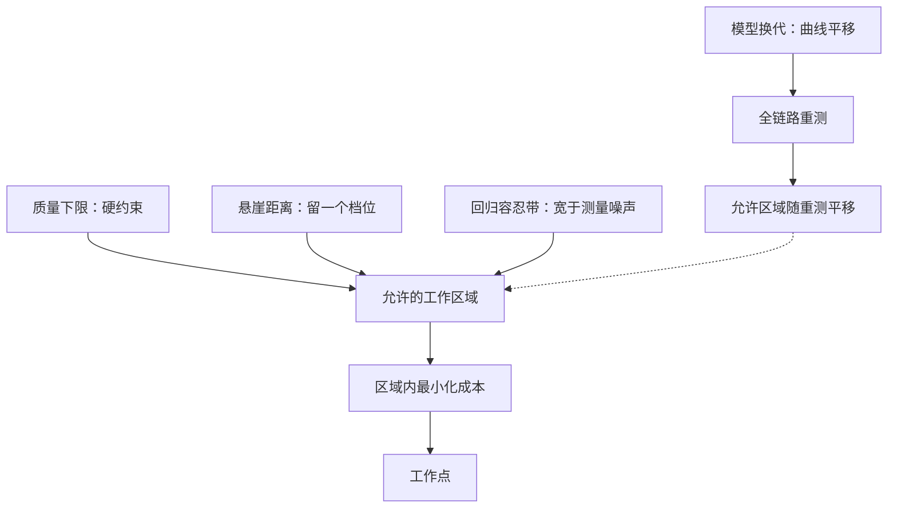

# 成本与质量的合同

成本与质量不是折中，是合同：要省的写清省到哪，要稳的写清稳在哪，违约的动作写死在条款里。

<footer>—— 据 Mirrlees, 1971 的激励相容口径与 Snell et al., 2024 的测试时计算权衡整理</footer>

[上一课](/llm/ce-optimization-cases)的每一步改造都过了一道质量门禁——那道门禁不能靠默契存在。本课把成本与质量的关系写成合同：可度量的条款、显式的违约动作、对齐的激励。它是治理单元的收口，为全课程的收束备好最后一页。

## 问题

「又省了又没变差」是一句不可检验的话，于是每次成本优化都是一场口头担保：优化者拍胸口，业务方将信将疑，出了事互相指认。更慢的失败在换季后：模型换代、流量漂移，钉住的平衡点静默失效，没人有义务重测。缺口是把两侧写成约束对——质量侧的下限、成本侧的上限、触发即执行的动作——并让做优化的人同时背质量后果。没有合同的组织里，收益归优化者、质量损失归业务方，激励错配会持续产出「便宜但不可用」的系统。

直觉类比：口头担保像「我保证不超速」，合同像车里的限速报警器——超速就响，响了就自动减速。成本优化同理：把「质量下限」「P95 单价上限」写成可测条款、触发即回滚，比任何「放心，不会变差」都可靠。

### 条款三组

质量侧条款：分任务族的分数下限；回归容忍带——评测本身有方差（[评测方差课](/llm/eval-variance-seed)的口径），容忍带必须宽于测量噪声，否则每次波动都是假警报；悬崖距离——工作点与质量悬崖之间至少留一个档位，沿[成本-质量曲线课](/llm/dec-cost-quality-curve)的读图口径。成本侧条款：每请求成本上限按 P95 钉而非均值——长尾请求主导成本，均值账会掩护它们；缓存命中率下限——它跌意味着前缀结构被人改了；单价漂移阈值——分型到预算课的「流量涨还是单价涨」。违约条款：触发即回滚或冻结放量，重测通过方可恢复；换代触发全链路重测，重测是条款不是自觉。

数字实例：100 个请求里 99 个各花 0.01 美元、1 个长尾花 1 美元，均值约 0.02 美元，看着很省；但成本是被长尾主导的。钉 P95 上限等于直接盯住最贵的那 5% 请求——用均值钉上限，优化者只要把便宜的请求再压便宜些就能「达标」，烧钱的长尾一个都没动。

## 方法

写合同的次序：先选度量——每任务族一门度量，可执行验收优先于打分、打分优先于人工（成本-质量曲线课的次序），度量与样本量钉死后不动；再定数值——下限与容忍带从历史评测分布推，上限从单位经济账的毛利约束倒推，不拍脑袋；然后配激励——谁提优化谁背门禁：优化提案必须附门禁报告，回滚的成本记在优化项目头上。激励相容是合同能自我执行的根据（Mirrlees 的口径）：让行动者承担行动的全部后果，监督才不必无处不在；只考核省钱数的团队，会把质量成本外部化给别人。

术语翻译：「激励相容」就是让做决定的人自己承担决定的全部后果——谁提优化，谁背质量门禁，回滚成本记在优化项目头上。这样他自然把质量当自己的事，监督者不必盯每一次改动；反之，只考核「省了多少钱」的团队会把质量成本转嫁给业务方。

## 机制

为什么是合同而不是共识：优化是一次性动作，合同是持续约束——共识只在谈判现场有效，条款在每次变更、每次换代时自动生效。机制上，合同把「折中」改写成「约束下的优化」：质量下限是硬约束，成本在约束内最小化——这正是本课程所有杠杆的统一形式（级联的 $q \ge q_0$、量化的误差预算、批的 SLO 上限都是实例，合同把它们从各课的局部约定收拢为一份全局文件）。条款与 Snell 的测试时计算权衡同构：每一档推理算力是曲线上一个点，合同钉住的不是某个点，是允许的工作区域——换代后曲线平移，区域随重测平移，约束关系本身不变。

条款数的提醒：合同不是越厚越好——条款过多，每次变更都被门禁阻塞，工程会开始绕过门禁。按流量分级：核心任务族条款从严，长尾从宽；一份十页的合同输给一页被真正执行的。

## 边界

合同不覆盖未知任务族：新任务上线时先补度量与下限，无门禁不放量——这条本身是条款。度量有方差，容忍带过窄把噪声当回归、过宽把回归当噪声，带宽从评测方差实测推。合同也不替代观测：条款的数值要靠预算课的单价分型与打点维度喂养，数据断了合同就盲了。最后，合同约束的是当前曲线上的行为；范式变更重开账本时，合同跟着重写而不是硬套——收束课会回到这条边界。

## 小结

- 条款三组：质量侧（分数下限、容忍带宽于噪声、悬崖距离）、成本侧（P95 上限、命中率下限、漂移阈值）、违约侧（触发即回滚、换代必重测）。
- 成本-质量关系是约束下的优化，不是折中；课程各杠杆都是「约束内最小化」的实例。
- 激励相容让合同自我执行：谁优化谁背门禁，回滚成本记在优化项目头上。
- 条款按流量分级，度量与样本量钉死后不动；数据与观测是合同的供给线。
- 出处：Mirrlees, 1971（激励相容）；Snell et al., 2024（测试时计算的区域约束）；度量方差见本仓库评测方差课。
