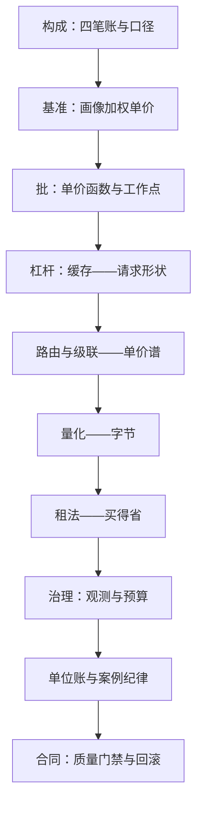

# 成本工程收束

成本工程的全部产出是一张账：拆得开组成，钉得死口径，拿得动杠杆，守得住合同。

<footer>—— 据本课程各课与 Pope et al., 2022 等口径收束</footer>

[上一课](/llm/ce-cost-quality-contract)把成本与质量钉成可执行的合同条款，本课程到此收束。十三课合成一张地图、一条主线、一份决策单；收束的任务不是新知识，是检索——面对一句「太贵了」，按什么次序打开哪些旋钮。

## 问题

成本工程的知识散在口径、杠杆、治理三层，临时抱佛脚的用法是记住几个「省钱技巧」：技巧不可迁移，画像一换就失效。缺口是把课程收成一套可执行的次序，让「太贵了」变成一个有流程的诊断，而不是一轮拍脑袋的降配。

## 方法

### 地图

三单元各司其职。构成单元（[成本的组成与口径](/llm/ce-cost-components)、[每百万 token 的基准](/llm/ce-per-million-benchmarks)、[批大小的经济学](/llm/ce-batch-economics)）给语言：四笔账、三种口径、单价函数——没有这套语言，后面的杠杆连「省了什么」都说不清。优化杠杆单元（[缓存命中经济学](/llm/ce-cache-economics)、[路由的成本面](/llm/ce-routing-cost)、[模型级联的成本](/llm/ce-cascade-cost)、[量化省下什么](/llm/ce-quantization-savings)、[租用对比：预留与竞价](/llm/ce-reserved-vs-spot)）给旋钮：改请求形状、改单价谱、改字节、改买法。治理单元（[成本观测](/llm/ce-cost-observability)、[预算与告警](/llm/ce-budget-alerting)、[单位经济案例](/llm/ce-unit-economics-case)、[优化案例研究](/llm/ce-optimization-cases)、[成本与质量的合同](/llm/ce-cost-quality-contract)）给执行：仪表、约束、账本、纪律与条款。

### 决策单

按数量级排的八问：一问口径——混报了吗，先把四笔账与测量窗口钉死；二问形状——重复多少，缓存的上界在哪；三问谱系——难度方差够不够支撑路由与级联；四问字节——量化空间与误差预算各剩多少；五问打满——批工作点离 SLO 上限还有多远；六问买法——负载按可中断性分层了吗；七问账目——单位账里漏了哪些小项；八问合同——门禁与回滚线写下来了吗。次序是刻意的：前两问不花钱就能排除一半误诊，中间四问按作用账目从结构到系数，后两问保证省下来的钱留得住。

## 机制

主线的原理只有一条：先给口径再给杠杆。没有口径的杠杆是玄学——省了说不清省在哪；没有杠杆的口径是抱怨——账拆得再细也不省钱。排序永远数量级优先（结构先于系数），验证永远三列表（成本、延迟、质量同看），这是贯穿构成、杠杆、治理三单元的同一副骨架。与邻域的接口也交代清楚：上游承接[显存·时间积](/llm/lc-memory-account)的会计口径与调度侧的打满率语言；下游开口给 [Agent 的成本与延迟](/llm/agent-cost-latency)、[RAG 的延迟与成本](/llm/rag-latency-cost)与[多模态的容量规划](/llm/mm-cost-capacity)——本课程给它们共同的记账语言，各自的画像与杠杆留在各自课程。

决策单的第一问常被跳过，也最常翻案：多起「模型太贵」的诊断，最后落在口径混报——时租除以波动流量得到的伪单价。先问口径再问模型，一半的成本会议可以不开。

## 边界

成本工程不改变范式：架构换代（新注意力、新硬件、新计费模式）会重开账本，四笔账的科目要重审——但拆账、钉口径、排序验证的方法不随范式过期。价格长期下行不豁免工程：单价的绝对值是市场给的，单价的相对结构是工程挣的，同一模型上省一半的结构性成本，在任何价格水平上都成立。最后，这门课管的住成本，管不了价值：单位账算完，若毛利仍为负，那是产品问题——成本工程到此收束，不再向前一步。

## 小结

- 三单元一线：构成给语言（账与口径），杠杆给旋钮（形状、谱系、字节、买法），治理给执行（仪表、预算、账本、合同）。
- 决策单八问按数量级排：口径、形状、谱系、字节、打满、买法、账目、合同。
- 先口径后杠杆，先结构后系数，验证永远成本、延迟、质量三列同看。
- 与邻域共享记账语言：上游显存账与打满率，下游 Agent、RAG、多模态各自展开。
- 出处：口径框架据 Pope et al., 2022 与本仓库 KV 成本模型、服务成本模型各课；本课程各课为杠杆与治理的详细出处。
