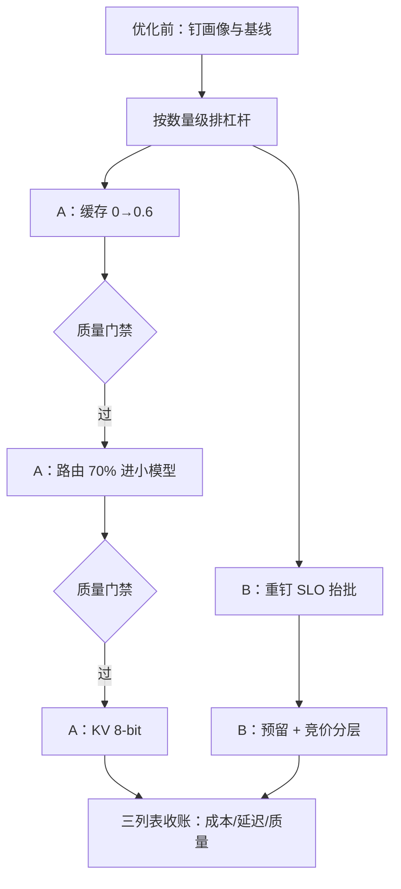

# 优化案例研究

案例不可移植，纪律可移植：每一刀成本优化，动手前先写好「砍在哪、怎么验证没有砍坏」。

<footer>—— 据本仓库长上下文成本案例课与成本-质量曲线课的口径整理</footer>

[上一课](/llm/ce-unit-economics-case)算全了文档问答产品的每请求账，并按作用账目排好了杠杆次序。本课把杠杆放进两个案例里兑现：一个检索型、一个低延迟型，流量画像相反，杠杆组合也不同。案例的价值不在数字——数字不迁移——在流程：先测后动、过门禁再放量。

## 问题

成本优化的失败很少是「没找到杠杆」，更多是两种：乱序与不验证。乱序：先上量化再想缓存，优化了常数、放过了数量级项；不验证：省下三成成本，质量门禁没跑，两周后客诉上门，回滚时连「哪一刀砍坏的」都说不清。缺口是两个带完整流程的案例，让排序纪律与验证纪律有可对照的样本。

### 案例 A：客服机器人

基线：每次请求全量 prefill 系统提示加知识段，全量走大模型。三步改造。第一步缓存：稳定段（系统提示、工具定义、知识库固定段）前置、用户上下文后置，命中率从零做到六成——作用于 prefill 重复量，是数量级项。第二步路由：难度标注后，简单咨询（七成）进小模型，困难单留大模型，打分器按「漏检率优先」调参——作用于单价谱。第三步 KV 8-bit：容量与带宽各兑现一部分。三步各降多少入各人的账，合计每请求成本降约七成；每步之间跑分任务族质量门禁，通过才放量——流程与[长上下文成本案例课](/llm/lc-cost-case)的六步链同构。

### 案例 B：代码补全

画像相反：输入短、输出短、QPS 高、单请求价值低。杠杆组合因此不同：第一步重钉 SLO——补全场景用户对稍高的 TPOT 不敏感，把延迟预算松一档，批工作点上移，打满率抬升（批课的「SLO 内最大批」）；第二步租法分层——基线走预留扛住水位，评测跑批与候选生成走竞价（上一课的可中断标签）；第三步才考虑权重量化——先实测瓶颈账再动手。合计单价降约六成，首 token 延迟反而因打满率结构改善而更稳。

## 方法

两个案例共用的流程沉淀为四条纪律。先测后动：每一步之前把当前三列表（成本、延迟、质量）钉下来，没有基线的优化没法归因。数量级优先：先做改变请求形状与单价谱的杠杆（缓存、路由），再做改字节的（量化），最后做改摊薄的（批、租法）——上一课排序的执行版。门禁前置：质量门禁不是上线后的补救，是放量的前置条件；工作点选在[成本-质量曲线课](/llm/dec-cost-quality-curve)的悬崖之前，每一档曲线用对应任务族的度量。回滚有触发线：门禁分数跌破哪条线自动回滚，写进合同（下一课的条款）。

## 机制

为什么流程比数字重要：案例数字是画像、报价、模型代际的函数，三者一变全变；而「测、排、砍、验」的流程对任何画像成立。排序的机制根据在第一课的账目分解：数量级项改账的结构，常数项改账的系数——先改结构后改系数，不把精力花在已经不大的项上。验证纪律的机制根据在质量与成本的合同关系：成本收益即时入账、质量损失延迟显现，没有前置门禁，两者的时序差会让每一刀都「看起来赚了」。

案例 A 的一个易错点：路由上线后同前缀请求被打散到两档模型，前缀缓存命中率跌了约一成——缓存与路由两本账必须合算，联合调参后命中回升。单杠杆优化的账，经常被另一个杠杆吃掉一块。

## 边界

案例未覆盖检索栈（嵌入与索引侧）与训练侧的成本，那两块账在各自课程里。数字全部是量级演示，不可作为决策依据；机制与流程可迁移，迁移时四条纪律一条不能省。案例 A 的路由漏检率依赖难度标注的质量，标注贵的业务这条杠杆要先算标注成本。最后，两案例都假设模型代际稳定——换代触发全链路重测，这是合同条款，不是自觉。

## 小结

- 两个画像相反的案例：检索型靠缓存与路由（数量级项），低延迟型靠 SLO 重钉与租法分层。
- 四条纪律：先测后动、数量级优先、门禁前置、回滚有触发线。
- 先改账的结构（少算、共享、谱系），再改账的系数（字节、摊薄）。
- 杠杆之间互相牵制（路由与缓存、量化与级联），账要合算。
- 出处：流程与门禁口径见本仓库长上下文成本案例课、成本-质量曲线课；案例数字为量级演示。
