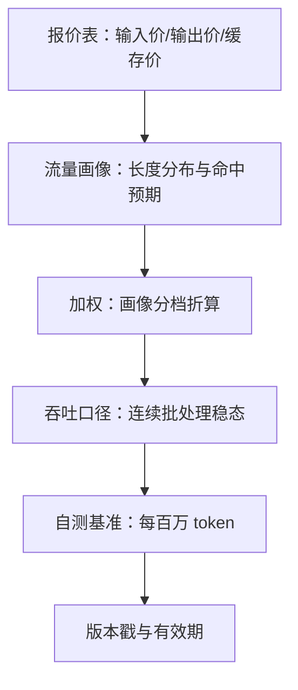
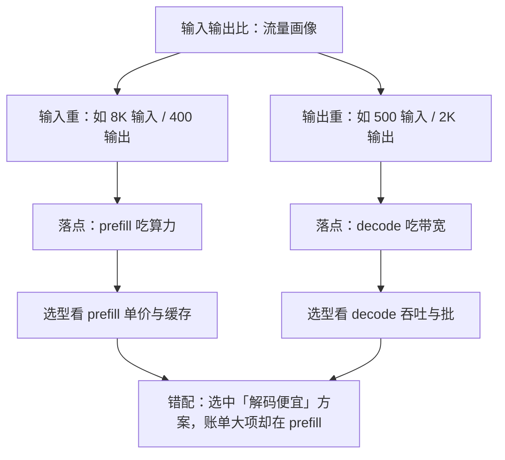

# 每百万 token 的基准

报价表上的每百万 token 是两个数，你账单上的每百万 token 是一个数；把两个数折成一个的，是你的流量画像。

<footer>—— 据开放 API 输入输出分档计价与缓存折扣的公开口径整理</footer>

[上一课](/llm/ce-cost-components)把成本拆成四笔不同质的账、三种口径，并钉下换算必须带测量窗口。口径钉完，第一件事是给「每百万 token」造一个可比的自测基准——没有它，后面每个杠杆省了多少都无可对表。[百万 token 成本课](/llm/cost-per-mtok)已经讲过输入输出两套物理与分价的来历；本课不重复物理，只写基准协议：怎么把报价折成你自己流量下的那一个数。

## 问题

报价表输入一个价、输出一个价（输出常贵数倍），缓存命中再打折；你账单上的单价是这些档位被真实流量加权后的结果。同一个模型，检索型流量（输入长、输出短）与对话型流量（输入短、输出长）的加权单价能差数倍。缺口由此而来：比较两个模型、两个方案时，若各方用的流量画像不同，比较的全部差异可能只是画像差异。更隐蔽的错法是拿 1:1 的「均匀 token」假设做基准：测出来的便宜模型，搬到自己输出占三成的真实流量上反而贵——选择错了，账单替你重测。

### 基准协议：四钉

加权单价的公式不复杂，难在把参数钉住：

$$c_{\rm Mtok} = \frac{r_{\rm in} c_{\rm in} + r_{\rm out} c_{\rm out}}{r_{\rm in} + r_{\rm out}},\qquad h\text{ 档位下另乘 } (1-h) + h\,k$$

钉四样：钉长度分布（用真实流量的分位数画像，输入 8K 输出 400 就按这个形状测，不要用 1:1）、钉命中预期（缓存命中比例 $h$ 与折扣系数 $k$，作为参数钉进画像）、钉并发口径（连续批处理下的稳态吞吐，不是单请求延迟）、钉计费等效（思维链、工具调用、重试产生的隐藏 token 都要计入分母）。自建集群走另一条路：时租除以画像吞吐，[服务成本模型课](/llm/serving-cost-model)的 $C_{\rm tok}$ 口径。

数字实例：拿「输入 0.15、输出 0.60 美元/百万」的报价按 1:1 均匀假设算，单价是 0.375；换成 8:1 的检索型画像，加权是 $(8 \times 0.15 + 0.60) \div 9 = 0.20$。画像一变，同一个报价折出的数差近一倍——所以参数必须先钉死。

## 方法

画像从哪来：从自己的请求日志抽分布，输入输出各取 P50 与 P95 两档，重尾业务（长文档、长思维链）单独成档。基准测两类：报价折算类，把公开价目按画像加权，用于快速选型；实测类，在自建或专用实例上以画像流量压测，时租除吞吐，用于容量与采购决策。两类的数字都要带画像戳——「每百万 token 0.4 美元」是不完整的句子，「在 8K 输入 400 输出、命中六成的画像下 0.4」才是。

术语翻译：「画像戳」就是给单价数字贴的标签，写明它是在什么流量形状下算出来的——输入输出分布、命中率、并发口径。没有这枚戳的单价像没有单位的物理量：数字再精确，也无法与另一个数比较。

## 机制

为什么 1:1 假设必错：prefill 是算力瓶颈、decode 是带宽瓶颈，输入输出比改变流量的落点。输入占比高的流量吃算力，输出占比高的流量吃带宽；批如何把 decode 往算力侧推，[连续批处理课](/llm/sch-continuous-batching-deep)的工作点分析已经给出。画像与瓶颈错配的后果是系统性的：拿输出重的画像给输入重的业务选型，选中的是「解码便宜」的方案，而你的账单大项根本在 prefill。加权本身也有陷阱：分档计价下加权平均不是线性运算，命中率变化会改档位结构，所以基准要按档位分开报，再按画像合成一个数做对表用。

例：输入 0.15、输出 0.60（每百万，美元）的报价，在 4:1 输入输出比下加权是 0.24，在 1:4 的对话画像下是 0.51——同一份报价单，画像一换，单价差近一倍。

## 边界

基准有有效期：模型换代、报价调整、缓存结构变化、tokenizer 更换都要求重测，基准数字不带版本戳就是过期票据。自测单价不等于公开报价：规模折扣、承诺用量价、批量接口价都是商业口径，混进物理账会把采购谈判的变量带进工程比较。跨硬件代际的实测要换卡重跑——带宽与算力比一变，画像的最优落点跟着变。

常见误区：初学者容易把批量接口价、承诺用量折扣直接填进基准表当「单价」。这些是商业口径，随谈判与用量规模变化；物理账一旦混进它们，换一份批量合同或换一个采购周期，全部比较就得重做。分开记账，需要时再合成。

## 小结

- 报价表是分档的，账单单价是画像加权的；不带画像的单价不可比较。
- 基准四钉：长度分布、命中预期、并发口径、计费等效，缺一钉则数字失真。
- 1:1 假设错在瓶颈错配：输入重的流量吃算力，输出重的流量吃带宽。
- 基准分报价折算与实测两类，均须带画像戳与版本戳。
- 出处：分档计价与缓存折扣按开放 API 公开口径整理；物理与单价来历见本仓库百万 token 成本课、服务成本模型课。
