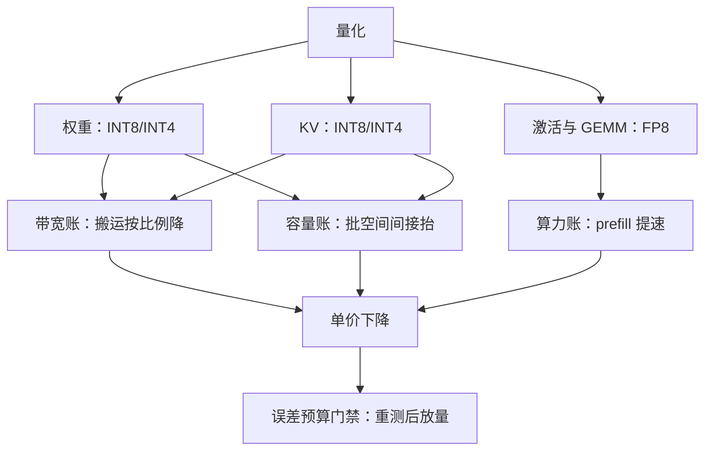

# 量化省下什么

量化省的不是算式，是字节：它把每一比特上承载的工作量加大；前提是误差预算允许你这么省。

<footer>—— 据本仓库 KV 量化课与推理误差预算课的口径整理</footer>

[上一课](/llm/ce-cascade-cost)把流量在模型谱系上分层。量化不动流量、不动模型结构，把同一个模型的字节变少。第一课拆过四笔账：权重摊销、容量积分、带宽搬运、固定开销。「量化省钱」这句口号，只有落到这四笔账上、说清省哪笔不省哪笔，才能变成工程决策。

## 问题

「上 INT8 能省一半钱」是把账目说丢了的说法。权重、KV、激活的量化各动不同的账：有的按比例省，有的间接省（通过批容量与打满率），有的一分不省。更常见的错法是拿理论压缩比当成本收益：权重量化到 4-bit 说「省四分之三」，可若瓶颈在 prefill 的算力、成本账上最大项根本没动。缺口是把每种量化对象映射到成本组成上，逐笔标注省与不省，再用误差预算检验允许不允许。

### 账目映射

逐项对账：权重量化（FP16 到 INT8/INT4）动两笔——显存里权重字节减半或减四分之三，decode 每步的权重搬运同步变少（带宽账），同卡装得下更多请求与 KV，批容量上移、打满率抬升（容量账的间接收益）。KV 量化动容量账与带宽账：序列容量近似翻倍、注意力扫描的字节减半，机制见 [KV 量化课](/llm/kv-quant-int8-int4)，端侧的对应处理见 [端侧 KV 课](/llm/on-device-kv)。激活与低精度 GEMM（FP8 等）动的是算力兑现：张量核在低精度下标称 FLOPS 更高，prefill 时长按比例缩短——这是四笔账里唯一真正加速计算的一档。不动的是：FLOPs 总量与固定开销——重试、调度、采样一次都不少。

## 方法

按账目排序再动手：先用画像定位瓶颈账——decode 带宽主导的输出重流量，权重量化的直接收益最大；长上下文容量主导的流量，KV 量化优先；prefill 算力主导的输入重流量，只有低精度 GEMM 真正提速。然后配误差预算：[推理误差预算课](/llm/num-inference-error-budget)给了「哪一层、哪一笔账允许掉多少」的框架，量化档位在预算内选最低比特；敏感层回退（少数层保 FP16）让平均比特数与实际收益脱钩，账要按实测算。最后重跑基准：量化后的单价必须用上一课的四钉协议重测——批容量变了，工作点也变了。

## 机制

钱从哪来：单位字节能承载的工作量变大，四笔账里的字节项按比例收缩，容量项再通过打满率间接收缩。为什么间接收益常被高估：批容量上移只在流量打得满的前提下兑现——流量不足时省出的容量只是空着，打满率不动，单价不动。为什么前提是误差预算：量化省的是钱、花的是质量，质量损失折价入账后可能倒挂——[KV 成本模型课](/llm/kv-cost-model)的边界早已写明：不做质量折价的成本模型，会优化出便宜但不可用的系统。低比特的隐性开销也在这条机制里：权重量化后 decode 每步要做反量化，kernel 效率损失可能吃掉一部分理论带宽收益，账目按实测核销。

核销的例子：权重 4-bit 理论上带宽降到四分之一，实测 decode 吞吐常只有两倍上下——反量化开销、对齐粒度与 kernel 利用率把理论值吃掉一半；预算表上写实测数，不写压缩比。

## 边界

量化不省的账要写明：固定开销、重试、prefill 的 FLOPs 总量（除低精度 GEMM 外）分文不减；输出重且批已打满的流量，量化收益以实测吞吐为准而非压缩比。敏感度分布随模型而变，上一代的逐层经验不能平移——量化档位属于模型版本的一部分，换版重配。最后，量化与级联是竞争关系不是叠加关系：把大模型量化后，它与小模型的价差缩小，级联的省钱空间同步缩水——上量化之前先看级联的账还剩多少。

## 小结

- 量化的账目映射：权重省带宽与批容量、KV 省容量与扫描、FP8 GEMM 省算力；FLOPs 总量与固定开销不省。
- 真正兑现要过两道门：误差预算允许、流量打得满——缺一道则理论收益不落账。
- 单价收益按实测核销，压缩比不是账；敏感层回退让平均比特数失真。
- 量化与级联互相挤压空间，动手前先比较两本账。
- 出处：账目框架沿用本仓库 KV 量化课、推理误差预算课、KV 成本模型课，不另造文献。
