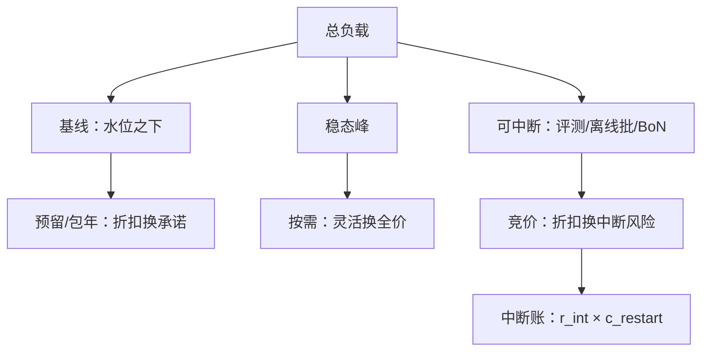
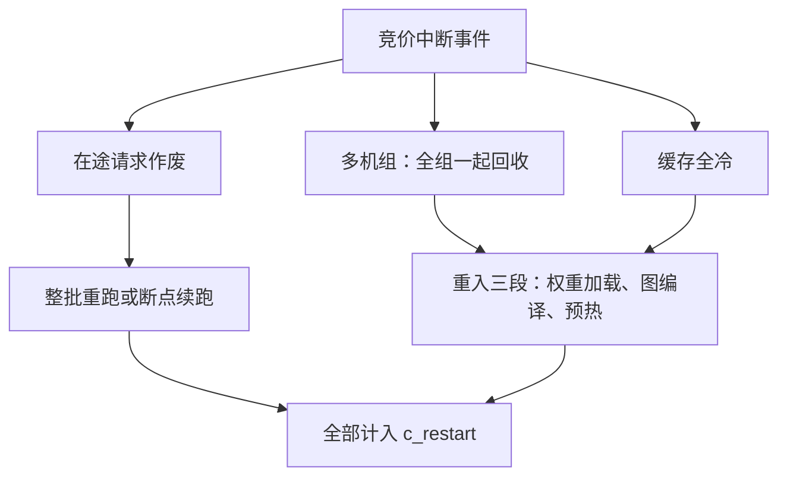

# 租用对比：预留与竞价

按需买灵活性，预留买折扣，竞价买别人的闲置；三种价格的差，是可中断性在定价。

<footer>—— 据云厂商公开定价口径与本仓库弹性伸缩、训练成本分析课整理</footer>

[上一课](/llm/ce-quantization-savings)盘点量化动的是哪些账。前几课的杠杆都在「用得省」——请求形状、模型谱系、字节；本课是优化杠杆单元的最后一课，杠杆换成「买得省」：按需、预留（包年包月）、竞价（Spot）三种租法，把折扣与可中断性放进同一本期望成本。

## 问题

竞价实例常为按需的两到四折、预留约六到七折（公开口径的量级），差价巨大；但竞价可被随时收回，预留是锁死用量的财务承诺。两种朴素错法：把全部负载搬上竞价，一次大规模回收把在线服务打穿——省下的钱不够赔一次事故；或者反过来，全部按需扛基线，时租照付、折扣全让。缺口是把负载按「可中断性」分层，每层匹配租法，并把中断重算的成本显式计入期望成本。

直觉类比：三种租法像住房市场——按需是酒店，住一天付一天，贵但随时能走；预留是签一年租约，便宜两三成但中途退租不退钱；竞价是住进别人临时退订的房间，便宜一半以上，但房东随时可能回来，你得立刻搬走。住哪种房，取决于你能不能接受半夜被赶。

### 分层匹配

负载分三层，各配租法。基线负载（长期水位之下的部分）配预留或包年——它利用率接近一，折扣全额兑现，代价是财务承诺：流量跌了，折扣变沉没成本。稳态峰配按需——灵活、贵、无中断风险，由[弹性伸缩课](/llm/sch-autoscaling)的分钟级供给机制托底。可中断负载配竞价——评测跑批、离线数据管线、best-of-n 候选生成、训练侧的对照实验（[训练成本分析课](/llm/ti-cost-analysis)的实验账），它们的共同定义是「重试即正确」：中断只损失重算时间，不损失正确性。竞价的期望成本写成

$$E[c_{\rm spot}] = p_{\rm spot}\,t + r_{\rm int}\,c_{\rm restart}$$

$p_{\rm spot}$ 是单价、$r_{\rm int}$ 是中断率、$c_{\rm restart}$ 是一次中断的重算成本——在途请求作废、gang 全组回收、缓存全冷，重入要走权重加载、图编译、预热三段（弹性伸缩课的供给时序）。

数字实例：按需 3 美元/小时、竞价 0.6 美元/小时，每小时省 2.4 美元；若中断率 0.1、一次中断的重算与冷启动合计 3 美元，中断账是 $0.1 \times 3 = 0.3$ 美元/小时，期望成本 0.9 美元——仍不到按需的三分之一，这层竞价才值得上。

## 方法

先给负载贴可中断标签：按请求来源分——在线交互流不可中断；内部评测、批处理、生成候选可中断，前提是断点续跑或整批重跑的成本可接受。再定配比：从流量画像量出基线水位，预留只买到水位之下的确定性部分，留一成上下浮动给画像漂移；竞价层设「让路」机制：市场价逼近按需或回收告警时，任务主动缩容。最后核算中断账：$r_{\rm int}$ 用历史回收率估，$c_{\rm restart}$ 按最坏路径算（全组回收、缓存全冷），期望成本与按需比价后才动——折扣不是收益，折扣减中断账才是。

## 机制

竞价为什么便宜：它是云厂商闲置容量的出清价。供给由别人的需求决定、弹性极差，中断风险由买方承担，价格就是对承担风险的补偿——价差不是白拿的补贴，是一笔风险交易。这解释了两条工程纪律：其一，可中断性的判断标准是业务语义（重试即正确），在线请求套上「断点续跑」仍是不可中断负载，因为用户在等；其二，中断成本的大头常被低估——机器时租按秒计，而冷缓存与在途请求按整个工作流计。预留的机制另一面同样清楚：它是供给方的需求确定性换来的融资折扣，兑现条件是利用率——利用率上不去的预留，比按需更贵。

配比的量级感：基线五成走预留六折、可中断三成走竞价三折、稳态峰两成走按需，加权价约为按需的六成上下——真正的变量是可中断负载的占比，它取决于业务里评测与批处理的比重。

## 边界

中断不可预测：市场价波动与平台维护事件都不提前足量预告，依赖竞价的层要有按需兜底缓冲，缓冲本身计入竞价层的账。gang 语义的负载（多机推理组）中断是全组的，$c_{\rm restart}$ 按组算不按机算。预留是财务工具：用量承诺跨季度，签字前先看弹性伸缩课的容量预测误差——误差大的业务压低预留比例。最后，本课的分层与调度层的优先级分档是两套正交机制：租法管钱怎么省，调度管收到的请求怎么排，混谈会把两本账搅在一起。

常见误区：初学者容易把「技术上能断点续跑」当可中断的标准，把在线对话也标成可中断。判断标准是业务语义：用户在不在等。在线请求挂上「自动重试」仍是不可中断负载——重试期间用户早已流失，这笔流失不进机时账单，但进流失率报表。

## 小结

- 负载按可中断性分三层：基线配预留、稳态峰配按需、可中断配竞价，配比由画像水位决定。
- 竞价期望成本 $=p_{\rm spot}t+r_{\rm int}c_{\rm restart}$：折扣减中断账才是收益，中断账按最坏路径算。
- 可中断性的标准是业务语义「重试即正确」，不是技术包装。
- 预留兑现条件是利用率；预测误差大的业务压低预留比例。
- 出处：折扣量级按云厂商公开定价口径整理；供给时序与重入成本见本仓库弹性伸缩课，实验账见训练成本分析课。
