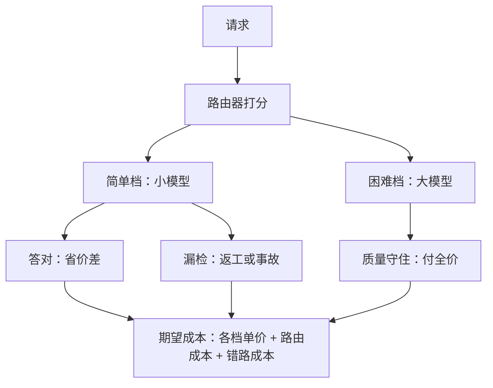
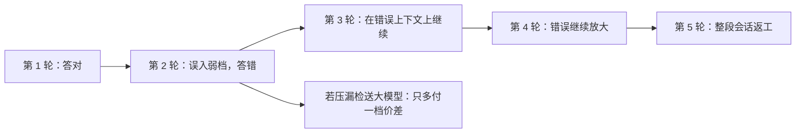

# 路由的成本面

路由赚的是请求之间的难度差：当所有请求一样难，路由器只是一个更贵、更容易出错的分发器。

<footer>—— 据 FrugalGPT（Chen, Zaharia, Zou, 2023）的模型选择框架与本仓库缓存感知路由课整理</footer>

[上一课](/llm/ce-cache-economics)把缓存写成命中率的线性账，省的是同一个模型里的重复计算。模型之间的价差比前缀复用大得多：同一请求走大模型与走小模型，单价可以差数倍到数十倍。本课写路由——「每个请求进哪个模型」——的期望成本，这是单元内第二个杠杆。

## 问题

手里有多档模型可用时，两个朴素方案都错：全走大模型，成本随流量线性放大，简单请求在为用不到的能力付费；全走小模型，难请求成批失败，返工与客诉把省下的钱加倍吐回去。中间态是路由：按请求特征分档。但路由不是免费的——路由器自己有打分成本与延迟，还会犯两种错，错的方向价不同。缺口是把路由的收益、自身的成本、错路的代价放进同一个期望成本，再问一句：这个流量值不值得上路由器。

术语翻译：这里的「路由器」不是网络设备，是摆在模型前面的分流程序——先给请求打个分，再决定送哪档模型。它可以简单到几条 if 规则（按长度、按领域），也可以复杂到用另一个小模型试答一遍看置信度；越复杂越准，也越贵。

### 期望成本

$$E[c] = \sum_i p_i\, c_i + c_{\rm router} + c_{\rm err}$$

$p_i$ 是被路由到模型 $i$ 的流量占比，$c_i$ 是各自画像下的单价（上一课的基准口径），$c_{\rm router}$ 是打分器计算与额外延迟的摊销，$c_{\rm err}$ 是错路成本：被送到太强档位的请求只多花了钱，被送到太弱档位的请求要返工——重试一次付两遍，失败流出则质量折价。路由器的实现谱系从轻到重：规则（长度、领域、语言）、打分模型、小模型试答看置信度，成本与准头递增，[缓存感知路由课](/llm/sch-cache-aware-routing)还提醒了另一面：路由打散前缀会拉低缓存命中率，两本账要合着算。

数字实例：设八成请求简单、两成困难；大模型 3 美元/百万、小模型 0.3 美元/百万。全走大模型是 3；理想路由是 $0.8 \times 0.3 + 0.2 \times 3 = 0.84$，省七成。但若漏检率 5%，答错的简单单要返工重付，错路账一加，省下的立刻缩水——所以漏检率是第一指标。

## 方法

先测流量值不值得路由：给历史流量做难度标注（可执行验收、评测集或人工分层），看难度方差。方差可测后按三步搭：钉质量下限——困难档的定义不是「模型答不好的」而是「跌破了任务族分数下限的」；选打分器——它的漏检率是第一指标，准头不够就用保守路由（拿不准的都进大模型）；算总账——把 $c_{\rm router}$ 与 $c_{\rm err}$ 代入期望成本，与全大模型、全小模型两个端点比，确认中间态真的更优。三步缺一的结果都可预测：不钉下限，路由退化成「能省则省」；不算总账，路由器自身的 API 调用费可能吃掉全部价差。

直觉类比：「拿不准的都进大模型」的保守路由，像体检报告上的「建议复查」——多数复查是虚惊，但漏掉一例真问题的代价远高于多跑一次检查。误入贵档只多花钱，误入弱档是事故，所以调参方向永远压漏检，与省钱直觉相反。

## 机制

收益的来源是难度方差：把占比 $p$ 的简单流量挪到便宜档，期望成本的下降约是 $p$ 乘以两档价差，而质量由「困难档守门」兜住；方差为零时这项收益是零。错路不对称是路由的机制核心：误入贵档的请求损失是钱，可计量、可回补；误入弱档的请求损失是质量事故与返工，返工还有连带——多轮会话里一步答错，后面的轮次全在错误上下文上继续。所以路由器的调参方向永远是压漏检、宁可多送大模型，这与「省钱优先」的直觉相反，也是多数路由上线后翻车的原因。

账目的提醒：路由器若是另一个 LLM，它自己的每请求成本要按它的画像计价入账——用大模型给小模型当路由器，价差可能直接倒挂。

## 边界

路由规则有保质期：流量难度分布漂移（新用户群、新功能、营销活动），打分规则静默过期，漏检率悄悄上升——路由准确率要当成线上指标持续观测。路由与缓存互相牵制：同前缀的请求被打散到不同模型档，前缀缓存的命中结构被破坏，两杠杆要联合调参而不是各自优化。最后，路由只做一次定档，定错了没有回头路；给「答错了再升级」留后门的版本，账目结构不同——那是下一课的级联。

## 小结

- 期望成本 $E[c]=\sum_i p_i c_i + c_{\rm router} + c_{\rm err}$：收益、自身成本、错路代价三笔合算。
- 收益来源是难度方差；方差为零时路由器只是纯开销。
- 错路不对称：误入贵档损失是钱，误入弱档是返工与质量事故，调参方向永远压漏检。
- 路由与缓存联合调参；规则随流量漂移过期，漏检率要持续观测。
- 出处：FrugalGPT（Chen, Zaharia, Zou, 2023）的模型选择框架；缓存牵制与打满口径见本仓库缓存感知路由课。
