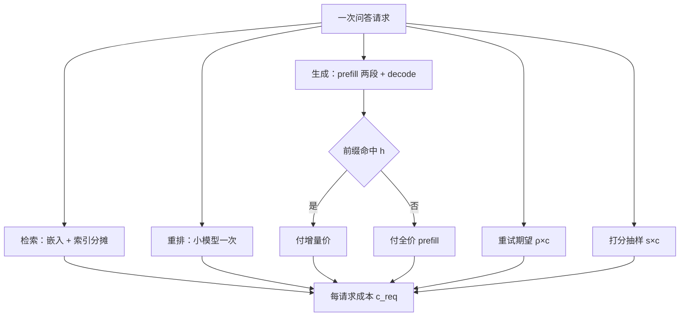
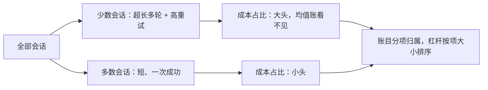

# 单位经济案例

毛利不是一个财务词，是每请求账的最后一行：客单价减去你漏掉的那些小项。

<footer>—— 据本仓库各成本课的口径做一个演算案例，数字为量级演示</footer>

[上一课](/llm/ce-budget-alerting)给成本装上约束与告警。本课把课程至今的全部口径合在一张表上：算一个产品形态完整的每请求账——单位经济。它向上回答「定价与免费层敢不敢给」，向下给优化案例（下一课）提供基线。

## 问题

LLM 产品的成本大项是生成调用，但每请求账里还躺着一批小项：检索的嵌入与索引、重排序、答案打分、失败重试、会话内多轮的重复 prefill。漏项的账方向一致——总是低估成本、高估毛利，于是定价偏低、免费层失控、增长越快亏得越多。缺口是把一个具体产品形态的账算全，并让每个漏项有归属。常见的翻车形态：只按生成 token 定价，把检索侧的账丢给「数据团队」，等流量上来才发现索引与查询侧吃掉了毛利的三分之一。

直觉类比：「单位经济」就是给产品算一笔便利店式的账——一单卖 10 元，货品成本、水电、损耗各占几毛几厘都记下来，才知道这单到底赚不赚。LLM 产品的「水电损耗」，就是检索、重试、打分这些不起眼的小项。

### 案例的账

产品形态取「文档问答」：检索增强、会话多轮、订阅收费。每请求账写成

$$c_{\rm req} = c_{\rm embed} + c_{\rm idx} + c_{\rm rr} + (1-h)\,c_{\rm gen}^{\rm pre} + h\,c_{\rm gen}^{\rm hit} + c_{\rm gen}^{\rm dec} + \rho\,c_{\rm retry} + s\,c_{\rm judge}$$

八项对号：嵌入按查询计；索引与检索侧按查询分摊（文档侧的写入账进内容成本，不进查询账）；重排一次小模型；生成拆成未命中 prefill、命中增量（命中率 $h$）、与 decode 三段——口径正是[缓存命中经济学](/llm/ce-cache-economics)的 $(1-h)c_p + h c_r$；重试率 $\rho$ 乘单次成本；评测打分按抽样率 $s$ 摊。代入量级（假设值）：8K 输入 400 输出、命中六成、重试率 5%、打分抽样一成，检索与打分合计约占账面的两成——这就是常被漏掉的份额。对照订阅价折算的每请求收入，毛利与盈亏平衡点就落在这张表上。

数字实例：重试率 5% 看似微小，但它乘的是最贵的失败路径——一次超长请求的重试可能顶普通请求十次的成本；100 万请求的月份，5% 就是 5 万次重试的账。把每项写成「比率 × 成本」的期望结构，就是为了让这些少数派在表上显形。

## 方法

算账的次序按依赖来：先钉画像——输入输出分布、轮次深度、命中率用真实流量（第二课的四钉协议）；再逐项计价——每项乘单价，单价全部带窗口与版本戳；然后并表对照——每请求成本对每请求收入，算毛利与盈亏平衡；最后排杠杆——按数量级排，不动手先排序：缓存（命中从零到六成作用于 prefill 两段）、路由与级联（简单问答进小模型，作用于单价谱）、量化（作用于字节）、批与打满率（作用于时租摊薄）——排序原理与[成本优化案例课](/llm/lc-cost-case)的六步同构：先少算、再共享、后压便宜。

## 机制

为什么小项的方向总是低估：每一项都是「期望成本」结构——重试率乘成本、抽样率乘成本、多轮乘轮数——而期望值对尾部敏感，超长会话与高失败率的少数会话贡献大头，均值账看不见它们。为什么杠杆有先后：各杠杆作用的账目不同——缓存作用于重复量、级联作用于单价谱、量化作用于字节、批作用于打满率——账目分解（第一课）决定杠杆只对对应的项生效，排序就是对项的大小排序，不是拍喜好。单位账还是定价的共同输入：免费层的成本按留存与转化摊销，不摊销的话获客成本会被误读成毛利——这是机制不是口径洁癖。

演算的提醒：例中检索与打分占两成、重试占半成，都是量级示意；换画像与报价要全表重算。表的意义在结构与归属——每一项有主人，超支时才知道敲谁的门。

## 边界

数字是量级演示，不构成定价依据；换流量画像、换报价、换模型代际都要重算全表。检索侧的账只取接口——嵌入与索引的深度优化属检索栈，本课程不展开。免费层与试用层按留存摊销的口径要与财务对齐，工程账与财务账的分界要写明。最后，单位账是静态快照：流量结构漂移后账会变形，它要按季度重跑，并且与预算课的单价异常检测共用同一套打点。

常见误区：初学者容易把「毛利为负」当纯技术问题去修。账算全之后若毛利仍为负，那多半是定价或产品问题——提价、收紧免费层或改计费单位，而不是继续在推理栈里找杠杆。单位账的作用就是把「工程能省的」和「产品该改的」分开。

## 小结

- 每请求账八项：嵌入、索引分摊、重排、prefill 两段、decode、重试期望、打分抽样；漏项方向总是低估。
- 期望成本结构（重试率、抽样率、轮数）对尾部敏感，均值账系统性低估。
- 杠杆排序按作用账目：缓存作用于重复量、级联作用于单价谱、量化作用于字节、批作用于打满率。
- 单位账是定价与优化的共同输入，免费层按留存摊销，表要定期重跑。
- 出处：案例为量级演算；口径沿用本仓库百万 token 成本课、缓存命中经济学课、成本优化案例课。
