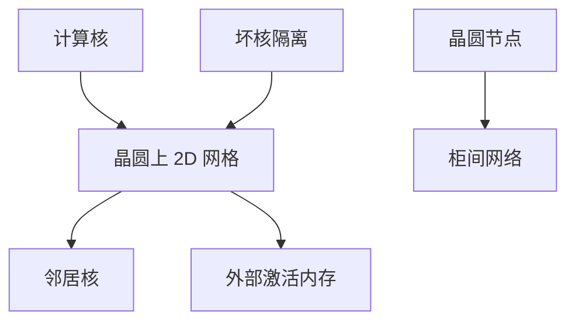

# Cerebras 晶圆级

把一片晶圆当成一张加速器，片间互连变成晶圆上的网格。通信的 $\alpha$ 按邻居计；故障模型按「一颗核坏了网格绕行」计，不再按 PCIe 掉卡计。

<footer>—— Cerebras Wafer-Scale Engine 的公开产品与体系结构描述</footer>

[TPU](/llm/tpu-architecture-basics) 仍是多芯片经 ICI 拼 pod。本课把阵列做到 **晶圆级（WSE）**：Cerebras 把整片晶圆做成一块处理器，核之间用片上网络相连，外部再接激活内存。缺口是规模换来的局部性假设——以及它不再使用 [NVLink](/llm/nvlink) / NCCL 这套集群故事。对比方法课会要求把「单设备」定义先说清：一张晶圆算一台还是算一万核。

## 问题

多芯片系统的墙经常在封装外：HBM 容量、芯片间带宽、机柜供电。晶圆级把大量核留在同一硅片上，邻居带宽按片上金属计，延迟远低于跨封装。代价是：良率（坏核必须隔离）、热与供电在单片上的密度、以及编程模型必须暴露 2D mesh 与近邻内存，而不是全局共享 HBM 的 GPU 幻觉。

LLM 映射：权重与激活如何铺在网格上，集体是近邻移位还是全局归约。若把模型当小 GPU 来用、所有数据经外部内存打转，晶圆级互连的优势被旁路。问题是 **算法必须空间化**，类似数据流，而不只是「更大的 TPU」。

公开材料强调核数、片上内存总量、以及绕过坏核的互连。具体一代的峰值以当时产品页为准。不引用未核对的第三方「等效 GPU 数」营销比。

## 方法

把模型切成在网格上流水的核图：卷积与某些 MLP 天然；注意力的全局 softmax 与 KV 是别扭的——要切块、在网格上广播或归约。编译器负责放置与绕行故障核。外部激活内存扩展容量，但一出晶圆，$\beta$ 掉档，类似 GPU 出 NVLink 域。

集群：多晶圆系统仍要柜间网络。那时又回到 Clos / 专有互连，只是「节点」变成晶圆。不要以为买了 WSE 就取消了 Scale-Out。

软件栈是专有编译器与框架接口。生态比 CUDA / JAX 窄，这是对比时的软件维，不是脚注。

## 机制

片上网格的 $\alpha$–$\beta$ 按 hop。局部 GEMM 几乎不付封装外延迟；全局 All-Reduce 按直径走，直径由晶圆上的核阵列尺寸决定。故障核增加绕行 hop，等效轻微降频或局部 $\beta$ 下降——与 GPU 掉卡导致整组 NCCL abort 不同，更像 mesh 上的自适应路由。

热：整片功耗集中，液冷几乎是标配。爆炸半径是整晶圆，不是单 GPU。调度仍是 gang，粒度更粗。

与 TPU mesh 的亲缘：都是同步阵列 + 邻接通信。差别是封装边界画在晶圆还是芯片，以及生态与精度栈。

## 边界与工程取舍

不要把「核数 × 某频率」乘成对标 H100 的 FLOPS 而不谈利用率与注意力映射。不要假设 PyTorch 模型一行迁移。不要忽略多晶圆时柜间墙又回来。下一课 Groq 走另一极端：不是更大的 mesh，而是确定性、时序编排的流。

## 小结

- WSE 把互连留在晶圆上，邻居 $\beta$ 按片上计；出晶圆即掉档。
- 编程必须空间化；坏核绕行而不是整卡 abort。
- 多晶圆仍要 Scale-Out；软件栈是屋顶线一维。
- 注意力等全局算子要显式切块，不能当大 GPU 用。
- 出处：Cerebras WSE 公开体系结构与产品说明。
