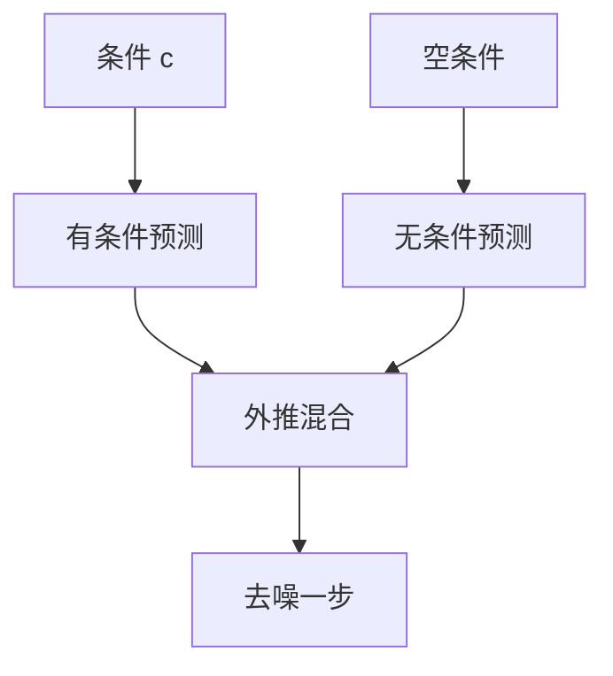

# CFG 在图像生成

同一网络既做有条件去噪也做无条件去噪。把二者之差放大，条件（文本、类）对采样轨迹的拉力就变强。

<footer>—— Ho, Salimans, Classifier-Free Diffusion Guidance</footer>

[上一课](/llm/latent-vae)给出潜空间里的条件生成器。主干[CFG 用于语言模型](/llm/cfg-llm) 已写 logits 上的同一几何。本课缺口是图像采样：在噪声预测或速度上做外推，而不是词表。后课自回归图像默认你知道扩散侧如何「听提示」。

## 问题

条件网络 $\epsilon_\theta(z_t,t,c)$ 可以忽略 $c$，尤其当噪声很大、数据更易用无条件先验解释时。分类器引导要另训分类器，且梯度在噪声图上不稳定。CFG 在训练时随机把 $c$ 换成空，让同一 $\epsilon_\theta$ 可算无条件支路。采样

$$
\hat\epsilon = \epsilon_u + \gamma\,(\epsilon_c-\epsilon_u)
$$

$\gamma=1$ 为普通条件；$\gamma\gt 1$ 沿条件方向外推。过强则过饱和、丢多样性、文字乱码——与 LM-CFG 过强跑题同类。

空条件必须与训练 dropout 协议一致。推理用的「负提示」是把 $u$ 换成负文本，几何仍是远离不想要的属性。

## 方法

训练：$c$ 以固定概率置空。推理：两趟（或 batch=2）U-Net / DiT，混合噪声预测或速度，再步进。代价近乎双倍前向。$\gamma$ 是产品旋钮，应在人评与多样性上扫，不要固定抄 7.5。与 [CLIP](/llm/clip) 余弦引导不是同一方法：那是另用 CLIP 梯度，本课是无分类器。

## 机制

$\epsilon_c-\epsilon_u$ 近似「条件对数密度」在噪声空间的方向。放大它等于提高条件似然的权重，降低无条件先验的权重。图像上表现为更贴提示、对比更强；几何上已离开训练边际时，就出现伪纹理。

## 边界

CFG 不增加 tokenizer 分辨率，也不把扩散变成离散 AR。下一课改走码本上的下一步预测。

## 小结

- 图像 CFG 混合有条件与无条件噪声（或速度）预测。
- $\gamma$ 换贴合与多样性，过强出伪影。
- 训练必须见过空条件。
- 出处：Ho & Salimans, Classifier-Free Diffusion Guidance。
