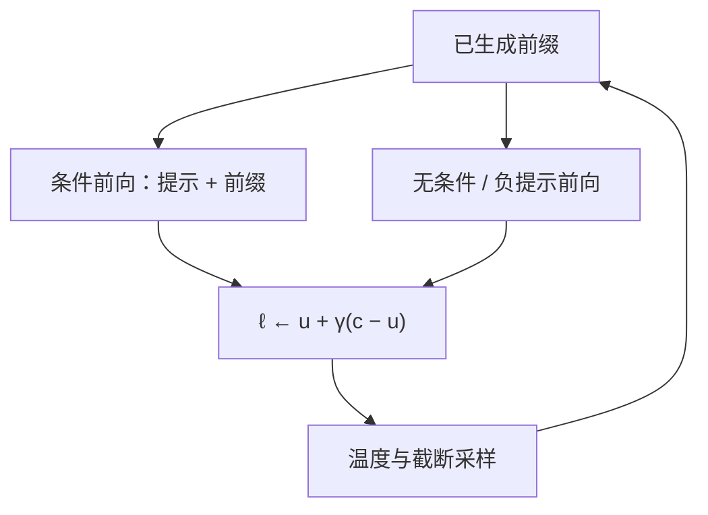

# CFG 用于语言模型

    
把有条件与无条件下一步分布的对数差放大，可以在不改权重的前提下加强提示的控制力；过强则会偏离模型原来的语言流形。

    <footer>—— Sanchez et al., Stay on topic with Classifier-Free Guidance, 2023</footer>

扩散模型里的无分类器引导（classifier-free guidance, CFG）用同一网络的有条件与无条件预测做外推，让生成更贴条件。Sanchez 等人把同一线性组合接到自回归语言模型的 logits 上：一次前向看完整提示，一次前向看空条件或负提示，再按引导强度 $\gamma$ 混合。它不是文法约束里的 CFG（上下文无关文法，见[约束解码](/llm/constrained-decoding)），也不训练分类器。代价是每步大约两次目标前向，以及外推过度时的重复、跑题或自信的胡话。本篇写的是 logits 算术如何改变下一步分布，以及它与对比解码、对比搜索的差别。

## 问题

提示是软约束。模型可以在概率上「听见」系统指令，仍在长文本里滑回无条件的闲聊先验。加长提示、重复指令、提高 logit bias，都是在同一条条件分布上加压，没有一条明确的「远离无条件」方向。扩散 CFG 的经验是：无条件预测给出先验，有条件减去先验再放大，等于沿条件梯度走得更远。语言模型的下一步已经是一个词表分布，同一几何可以写在 logit 空间。

无条件支路必须可定义。空字符串、仅 BOS、或「空系统 + 空用户」都是候选，它们给出的 $p(\cdot\mid\emptyset)$ 并不相同，引导方向也就不同。负提示（写明「不要」的属性）把无条件换成「带负条件」的分布，外推方向变成远离不想要的属性，而不是远离空先验。两种用法共用同一公式，语义完全取决于第二条前向看见什么。

### 引导强度与分布外推

记有条件 logits 为 $\ell^c$，无条件为 $\ell^u$。标准混合是

$$
\ell^{\mathrm{CFG}} = \ell^u + \gamma\,(\ell^c - \ell^u) = \gamma\,\ell^c + (1-\gamma)\,\ell^u.
$$

$\gamma=1$ 退回普通条件生成；$\gamma>1$ 沿 $c-u$ 外推；$\gamma=0$ 是无条件。有人把公式写成 $(1+\gamma)\ell^c-\gamma\ell^u$，只是把强度的零点从 $1$ 挪到 $0$，实现时要对齐文档。外推不是概率意义下的几何平均：softmax 之前的线性组合会改变相对排序，也可能把原来的第二名打成第一。强度过大时，分布会离开训练时见过的条件边际，表现为突然的重复或罕见词——与过大的频率惩罚类似，都是把质量推到流形外。

CFG 的第二条前向必须与第一条共享除提示以外的已生成前缀。只在第一步做引导、后续只走有条件，等于只在开篇推一把。只共享用户提示、系统提示不同步，引导方向会漂。

## 方法

每一步对当前前缀做两次（或一次 batch 维为 $2$ 的）前向：条件侧输入完整提示加已写 token，无条件侧输入空条件加同一已写 token。得到 $\ell^c,\ell^u$ 后按 $\gamma$ 混合，再接温度、截断、停用。KV 缓存要为两条序列分别维护，或把两条写进同一 batch 的不同槽。草稿模型上的 CFG 不能替代目标上的 CFG：投机若只在草稿侧引导，目标校验看到的是未引导分布，接受规则对的不是用户以为的那个 $p$。

负提示把 $\ell^u$ 换成 $\ell^{-}$。公式仍是 $\ell^u+\gamma(\ell^c-\ell^{-})$ 的形式，几何上是「靠近 $c$、远离负条件」。空条件 CFG 加强「像在回应用户」；负提示 CFG 加强「不要像这段描述」。两者可以同时做（三条前向），成本更高，方向在词表上可能冲突，需要把强度拆开而不是共用一个 $\gamma$。

### 与对比解码、对比搜索的位置

Li 等人的对比解码用小模型当「业余」分布，用 $\ell_{\mathrm{expert}}-\ell_{\mathrm{amateur}}$ 压掉小模型也会的平庸续写，对象是 *另一个网络*。CFG 的两条支路是 *同一网络、不同提示*。Su 的 [Contrastive Search](/llm/contrastive-search) 用自身隐状态的最大相似度当退化项，对象是 *已经写出的表示*，且通常走 $\arg\max$ 而不是采样。三条线都在打「泛化、重复、不贴题」，机制分别是提示差、模型能力差、上下文表示差。不要把 $\gamma$ 抄到对比搜索的 $\alpha$ 上。

## 机制

在 log 域，CFG 近似在做

$$
\log p_\gamma(v\mid c) \propto \gamma\log p(v\mid c) + (1-\gamma)\log p(v\mid \emptyset).
$$

$\gamma>1$ 时，有条件相对无条件更高的 token 被进一步抬高，更低的被进一步压低。若某词在提示下比在空条件下更可能出现，它会主导采样；若某词是语言模型的无条件口头禅，只要它在空条件下更高，就会被抑制。这就是「更贴题」的来源：贴的是 *相对空先验的超额对数概率*，不是相对真值。提示本身若含糊，超额方向也含糊，加大 $\gamma$ 只会更自信地执行含糊指令。

计算上，decode 步的主要成本仍是读 KV。两条前向几乎加倍带宽，墙钟接近 $2\times$，除非把 batch 拼在一起摊启动开销。对已经带宽打满的大模型，CFG 是昂贵的采样器，不是免费的控制度。Prefill 阶段两条提示长度不同，不能共用同一段 KV；实现上无条件支路往往更短，算力不对称。

$\gamma$ 不是温度的倒数。温度对混合后的 logits 再缩放；CFG 先改方向，再让温度决定锋利程度。只报一个「CFG 1.5」而不报 $T$ 与截断，分布不能复现。

### 空条件如何构造

「无条件」在聊天模板里并不空。若条件侧有系统角色与工具定义，无条件侧仍塞进同一套角色包装、只挖掉用户问题，引导会加强「像助手」而不是「回答这个问题」。若无条件侧连角色也不给，引导会夹带「像助手 vs 像裸模型」的方向。必须把第二条序列的构造写成产品约定。多轮对话里，无条件支路是丢掉全部用户轮、只留系统，还是每轮都丢掉当前问题、保留历史，会改变「贴题」相对于哪一段历史。后者更贵，前者更容易在长对话里把旧题当先验压掉。

## 边界与工程取舍

CFG 不保证事实正确，只保证相对所选无条件更极端。错误事实若只在有条件提示下被强化（提示里已经暗示了错答案），引导会更错。安全策略若写在系统提示里，空条件支路丢掉系统提示等于在引导里 *削弱* 安全方向——这是实现漏洞，不是论文声称的能力。正确做法是让安全前缀出现在两条支路，只把任务条件放进差分。

与 nucleus、min-$p$ 叠用时，应在混合后的 $\ell^{\mathrm{CFG}}$ 上截断。两条支路分别截断再混合，几何意义不清，也容易空核。停用词与 stop 字符串仍按最终采样的字符串匹配，与是否引导无关。评测要对齐：学术报告里的 $\gamma$ 曲线通常不含聊天模板；产品里模板一变，同一 $\gamma$ 的主观控制度会变。

不要为了省一次前向而用「把无条件 logits 固定成均匀」或「用小模型冒充无条件」。那已经不是 Sanchez 等人的 CFG，而是另一种对比解码，需要单独验证。训练期的 CFG（在 dropout 条件上联合训）属于扩散与部分多模态模型的配方，与推理期对已训好的 LLM 做两条前向不是同一档实验。

出处是 Sanchez et al., 2023，把 Ho 与 Salimans 的无分类器引导接到 LM logits。不要把本篇的 CFG 写成上下文无关文法，也不要把 $\gamma$ 写成分类器梯度。

## 小结

- 语言模型上的 CFG 用同一模型的有条件与无条件（或负提示）logits 做线性外推，加强提示方向。
- $\gamma=1$ 为普通条件生成；$\gamma>1$ 沿条件减无条件的方向走得更远，也更容易离开语言流形。
- 无条件支路看见什么，决定「贴题」相对哪一个先验；聊天模板必须写进协议。
- 每步约两次前向，decode 带宽墙下成本接近翻倍。
- 它与对比解码（大小模型差）和对比搜索（上下文表示差）不是同一机制。
- 安全前缀应出现在两条支路，只对任务条件做差分，否则引导会削弱系统约束。
- 出处：Sanchez et al., *Stay on topic with Classifier-Free Guidance*, 2023。扩散侧原型见 Ho & Salimans 的无分类器引导。
