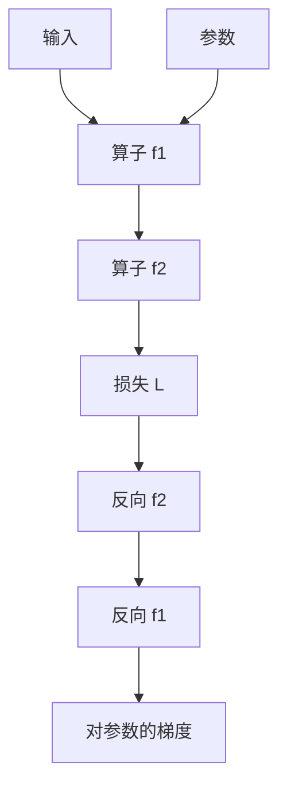

# 链式法则与计算图

复合函数的导数是局部导数的乘积；把每次张量运算记成图上的结点，乘积就沿边反着走。

<footer>—— 据 Rumelhart, Hinton &amp; Williams, Learning Representations by Back-propagating Errors, Nature 1986；Goodfellow et al., Deep Learning, 2016 整理</footer>

[过拟合、权重衰减与早停](/llm/overfit-wd-earlystop)假定我们能得到 $\nabla_\theta L$。本课不重谈 $\lambda$。缺口是：损失是一长串张量运算复合出来的，$L=f_k\circ\cdots\circ f_1$，如何把 $\partial L/\partial\theta$ 写成可执行的局部步骤。方法是计算图：结点是张量，边是算子，正向存下需要的中间量，反向沿拓扑逆序乘局部 Jacobian。下一课才把「一层一行」写成矩阵规则。

## 问题

优化课把 $g=\nabla L$ 当黑盒。前向其实是：输入与参数经过矩阵乘、加法、激活、softmax、取负对数，得到标量。若把整条复合函数当成一个符号公式来手工求导，每改一层就要重推。缺口不是新的优化器，而是一条与层数无关的程序：每个算子只提供「输出对输入的局部导数」，链式法则负责把它们接起来。

多元时「乘积」是 Jacobian 的乘法。形状必须对得上：若 $y=f(x)$，$x\in\mathbb{R}^n$，$y\in\mathbb{R}^m$，局部导数是 $m\times n$ 矩阵。标量损失对 $y$ 的梯度是行向量，右乘这个矩阵得到对 $x$ 的梯度。上一课已经用过一个实例：softmax 接交叉熵的局部结果是 $p-y$，不必物化 $K\times K$ 的 Jacobian。

### 计算图不是流程图里的「再算一遍前向」

反向不是把前向公式对 $\theta$ 重新解释一遍，而是每个结点用自己的局部规则，把上游传来的 $\partial L/\partial\mathrm{out}$ 变成 $\partial L/\partial\mathrm{in}$ 与 $\partial L/\partial\theta$。需要的中间量（例如激活前的 $z$）要在正向时保存，否则局部导数没有代入点。把反向理解成「用数值扰动估梯度」，那是检验手段，不是本课的算法；有限差分的代价随参数量线性涨，图上的反向只随算子数涨。

同一张量被两个算子读，反向要把两条入边的梯度相加。残差稍后正是这种结构：加法结点把上游梯度原样分给两条输入。本课先承认「多父结点要累加」，不提前讲完残差动机。

## 方法

正向：按算子顺序执行，把每个结点的值记在图上。反向：从 $L$ 出发，$\partial L/\partial L=1$，对每个结点 $v$，

$$
\frac{\partial L}{\partial v}=\sum_{w\in\mathrm{children}(v)}\frac{\partial L}{\partial w}\frac{\partial w}{\partial v}.
$$

参数 $\theta$ 是图里没有子结点依赖数据的叶。实现上，每个算子注册 `forward` 与 `backward`；`backward` 吃上游梯度，吐输入梯度。形状规则与[张量、形状与广播](/llm/tensor-shape-broadcast)一致：广播过的轴在反向要做 sum，把展开的梯度收束回原来的 $1$ 维。

## 机制

链式法则把全局导数分解成局部矩阵乘。只要每个算子的局部导数正确，整图正确——这是模块化的来源。错误几乎总是：忘了累加多条入边、忘了把广播的梯度求和、在原地修改了正向还需要的缓冲。数值上，许多局部 Jacobian 并不物化：矩阵乘的反向是两次 GEMM，softmax+CE 是一次减法，ReLU 是一次掩码。后课「一行一层」会把常见层的局部规则列成表。

图还可以被框架拆成正向模式或反向模式自动微分，那是再下一课。本课的默认是反向：从标量 $L$ 回传到许多参数，正好匹配训练。

## 边界

本课不写每一层的矩阵公式，不比较正向 / 反向 AD 的复杂度。下一课[反向传播一行一层](/llm/backprop-layerwise)把线性层与激活的局部规则写出。后课默认：说到「反传」，指沿计算图逆序应用局部导数；梯度形状与参数形状相同。

## 小结

- 复合函数的导数是局部 Jacobian 沿计算图逆序相乘。
- 每个算子只注册局部反向；多父结点的梯度相加。
- 广播在反向要求和收束；中间量需在正向保存。
- 训练走反向模式：一个标量对许多参数。
- 出处：Rumelhart et al., Nature 1986；Goodfellow et al., Deep Learning, 2016。
