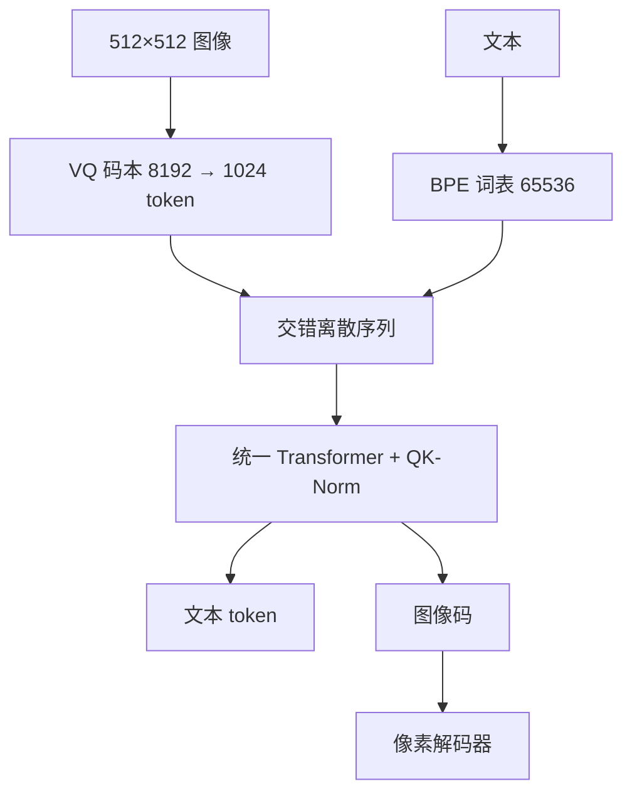

# Chameleon 早期融合

把图像量化成与词同一套离散符号，从第一层自注意力起就在混合序列上做下一 token 预测；早期融合的难点不是概念，而是 softmax 在两种熵差很大的符号上如何不炸。

<footer>—— Chameleon Team，Chameleon: Mixed-Modal Early-Fusion Foundation Models，arXiv:2405.09818</footer>

Meta FAIR 2024 年 5 月的 **Chameleon** 是 7B / 34B 稠密 Transformer：图像经 VQ 码本变成离散 token，与文本 BPE 共享词表，**从零**在混合模态上训因果语言模型。它要既能看图写字，也能在同一条序列里生成图像码，再解码成像素。这与 Flamingo / LLaVA 把连续视觉向量晚接入冻结或微调 LLM 不同，论文称之为 **early-fusion、token-based**。公开权重面向研究、图生图能力因安全未放。本篇按 arXiv:2405.09818 写架构、稳定化与词表，不把后续未写入该报告的产品名倒填进来。

## 问题

晚融合把「理解图像」交给 CLIP 一类编码器，语言模型只读投影后的连续前缀或交叉注意力记忆：生成图像要另接扩散头，交错文档里「写到一半插一张图」不是同一套损失。[交错训练](/llm/interleaved-multimodal) 可以只预测文本；若还要图文混生，图像必须进入与词相同的离散空间，否则解码器没有可采样的图像符号。早期融合的优化问题立刻出现：文本 token 条件熵低、图像码条件熵高，同一 softmax 里两类 logits 尺度打架，深层的注意力与最终词表都容易发散。Llama-2 的预归一化配方在纯文本 2T 上稳，在混合 4.4T 上不够。

第二个问题是码本本身。$512\times 512$ 图编成 **1024** 个离散码（约 $32\times 32$ 网格），码本大小 **8192**，文本 BPE 词表 **65536**（含这 8192 个图像码）。码本弱重建——尤其是图里的字——会给整个模型的 OCR 封顶。论文用授权图像训 tokenizer，人脸过采样约 2 倍，并写明文字重建是核心弱点。

### 统一词表，不是两个模型的加权和

早期融合的操作定义是：任意图文交错序列 $z_{1:n}$ 上

$$
\mathcal{L}=-\sum_t \log p_\theta(z_t\mid z_{<t}),
$$

$z_t$ 既可以是子词也可以是图像码。没有单独的图像交叉层，也没有「先看完图再读字」的路由。Gemini 同期也走原生多模态，但报告写明 Gemini 用**单独的图像解码器**；Chameleon 强调自己是端到端稠密、无路由。不要把两者画成同一张结构图。

公开检查点是研究许可下的「混合输入、文本输出」安全对齐版。论文评测里的图像生成与长文混生，不等于 Hugging Face 上能采样图像码。部署前读卡片，不要假设权重覆盖论文全部生成面。

## 方法

骨干相对 Llama-2：上下文 4K，7B 无 GQA、34B 有 GQA，预训练 **4.4T** token，峰值学习率 $1.0\times 10^{-4}$，AdamW。图像 tokenizer 基于 Gafni 等（2022）的量化器。为压住注意力 softmax 的输入范数，引入 **QK-Norm**：对 $q,k$ 做层归一化再点积。7B 还曾用注意力与 FFN 后 dropout 0.1；34B 额外采用 Swin 式 **norm reordering**，把范数增长限制在 SwiGLU 乘法放大之前，并去掉 dropout。最终 softmax 的配分函数用 **z-loss** $10^{-5}\log^2 Z$ 正则，减轻 logit 漂移。论文消融：无 QK-Norm 时 7B 约在 20% epoch 处发散；QK-Norm 对两档都必要。

### 对齐与评测面

SFT 把提示与回答打包进 4096，对提示掩码损失，学习率 1e-5，dropout 0.05，保留 z-loss。提示中的图用加边框的 resize，避免裁掉信息；生成图像时另有裁切策略，训练与推理的几何要配对。评测覆盖 caption、VQA、纯文本（相对 Llama-2 不掉、34B 在部分常识与数学上可过更大对照）、以及新的长文混合模态人工评测。谱系上接 CM3 / CM3Leon 的离散交错，而不是 CLIP+LLM 适配器。

## 机制

离散化把「生成图像」收成与写词相同的分类问题，交错是序列的自然形态，不必为插图发明一种新注意力。相对性质是双刃：码本的量化误差进入每一层，文字密集的图在重建阶段已经丢了笔画，后面的 Transformer 无法凭空补 OCR。QK-Norm 控制的是注意力内部的尺度，z-loss 控制的是词表 softmax 的 $Z$；两者不是同一层的同一病。34B 上 Swin 序归一化是因为 SwiGLU 的门把隐藏范数乘大，预归一化残差会把爆炸传到更深——这是早期融合放大了本已存在的优化脆性，不是图像模态独有的新定律。

### 和连续视觉前缀、和扩散衔接

LLaVA 式 MLP 投影、Flamingo 式交叉注意，视觉是连续向量，生成图像通常外挂扩散；Emu 预测连续视觉嵌入再交给扩散解码，仍不是共享词表。[Emu](/llm/emu) 与 Chameleon 都做图文混生，前者码是连续的、后者是离散的。离散路线的服务形态是「一个自回归头」；连续路线的服务形态是「语言模型 + 扩散」。不要用「都能出图」把两条账单画等号。

论文把 Gemini 列为最相近的早期融合对照，并明确差异在图像解码是否独立。讨论「原生多模态」时，应分开写：联合训练的数据主张、是否共享离散词表、生成图像是否走同一 LM 头。三件事可以拆开买。

## 边界与工程取舍

4K 窗口装不下多张 1024 码的图再加长文；产品级多图文档不是这篇的设定。OCR 上限在 tokenizer。安全：混生能出图，公开权重砍掉生成侧是政策选择，不是模型突然不会了。研究许可不可当商用 Apache 读。不要把 7B 的 dropout 配方抄到 34B，也不要把 34B 的 Swin 序当成 7B 必需——论文写 7B 在 norm-reorder 后也可以不用 dropout，但 QK-Norm 不能省。

训练稳定性不要只靠降学习率。混合熵下，应先看注意力 logits 范数与最终 $Z$，再决定是否加 QK-Norm / z-loss。推理时图像码的采样温度与文本温度往往不能共用：图像码更需要多样性，文本需要锋利。若只用文本输出的检查点，服务里应拒绝图像码采样接口，以免「论文能画、权重不能画」变成静默乱码。

数据配比未在主文展开成可复现表；不要编造「百分之多少是图」。人脸过采样影响生成分布，理解侧评测若不含人脸占比声明，不要外推到证件照 OCR。长文混生的人工评测是新协议，不能直接换成 COCO CIDEr 排序。

出处：Chameleon Team，*Chameleon: Mixed-Modal Early-Fusion Foundation Models*，arXiv:2405.09818。图像 tokenizer 基于 Gafni 等 2022；交错离散文档谱系见 Aghajanyan 等 CM3 与 Yu 等 CM3Leon。不要给 Chameleon 另编一个 2024 年会议长文号若当时仍是预印本。

## 小结

- Chameleon 用 VQ 图像码与 BPE 共享词表，7B/34B 从零训 4.4T，早期融合自回归图文。
- 稳定化靠 QK-Norm、z-loss，34B 另加 Swin 式归一化顺序；无 QK-Norm 会发散。
- 与晚融合连续视觉、与带独立图像解码器的 Gemini 不是同一张结构。
- 公开权重偏研究与文本输出；OCR 受码本重建限制。
- 出处：Chameleon Team，arXiv:2405.09818。
