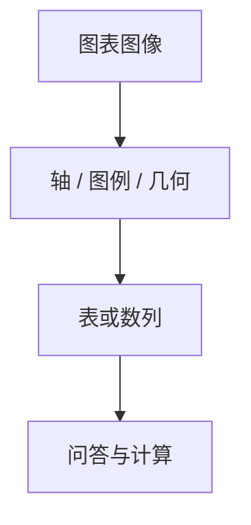

# 图表与表格理解

柱的高度是几何，不是名词。把图当成场景描述，数轴与图例会先死在流畅的错答里。

<footer>—— Masry 等 ChartQA；Liu 等 DePlot；文档侧对照 [OCR 与文档 VLM](/llm/ocr-vlm)</footer>

[上一课](/llm/gui-grounding)读的是控件。[OCR](/llm/ocr-vlm) 读的是字。缺口是把几何量译成数：轴刻度、图例颜色、柱高、单元格行列。后课长视频默认单帧结构已经能读，再加时间维。

## 问题

ChartQA 一类题要看图作答，答案常是数或短短语。失败模式不是「没看见图」，而是：轴范围读错、把装饰当数据、图例颜色绑错系列、表格跨页对错列。强制 squish 的 [ViT](/llm/vit-as-encoder) 会把细刻度糊进同一 patch；[CLIP](/llm/clip) 标题先验会把常见图表故事写出来，与这张图的真实柱高无关。

DePlot 把图表先译成表（plot-to-table），再在表上推理，把视觉识别与算术拆开。端到端 VLM 则要求同一 [投影器](/llm/llava-projector) 前缀同时支撑读刻度与计算。

表可以是图（扫描件）或已解析的 HTML/Markdown。本课管「当图像看的表」。已解析表应走文本，不要浪费视觉 token。

## 方法

分辨率与长宽比优先：宽表用横条切格（[AnyRes](/llm/anyres) 或原生分辨率）。监督要含：转写为 Markdown/CSV、读指定单元格、读轴上的值，而不只是「这是什么图」。算术应允许先抽取数字再算，避免口算与读图绑死。评测：ChartQA 等与纯 OCR、纯表格 QA 分列；检查「数对了但系列绑错」。

## 机制

读图是把像素几何逆映射到数据坐标：柱顶相对原点的比例 × 轴量程。这依赖格子仍分辨刻度线，以及模型把图例颜色当作键去查系列。语言先验提供的是「失业率图通常长这样」，不能提供这张图的读数。

## 边界

抽取对了仍可能算错；算对了也可能看错系列。下一课把画布换成视频：结构问题变成时间采样与记忆。

## 小结

- 图表理解是几何到数字，不是场景描述。
- 先读成表再推理，可把识别与算术解耦。
- 分辨率与长宽比决定刻度是否还在。
- 出处：ChartQA；DePlot。
