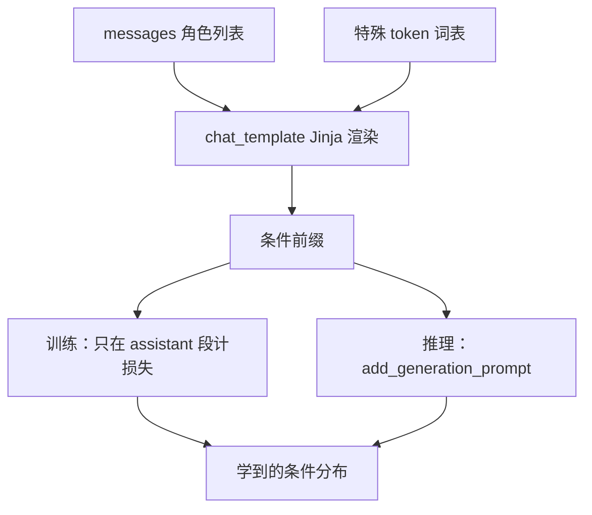

# 指令模板与 chat template

模型并没有在「变傻」；它在按另一套分隔符读角色。训练与推理各用一套 chat template，等于把对齐过的条件分布接到从未见过的前缀上。

<footer>—— 以 Hugging Face 的 chat_template 为工程契约；错误来自格式不一致与标签泄漏，而不是权重突然损坏</footer>

指令微调真正写入模型的，不只是回答内容，还有「谁在说话、话在哪里结束、轮到谁生成」这套离散结构。Hugging Face 把这套结构收成 tokenizer 上的 `chat_template`：一段 Jinja，把 `messages` 里的 `role`/`content` 渲染成特殊 token 与正文。工具调用再加分隔符，标明参数块从哪开始、哪结束。模板错一处，训练时的条件前缀与推理时的条件前缀就不是同一事件，表现是拒答、复读角色标签、能力像退回基座——俗称「模型变傻」。根因几乎总是数据泄漏或格式不一致，而不是学习率没调好。

## 问题

预训练语料是连续文本，没有统一的说话人边界。SFT 必须人为引入边界，否则多轮里模型分不清上一句是用户还是自己。边界一旦引入，就成了条件分布的一部分：模型学的是 $p(\text{assistant}\mid \text{渲染后的前缀})$，不是 $p(\text{assistant}\mid \text{抽象对话})$。渲染规则因此与权重同等级：换规则等于换任务。

特殊 token 若不在词表里，会被拆成普通子词，边界从「单 token 事件」变成「若干片噪声」。若在词表里但训练数据没用它们、推理用了，或反过来，条件前缀同样错位。工具调用的参数 JSON、代码围栏、结束符若训练与推理各写一套，模型会在该输出工具时输出自然语言，或把工具结果当成用户闲聊。问题是工程契约，不是表达力。

### 「变傻」的两种统计来源

第一种是分布偏移：推理模板从未在损失里作为条件出现，模型落到预训练先验，看起来像没微调。第二种是泄漏：训练时把本该掩码的用户段、系统段算进损失，或把答案写进用户字段，模型学会在错误位置抄答案；推理时那些位置是空的，抄袭通道关闭，能力崩溃。两种都表现为「指标掉了」，调试时应先做前缀字符串对照，而不是先加秩。

chat_template 是 tokenizer 的属性，不是模型权重的属性。换一份基座检查点却沿用另一模型的模板，或同一检查点在训练脚本与 <code>pipeline</code> 里各渲染一次，是最常见的错位。

## 方法

对话先做成消息列表：`system` / `user` / `assistant`，工具场景再加 `tool` 或框架约定的角色。调用 `apply_chat_template(messages, add_generation_prompt=True)` 得到推理前缀：在最后一轮用户之后插入「现在轮到 assistant」的起始标记，但不伪造 assistant 正文。训练时对完整对话渲染，`add_generation_prompt` 为假，并只在 assistant（及需要学习的工具参数）位置上计算损失。Hugging Face 的模板语言是 Jinja，负责循环消息、写入特殊 token、处理空系统、是否在句首加 BOS。

特殊 token 必须在 tokenizer 中注册，并与模板字符串里写死的符号一致。Llama 2 风格的 `[INST]`、ChatML 的 `<|im_start|>`、Llama 3 的 header 标记，彼此不能混用。工具调用要有成对分隔：开始、结束、以及把工具结果喂回模型时的角色名。这些符号应在 SFT 数据里以与推理相同的拼法出现，而不是训练用 Markdown 代码块、推理用 XML。

核对方法极土但有效：把训练集里一条样本的渲染结果打印出来，与推理日志里送进模型的前缀逐字符比。差一个空格、差一次 BOS、差一行 generation prompt，都足以让已对齐的模型回到「未对齐但仍会续写」的状态。

## 机制

### 模板如何进入注意力条件

特殊 token 是嵌入表里的独立向量。模型用它们当硬分隔：看到 assistant 起始标记，就把后续位置解释为该说话的角色。因果掩码下，这些标记成为后续所有预测的公共前缀。训练若从未在「标记 A」之后预测过回答，推理却以「标记 A」开头，注意力读到的是一个陌生的键，值方向仍是预训练的。这与换了一种自然语言指令的伤害不同：自然语言至少还在预训练流形上；未注册或未对齐的特殊 token 更接近 OOD 点。

`add_generation_prompt` 控制的是这条公共前缀是否完整。缺了它，模型可能接着用户正文继续写，像在补全用户；多了一次，序列里出现两个连续的 assistant 起始符，训练分布里若没有双标记，同样 OOD。工具分隔把「现在输出的是给程序看的结构」从自然语言里切开；切不开时，模型用散文描述该调用的函数，解析器失败，产品层说「不会用工具」，统计层只是分隔符条件没学到。

损失掩码与模板是一对。模板把角色标出来，掩码决定哪些角色的 token 进入梯度。只改模板不改掩码，会把用户问题也当语言模型目标，模型学会模仿用户；只改掩码不改模板，角色边界在输入里看不见，掩码成了随机位置上的开关。

### 泄漏如何伪装成能力

若清洗不严，用户字段里出现标准答案、或系统字段里出现即将考察的选项，训练损失可以很低：模型在抄已经写在前缀里的字符串。推理时评测集没有这份泄漏，抄袭失败，分数断崖。这常被解释成「过拟合」或「灾难性遗忘」，但检查渲染文本就能看到答案提前出现。另一类泄漏是把测试用模板混进训练，却在评测时用另一套「更干净」的模板，等于训练过的条件被评测丢掉。格式不一致与数据泄漏可以同时发生，需要两条检查：前缀是否相同；答案是否只出现在被监督的 assistant 段。

## 边界与工程取舍

没有一份全球统一的模板。基座发布时带的 `chat_template` 是与它对齐数据绑定的契约；继续 SFT 时应默认沿用，而不是改成自己更喜欢的 ChatML。若必须改模板，应视为新任务：用新模板重渲染全部数据再训，不能把旧模板权重接到新渲染上还指望零成本迁移。多模型路由时，每条请求按该模型的 tokenizer 渲染，禁止共用一个全局字符串格式。

工具调用的 schema、参数键名、失败时是否重试，都属于模板外围的协议。协议变了而模板没变，或反过来，故障同样像能力消失。评估「会不会用工具」要固定分隔符与解析器，否则比的是协议而不是模型。

Alpaca 的 <code>### Instruction</code> 与对话角色模板是不同函数类。用 Alpaca 数据训完却用 chat_template 推理，属于格式不一致；把多轮对话压成单轮 Instruction 字段，属于信息丢失。二者都会「变傻」，修复不同。

### 调试顺序

先打印训练渲染与推理渲染。再确认特殊 token id 在词表中且不会被普通分词切开。再确认损失掩码只覆盖应对齐的角色。再查工具分隔是否成对、是否与解析器一致。最后才动学习率与秩。这条顺序能排除大多数「微调把模型毁了」的误报。真正的灾难性遗忘存在，但它不表现为突然不会用分隔符；分隔符问题优先当模板 bug。

## 小结

- 模型学的是渲染后的前缀上的条件分布；`chat_template` 与权重同为契约。
- Hugging Face 用 Jinja 模板与 `apply_chat_template` 统一训练、推理的角色渲染。
- 特殊 token 必须在词表中且与模板字符串一致；工具调用需要成对分隔。
- `add_generation_prompt` 与损失掩码决定「谁在说话」以及「谁被学习」。
- 训练/推理模板不一致，看起来像能力消失，实为条件前缀 OOD。
- 答案出现在用户或系统字段是泄漏，会造成训练很强、评测很弱。
- 调试先对渲染字符串，再动优化超参。出处：Hugging Face tokenizers 的 chat template 机制；与 InstructGPT、Llama 2 等以固定指令格式做监督的实践一致。
