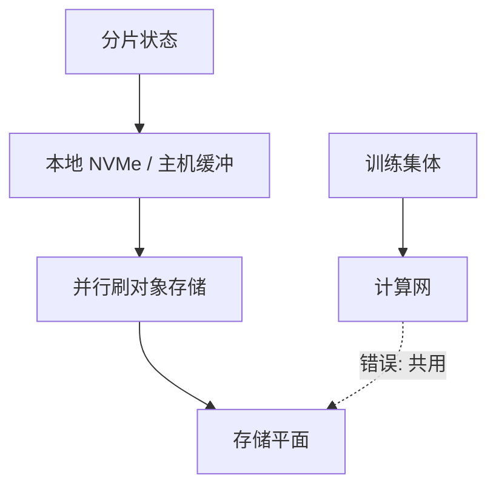

# 检查点 I/O 带宽

一步的集体通信以毫秒计；一次满权重检查点以分钟计。两者若走同一套 NIC，训练曲线上会出现周期性的悬崖。

<footer>—— 对照 PyTorch Distributed Checkpoint 与异步检查点实践；抢网见预训练通信</footer>

[上一课](/llm/parameter-server-contrast) 收束了集合通信对照。本课打开「集群运行」：状态要落盘。缺口不是「要不要存」，而是 **检查点的字节如何打到存储平面而不绑架 step time**。百亿到千亿参数，满检查点是数百 GB 到数 TB（含优化器状态）；同步写会让所有 rank 在屏障上等到最慢的那个 OSD。[预训练通信](/llm/pretrain-comm) 已警告检查点不要与梯度 All-Reduce 抢 InfiniBand；本课把带宽账算清楚。

## 问题

体积粗算：参数 BF16 为 $2P$ 字节，Adam 状态约 $12P$ 量级（FP32 主权重 + 两矩），再加 RNG、调度器。ZeRO 分片让每卡只写 $1/N$，总流量仍是全量——只是扇出到更多 NIC。存储端若是共享文件系统，元数据与锁会把「$N$ 个文件」变成元数据风暴；若是对象存储，吞吐好但一致性与最终可见性要自己做。

频率与故障概率博弈：检查点太稀，故障回滚丢步数；太密，I/O 占墙钟。异步检查点把「拷到主机 / 缓冲」从临界路径拿开，但内存翻倍窗口和「崩溃时缓冲未刷完」要单独设计。问题是：**峰值写入带宽是否小于存储平面与 NIC 的剩余 $\beta$**，剩余是扣掉训练集体之后的。

只存权重、不存优化器，恢复必须重热 Adam，前期 step 会抖。只存一份完整权重（由 rank0 或专门 writer 收集）会把 all-gather 加回临界路径，体积集中在少数 NIC。分片写与集中写是带宽形状不同的两种坏，不是一种绝对更好。

## 方法

分平面：训练集体走计算网，检查点走存储网或至少走不同优先级 / 不同网卡。做不到就错开：在 step 间隙、或累积若干 step 的本地快照再后台上传。

分片写：每 rank 写自己的 ZeRO 片，避免集中。文件系统用少目录、大文件、避免每微批建文件。Distributed Checkpoint 一类格式按张量切，加载时按新并行度重切，比「pickle 整份 state_dict」可扩展。

异步：计算流继续，拷贝流把状态搬到主机或 NVMe，再由主机进程刷远存。要限制并发刷盘，避免自己变成拥塞源。校验和与版本 epoch 必须原子可见，防止读到半份。

加载同样是带宽问题：作业启动、$N$ 卡同时读全量，存储端 incast。错开 rank 的读、或从最近的本地缓存重建，比所有人打同一目录更重要。弹性恢复还要把并行度变化考虑进去——这是格式问题，不是多买磁盘。

## 机制

检查点 I/O 的 $\alpha$–$\beta$ 里，$\alpha$ 往往是元数据与开放连接，$n$ 是 TB 级。并行度太高时，$\alpha$ 项（百万小文件）可以超过 $\beta$ 项。这与集体通信相反：集体怕小 $n$，检查点怕碎文件。工程上把张量聚成大 blob 正是为了把检查点拉进 $\beta$ 区。

与 [NVLink](/llm/nvlink) 的关系：域内可以先把分片收成每节点一份再写盘，减少并发 writer，但会占用 NVLink 与主机带宽。超节点上「像一块 GPU」并不自动给你一块共享盘；托盘级 NVMe 仍然是分片。

静默损坏（后课 GPU 故障）会让检查点变成「坏状态的永久化」。写路径要校验；读路径要能丢弃一份坏快照回退到上一 epoch。I/O 带宽再高，坏快照也只是更快地写错。

## 边界与工程取舍

不要每 step 写满优化器到共享盘。不要用同一条 400 Gb/s 网卡同时打满 All-Reduce 与检查点而不做 QoS。不要假设云盘的「吞吐上限」是单流数字——集体式 $N$ 路同写有自己的上限。推理服务的权重加载与训练检查点相关但更简单：通常只读一份权重、无 Adam，仍要防启动风暴。

下一课数据集流式加载是另一条持续的存储流量，和检查点的突发流量叠加时更要分平面。

## 小结

- 检查点体积含优化器时远大于参数；总流量不因 ZeRO 分片而消失。
- 计算网与存储平面分离，或至少错开峰值。
- 大 blob 分片写，避免元数据风暴；异步把刷盘移出 step 屏障。
- 加载是反向 incast，要错开或本地缓存。
- 出处：PyTorch Distributed Checkpoint 一类实践；集群侧分平面见预训练通信。
