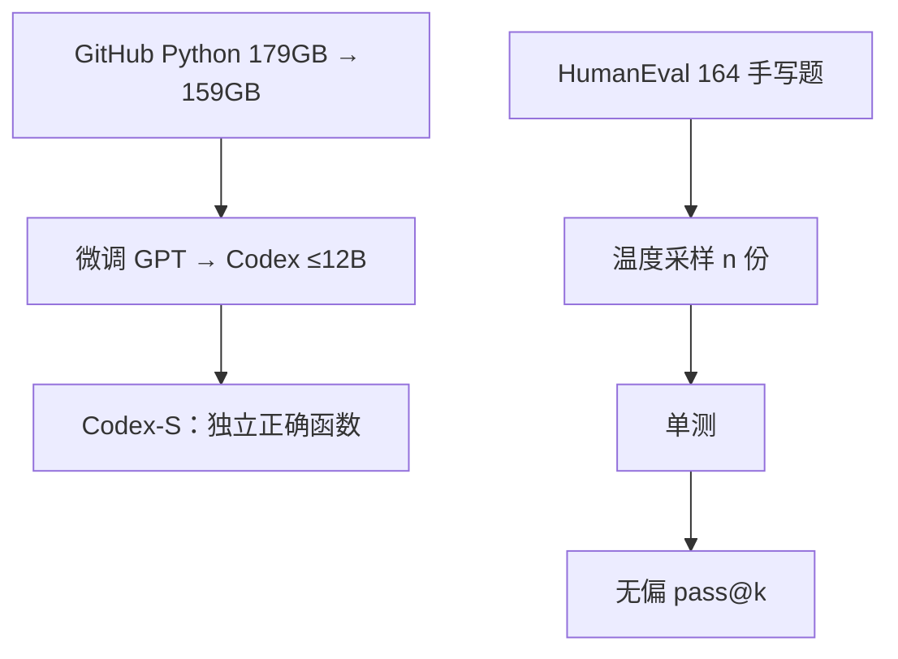

# Codex 论文

不要用 BLEU 衡量写代码：从文档字符串合成的函数对就对、错就错；pass@k 估计的是 $k$ 次采样里至少一次通过单测的概率，而不是某一次贪心解码的漂亮程度。

<footer>—— Chen 等，Evaluating Large Language Models Trained on Code，arXiv:2107.03374</footer>

OpenAI 2021 年这篇把 GPT 式解码器在公开 GitHub Python 上微调，得到最多 **12B** 的 **Codex**，并放出 **HumanEval**：164 道手写 Python 题，用单测判对错。它是 GitHub Copilot 背后被引用最多的技术锚，但论文自己评估的是「独立函数合成」，不是仓库级代理。本篇按 arXiv:2107.03374 写数据、pass@k 与 HumanEval；不把 2025–2026 产品名 Codex 倒填进 12B，也不把 [AlphaCode](/llm/alphacode) 的百万采样竞赛管线写成 Chen 等人的贡献。

## 问题

2021 年代码生成评测仍常走 BLEU / 精确匹配：参考实现只有一种表面形式，等价程序被判错；GPT-3 12B 在他们的函数合成集上几乎为 0，说明「会英语」不等于「会过单测」。需要一个**手写、尽量未出现在 GitHub** 的题目集，以及一个承认「可以多试几次」的度量——因为程序员本来就会跑测例、换一版。

第二个问题是数据。从 GitHub 收 Python：先得到约 **179 GB** 唯一文件，过滤后约 **159 GB**。微调目标仍是下一 token，没有竞赛级执行反馈。模型会抄训练里见过的片段、会写出看起来对却不过测的代码，也会在安全与授权上出问题。论文要把能力边界和这些风险写在同一份报告里。

### HumanEval 不是竞赛全库

164 题覆盖语言理解、简单算法与数学，提供函数签名、文档字符串与若干单测。模型补全函数体，沙箱跑测。题目手写是为了降低「训练集里有原题」的污染；不保证后续年份的爬虫不会把 HumanEval 本身爬回去——那是后代论文的污染故事，不是 2021 年的设定。

论文主数字是 Codex-12B：pass@1 **28.8%**（正文亦写 28.81%），pass@100 约 **72.3%**；摘要保守写 100 样本解开约 70.2%。Codex-S 在独立正确函数上再微调，pass@1 **37.7%**。温度 0.8 的 100 样本里，按均 log 概率挑一个到 44.5%，按单测挑到 77.5%。引用必须带 $k$ 与是否 Codex-S。

## 方法

从 GPT 检查点（300M 至 12B）在过滤后的 GitHub Python 上微调。对照：GPT-3 近 0，GPT-J-6B pass@1 **11.4%**，TabNine **2.6%**。规模曲线：Codex-300M 已 **13.2%** pass@1，2.5B **21.4%**，12B **28.8%**。采样多候选是一等方法，不是评测附录：同一 12B，1 次与 100 次之间的鸿沟大于再加一点参数。

无偏 pass@k：每题抽 $n$ 个样本，其中 $c$ 个通过，

$$
\mathrm{pass@}k=\mathbb{E}\left[1-\frac{\binom{n-c}{k}}{\binom{n}{k}}\right].
$$

直接用「$k$ 次里是否出现至少一次成功」的朴素频率，在 $n$ 不够大时偏高；该公式是组合无偏估计。实现上 $n>k$，例如用 200 样本估 pass@100。

### 功能正确对表面匹配

BLEU 与 Codex 的功能正确排序可以打架：抄近参考文本的错误程序可能 BLEU 高，结构不同但过测的程序 BLEU 低。论文以此拒绝把翻译度量当代码主榜。Codex-S 把分布从「仓库里的任意文件」拉向「独立、正确的函数」，更贴近 HumanEval 的题型，故 pass@1 涨；这不是更大的预训练，是评测任务上的继续训。

## 机制

代码微调改变的是 token 分布：标识符、缩进、API 共现进入同一因果链，文档字符串里的自然语言成为函数体的前缀条件。GPT-3 缺这段分布，所以 12B 文本模型在 HumanEval 上近乎零，不是「不够聪明」。pass@k 的机制是搜索：温度拉高后正确程序以低概率出现，单测当验证器把搜索变成可用系统。这已经是 Copilot 式「多建议、人来选」以及后来 AlphaCode「百万采样再过滤」的雏形，只是 $k$ 还停在 100、题目还停在单文件函数。

文档到代码不是软件工程：没有仓库上下文、没有需求变更、没有失败测例回流训练。论文用 APPS 等更难集与定性例子说明：链式运算、边界条件、算法题仍脆。安全一章写恶意代码与敏感信息，授权一章写训练数据版权——这些不是附录客套，是把「能过单测」和「能上生产」切开。

### 和 AlphaCode、和后来的开源代码模型

AlphaCode 把采样预算拉到百万、用竞赛平台当战场，编码器–解码器吃题面。Codex 论文是解码器微调 + HumanEval 方法论。[StarCoder](/llm/starcoder) / [DeepSeek-Coder](/llm/deepseek-coder) 把 FIM、多语言与许可数据做成开源配方，主榜仍常报 HumanEval pass@1，口径来自这篇。不要把 Copilot 产品的补全延迟写成 12B 的 HumanEval 曲线。

选样规则会改叙事：随机 100 次里「存在正确」是 pass@100；用单测挑最好是「验证器在环」，数字 77.5% 不可当成用户只看一条建议时的成功率。

## 边界与工程取舍

HumanEval 饱和后不再能代表仓库任务。无偏公式要求 $n$ 足够且样本独立，核采样或去重会破坏假设。159 GB Python 不含「当时不在 GitHub 的私有风格」；语言偏 Python，C++ 竞赛不是这篇的主表。沙箱执行有资源与逃逸风险，评测基础设施是结果的一部分。不要伪造 Codex 的层表或 token 量——论文没给 Llama 式配置卡。

生产补全要把温度、候选数、停止符当配置：IDE 里 $k=1$ 的体验接近 greedy pass@1，不是论文图上的 pass@100。安全扫描不能因为「过了 HumanEval」而省。版权：输出可能复述训练片段，论文讨论过 memorization。后续 InstructGPT / ChatGPT 的代码能力是另一套对齐，不是 12B Codex 检查点的连续编号。HumanEval 的文档字符串本身是提示工程：换一种 docstring 风格，同一 12B 的 pass@1 会抖。把它当唯一门禁，会选出「会填这 164 种题面」的模型，而不是会读你们仓库注释的模型。温度 0.8 是论文出曲线的设定，不是 IDE 默认；补全产品通常更贪心，数字应另测。

出处：Chen 等，*Evaluating Large Language Models Trained on Code*，arXiv:2107.03374。作者含 Mark Chen、Jerry Tworek、Heewoo Jun 等。HumanEval 数据与 pass@k 估计以该 PDF 为准，不要用后来排行榜的改写提示词倒推 2021 年的 28.8%。

## 小结

- Codex 是 GPT 在过滤后 GitHub Python 上微调到 12B 的代码模型；HumanEval 164 题用单测定义正确。
- 主度量是无偏 pass@k：12B 约 28.8% @1、约 72% @100；Codex-S 到 37.7% @1。
- BLEU 不能当代码主榜；多候选加执行是能力的一部分。
- 评估的是函数合成，不是竞赛排名，也不是 2026 年的同名产品。
- 出处：Chen 等，arXiv:2107.03374。
