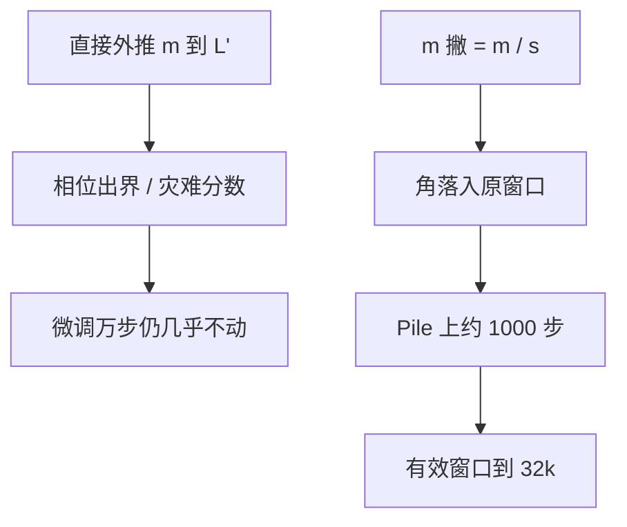

# Position Interpolation

    
不要把位置下标外推到训练从未见过的整数上；把它们线性压回原窗口，插值比外推稳定约六百倍。

    <footer>—— Chen、Wong、Chen、Tian，Extending Context Window of Large Language Models via Position Interpolation，2023</footer>

2023 年 6 月，Meta 的 Shouyuan Chen、Sherman Wong、Liangjian Chen 与 Yuandong Tian 发表 Position Interpolation（PI）：把 RoPE 模型的位置下标按比例映回预训练窗口，再在目标长度上做大约一千步微调，即可把 LLaMA 从 2048 拉到 32768。论文同时给出注意力分数上界的比较——在 LLaMA 7B 设定下，插值上界大约比外推小 600 倍——用来解释为什么「直接把下标写到 4096」微调一万步也几乎不动有效窗口，而插值一千步就能用。本篇按这篇原文写：问题是 RoPE 外推的灾难值，方法是线性下标压缩加短微调，评测是 passkey、语言建模与长摘要。失败谱与后续补丁见[位置插值与外推失败模式](/llm/position-extrapolation)；频率分段见 [YaRN](/llm/yarn)。

## 问题

LLaMA 一类 RoPE 模型在预训练时只见过 $m\in[0,L)$。应用侧要把对话、文档、规划轨迹一次塞进窗口，长度经常超过 2048。从零按 $L'$ 预训练太贵。最朴素的补丁是：保持 $\theta_j$ 不变，直接把位置写到 $L'-1$，在更长序列上继续语言建模。论文的对照实验表明这条路极慢：微调超过一万个 batch 之后，有效窗口只从 2048 挪到大约 2560。模型并不是「不会语言」，而是位置通道给出了训练分布外的旋转角，注意力分数出现灾难性的大值，softmax 被个别位置霸占，梯度很难把几何拉回来。

ALiBi、LeX 这类「训短测长」方案在自己的位置编码上成立，但不能 retroactively 接到已经用 RoPE 训完的 LLaMA 上。问题因此收窄为：在不改架构、不换优化栈的前提下，如何让已有 RoPE 权重看见更长输入，并且微调成本相对预训练可以忽略。

### 外推给出灾难值，插值给出中间角

RoPE 把位置 $m$ 写成复平面上的 $e^{im\theta_j}$。外推时 $m\ge L$，某些频率的相位走出预训练见过的弧，点积不再是「相对 $k$ 步」的平滑函数。插值走相反方向：需要 $L'$ 个位置，却只使用 $[0,L)$ 里的实数坐标，相邻整数之间的旋转角由 RoPE 的连续性给出。神经网络在训练支撑集内部插值，通常比在支撑集外外推稳定——PI 把这条常识写成位置通道上的操作。

并发的 kaiokendev SuperHOT 博客也独立用线性插值把窗口从 2k 拉到 8k，开源侧随后用 LoRA 复现。Chen 等人的贡献是把全参微调做到 65B、把目标长度做到 32k，并给出插值与外推注意力上界的理论比较，而不是只发一条经验菜谱。

## 方法

设原窗口 $L$、目标窗口 $L'$、尺度 $s=L'/L$。位置插值把输入下标换成

$$
m' = m \cdot \frac{L}{L'} = \frac{m}{s}.
$$

最大下标 $L'-1$ 落回约 $L$ 的原区间。RoPE 允许非整数位置：$\cos(m'\theta_j)$ 对实数 $m'$ 有定义，于是「多出来的 token」占用的是原先相邻整数之间的角，而不是 $L$ 以外的新整数。查询与键仍用同一套 $m'$，相对位移变成 $\Delta/s$，所有频率一起被压慢。

微调在 Pile 上做，步数约一千，序列长度等于目标窗口。论文强调：几何一旦落回支撑集，适应被压慢的频谱比重新学习语言便宜几个数量级。架构不变，FlashAttention、张量并行、已有推理栈都可以复用，只要 RoPE 的输入位置统一乘 $L/L'$。

### 从 7B 到 65B，从 2k 到 32k

实验覆盖 LLaMA 7B、13B、33B、65B，目标长度包括 8192、16384、32768。passkey retrieval 用来证明模型真的在用新窗口，而不是只靠局部流畅把困惑度刷低。语言建模上，困惑度随窗口增大而下降，说明加长的上下文被用上了。长文档摘要作为下游任务。原 2048 窗口内的标准基准只有小幅掉点，论文称之为「相对好地保住短窗质量」，不是零损失。

不插值、只加长序列的对照，是方法成立的关键负例：同样的数据与优化器，外推坐标让有效窗口几乎不涨。PI 不是「多训一会儿」，而是换了一种位置几何之后，短微调才有意义。

## 机制

### 注意力上界：插值为什么比外推稳

论文把 RoPE 注意力写成相对位移的函数，再分别给插值与外推的分数一个上界。外推时某些 $\Delta$ 对应的旋转可能让查询与键异常对齐，分数可以极大；插值把所有 $\Delta$ 按 $s$ 缩小，分数被压在预训练见过的量级附近。LLaMA 7B 设定下，插值上界大约是外推上界的 $1/600$。这个数字不是「效果好 600 倍」，而是「优化时遇到的最坏分数小两个数量级」，用来解释为什么插值微调收敛、外推微调不收敛。

高频维被同一比例压缩，是机制里的已知代价：邻域差变小，「差一个 token」更难分辨。一千步微调可以让投影改用剩下的带宽做局部区分，但不能把被线性映掉的频谱凭空找回来。这就是后续 NTK-aware 与 YaRN 要分段处理频率的起点；PI 原文选择的是最简单的全局仿射，换收敛与实现简单。

上界比较依赖 RoPE 的三角形式，不能套到 ALiBi 的线性偏置上。PI 是 RoPE 与可插值坐标的方法；换位置编码等于换定理假设。

## 边界与工程取舍

$s$ 不能任意大。压缩比过高时，微调也无法从低频里挤出足够的局部分辨率，passkey 会在某个长度之后掉下来。论文做到 16 倍（2k→32k）是实证范围，不是物理极限。多阶段拉长——先 8k 再 16k——往往比一次 $s=16$ 更稳，但原文主表是直接扩到目标长度。

KV 缓存必须与 $m'$ 一致。若缓存按真实 $p$ 旋转、注意力按 $p/s$ 旋转，相对位置全错。实现上应在 RoPE 入口统一缩放，而不是只改部分层。短窗基准的轻微掉点说明：插值加长窗微调会轻微牺牲原分布；若产品仍以 2k 对话为主，需要在短数据上再对齐，或接受这一税。

PI 不降低二次注意力，也不增加记忆模块。32k 的代价是 32k 的 KV 与 prefill。它解决的是位置 OOD，不是显存。后续 Dual Chunk、Beacon、Landmark 处理的是另一轴。

### 不要把「能跑 32k」写成「会长推理」

passkey 证明针还在；摘要证明有一些文档级信号。多跳、全书问答、需要精确相对偏移的复制，PI 原文没有当成主表。坐标变换不可逆：被压掉的高频带宽回不来。评测应同时看目标长度上的困惑度曲线、针测，以及原窗口基准，避免只报最大可解码长度。

## 小结

- Position Interpolation 把 RoPE 下标按 $L/L'$ 线性压回原窗口，用插值代替外推。
- 理论比较：插值注意力上界远小于外推（LLaMA 7B 设定约 600 倍），解释短微调为何可行。
- 实证：LLaMA 7B–65B，约 1000 步 Pile 微调，窗口做到 32768；不插值则万步也几乎不涨有效长度。
- 架构不变，推理栈可复用；代价是全局压慢高频、短窗略掉点、计算仍二次。
- 后续 NTK-aware、YaRN、LongRoPE 都把 PI 当成全局仿射这一基线再分段或搜索。
- 出处：Chen、Wong、Chen、Tian，*Extending Context Window of Large Language Models via Position Interpolation*，arXiv:2306.15595，2023。对照 Su 等 RoPE（2021）、kaiokendev SuperHOT（2023）与 Peng 等 YaRN（2023）。
