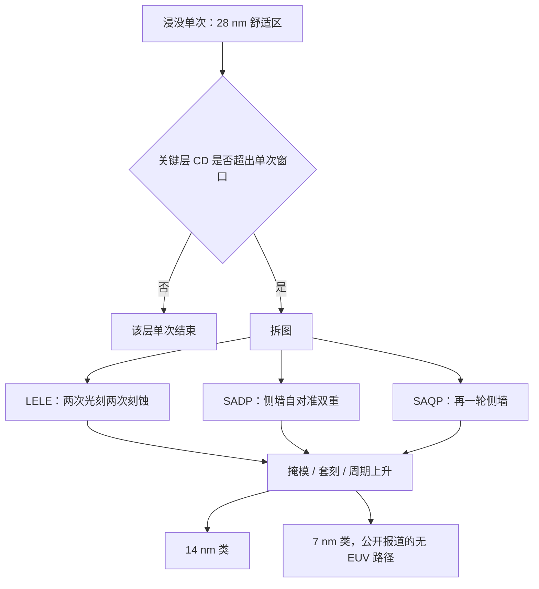

# 国产 DUV 多重曝光

波长与数值孔径已经用尽时，把一层图形拆成两次或四次曝光，用套刻精度去换半节距；浸没机不必变成 EUV，产线却要为每一次额外的掩模付周期与缺陷。

<footer>—— 对照 LELE、SADP、SAQP 的公开工艺，以及中芯国际用浸没多重图形化做出 7 nm 级产品的公开报道</footer>

多重曝光（multiple patterning）不引入新的光源。它假定你已经有一台套刻足够好的 193 nm 浸没扫描仪，然后把设计规则里密到单次成像装不下的那一层，拆成两次光刻加刻蚀（LELE）、或一次光刻加侧墙自对准双重/四重（SADP / SAQP）。半节距可以往 14 nm、再往 7 nm 一类节点推——台积电在 EUV 量产前、以及公开报道中中芯国际在没有 EUV 的条件下，走的都是这条路。国产浸没若停在 [28 nm 单次](/llm/china-immersion-duv)，多重曝光就是把同一类机器往更先进节点推的唯一光学手段。它补的是 $k_1$ 用尽之后的几何，代价是掩模次数、套刻预算、沉积/刻蚀均匀性与晶圆成本一起上升；EUV 要解决的正是不想付这笔税。

## 问题

瑞利公式在浸没 NA ≈ 1.35、$\lambda = 193\,\mathrm{nm}$ 时，量产 $k_1$ 大约给到三十多纳米的半节距量级。28 nm 节点的许多层还能单次；14 nm FinFET 的鳍片与部分金属，7 nm 的关键间距，单次窗口会关死。选项只有三个：换更短波长（EUV，被许可卡住，见 [EUV 出口管制](/llm/euv-export-control)）；换更高 NA（仍是 EUV 的高 NA，更稀）；或把一层变成多层图形的布尔组合。第三项不需要新波长，但需要：扫描仪套刻进入数纳米且稳定；刻蚀与薄膜把「侧墙宽度」做成新的 CD 定义；电子束掩模与 OPC 把拆图后的两套、四套版做准。

没有多重曝光，国产浸没的天花板就是单次节点。有多重曝光，天花板变成「套刻与成本还能不能扛」。公开报道里，华为麒麟 9000S 一类芯片被业界用拆片与工艺分析归到中芯国际的 7 nm 级浸没多重图形化，而不是 EUV。这证明路径物理上通，也证明它贵、慢、难扩产——否则不会在 EUV 工厂里被当成过渡而不是终点。

### 拆图方式不是一种

LELE（litho-etch-litho-etch）把密线拆成两套较疏的图形，两次光刻之间做一次刻蚀。分辨率按大约一半来，但两次曝光的套刻误差会直接变成线宽或间距的偏差，对套刻最苛刻。SADP（self-aligned double patterning）先做较疏的芯轴，再沉积侧墙、去掉芯轴，CD 由薄膜厚度定义，套刻压力转到芯轴放置与切线（cut）层。SAQP 再做一轮侧墙，把密度再翻一倍，鳍片层常用这一套。还有 LELELE 三次光刻。选哪一种，看这一层是要线密度、孔密度还是切线灵活性，不是「多重」这个词可以混用的。

多重曝光增加的是光刻与配套薄膜/刻蚀的次数，不是把 193 nm 变成 96 nm 光。等效波长这种说法是媒体简化。物理波长不变，空间频率靠图形叠加或侧墙获得。

## 方法

要把国产 DUV 往更先进节点推，方法是把浸没机当成多重图形化产线的曝光站，而不是当成 EUV 的替代品。产线配方至少包含：

扫描仪：套刻专机或经过匹配的浸没机，匹配套刻（machine-to-machine overlay）往往比单机套刻更难——先进节点扩产意味着多台机器对同一套层。国产浸没若只有样机级套刻，多重曝光会先在匹配套刻上死掉。剂量与焦点必须稳，因为侧墙对芯轴 CD 敏感。

配套设备：PECVD / ALD 做侧墙材料，刻蚀机做芯轴剥离与切线，清洗与量测（CD-SEM、套刻量测、缺陷检测）次数按图形化倍数增加。光刻机国产化若不同步这些站，7 nm 级流程仍然绑在进口刻蚀与薄膜上。计算光刻要把设计拆成两套或四套掩模，OPC 与拆图软件本身也是管制与替代对象。

工艺集成的方法是分层决策。接触孔与部分金属用 LELE 或三重，因为孔的二维图形不适合纯侧墙。鳍片与密集栅极用 SADP/SAQP。切线层用相对稀疏的单次或双重去「剪断」自对准出来的长线。每一层选错图形化策略，不是 CD 差一点，而是根本做不出连通性。EUV 的优势是其中许多层可以回到单次，减少这张决策表。

### 套刻预算要先于「能做 7 nm」的标题

设单次套刻误差为 $\sigma$，LELE 的关键间距会对 $2\sigma$ 量级敏感。自对准双重把最密间距交给薄膜，但切线层对鳍片的套刻仍在。先进节点通常要求套刻是 CD 的一个小分数。国产浸没报道里的 2–3 nm 套刻，若是单机最佳值，用于 SAQP 的切线是否够，要看量产分布与层间匹配，不能用样机海报去规划 7 nm 产能。公开的中芯 7 nm 级产品，用的是已经装在厂里、许可年代更早的 ASML 浸没机，不是国产机刚刚打平 NXT 的证据。

## 机制

几何机制：单次光刻能成像的最小周期是光学截止与工艺窗口共同决定的。LELE 把周期约为两倍的两套图形嵌套，合成周期减半，条件是两套之间的位移误差足够小。SADP 的机制是薄膜共形：芯轴间距的一半加上侧墙厚度决定新节距，对齐精度由沉积均匀性而不是第二次光刻对准来保证，所以它对扫描仪套刻的依赖从「两次曝光相对位置」转到「第一次曝光加切线」。SAQP 重复这一操作，均匀性误差也会被放大一轮。

成本机制是几乎线性的次数税。一层从单次变成四重，光刻机台时间、掩模、胶、刻蚀、量测都乘上去，产线瓶颈可能从曝光变成刻蚀或量测。这也是为何同样「7 nm」，EUV 工厂与纯 DUV 工厂的晶圆成本、周期、良率不可比。管制卡住 EUV 之后，多重曝光能让产品出现，但扩产斜率被浸没机台数量、许可（高端机增量）和配套设备一起掐住。

自对准不是免费的套刻。切线、块状图形（block）和通孔仍要光刻对准到侧墙网格上。宣传「SAQP 不需要套刻」只说对了一半。

缺陷机制：每加一次刻蚀与沉积，就多一次颗粒、残留与薄膜缺陷的机会。多重曝光的良率模型必须按步骤乘，而不是按产品节点名估一个数。这与 [Chiplet 封装](/llm/chiplet-packaging) 的逻辑相似——系统级可以拼面积，晶圆级每一步仍在付缺陷税。

## 边界与工程取舍

多重曝光可以把国产（或已进口的）浸没 DUV 推向 14/7 nm 类产品，推不到 EUV 为 5/3 nm 准备的那套层数与密度经济性。高 NA EUV 更是另一张表。把麒麟一类拆片结论写成「光刻已经不受管制影响」，忽略了：那是存量浸没机 + 多重曝光 + 有限产能，不是可以按年百台扫描仪去复制的路线。荷兰对 NXT:2000i 及更新机型的许可，公开目的就是限制这条路的**增量**。

国产浸没机若尚未在 28 nm 单次上交出可匹配的套刻与产率，谈国产机做 SAQP 是跳级。正确顺序仍是：单次 28 nm → 双重 14 nm 类 → 有限的 7 nm 类，每一步把配套刻蚀与量测绑上。软件上的拆图与 OPC 若仍用进口计算光刻，先进节点的设计规则发布会卡在工具链，而不只是曝光机。

节点名在营销里可以跳跃，在光刻里不能。没有 EUV 的「5 nm」若只是设计规则微调或金属层减薄，不要自动写成 SAQP 已经再翻一倍。

取舍是钱与时间。对必须出货的先进逻辑，多重曝光是今天唯一公开可行的无 EUV 路径。对成熟制程大扩产，28 nm 单次更划算，不必为所有产品付四重税。对训练加速器，还可以把一部分系统复杂度丢给封装，减少对最密逻辑面积的需求。三条要分开记账。

### 计算光刻与拆图是多重曝光的另一半

LELE 要把设计多边形拆成两套互不违规的掩模，SAQP 要把切线层对齐到侧墙网格能剪断的位置。这是计算光刻与设计规则协同，不是曝光机面板上的一个倍数开关。OPC、拆图、光源掩模优化若仍绑在进口软件上，国产浸没机即使套刻够，先进节点的版图也出不了。把「多重曝光」只写成光刻机次数，会漏掉这一半工具链；许可同样可以打在这类软件上。

## 小结

- 多重曝光用多次光刻或侧墙自对准，在 193 nm 浸没上换取更小半节距，不改变波长。
- LELE 吃套刻，SADP/SAQP 吃薄膜均匀性与切线层；层类型决定策略。
- 公开的无 EUV 7 nm 级产品走的是存量浸没机加多重图形化，证明路径通、扩产贵。
- 国产浸没必须先把单次套刻与匹配套刻做稳，才能把机器当作多重曝光平台。
- 高端浸没机的许可限制的是这条路径的增量，不是否认存量上已经做出过产品。
- 它不替代 EUV，只把先进逻辑的成本曲线抬高并变陡。
- 出处：多重图形化的标准工艺文献；台积电引入 EUV 前的公开技术路线；关于中芯国际 7 nm 级浸没产品的公开拆片与新闻报道。
