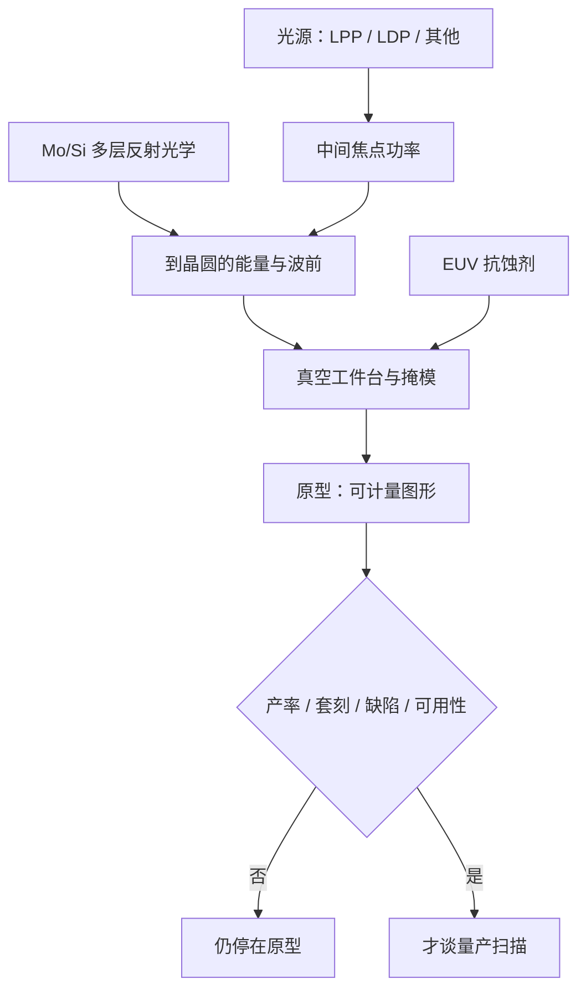

# 国产 EUV 原型

能在实验室里看到 13.5 nm 光，与能在真空里按每小时百片去扫描、套刻并出良率，中间隔着光源功率、多层反射光学和整机集成；公开报道把国产 EUV 停在原型，瓶颈也正好是这几段。

<footer>—— 对照 ASML 从原型到量产的公开时间线，以及路透社等对国产样机「尚未做出工作芯片」的报道</footer>

极紫外光刻把照明波长收到 13.5 nm，空气与常规透射玻璃都变成不透明，光路必须全反射、全真空。量产机还要求光源在晶圆处的功率高到能撑起每小时百片以上的产率、投影光学的波前与反射率足够、工件台在真空里做到浸没机同级或更紧的套刻。ASML 公开说过：从内部原型到与 IMEC 等伙伴的样机，再到 2018–2019 年前后进入高容量制造，用了约二十年量级的时间。国产 EUV 在公开报道里出现的是**样机或原型**：有实验室级或厂房级的集成尝试，光源与光学有分头的研究所进度，但没有可对照 NXE 的量产交付，也没有「已经用国产 EUV 扫出工作芯片」的可核实产品。本篇按公开物理与公开报道写瓶颈，不补充任何未公开的功率数字、图纸或时间表承诺。

## 问题

[EUV 出口管制](/llm/euv-export-control) 把量产扫描仪挡在许可之外，先进逻辑若不想永远付 [多重曝光](/llm/china-duv-multipattern) 的税，就只能自己做 13.5 nm 这一档。问题是 EUV 不是「把 193 nm 镜头镀一层膜、换个灯泡」。三个子系统各自曾经是全球性瓶颈，现在对国产仍是：

光源：工业方案是激光打锡滴的激光等离子体（LPP），把红外激光的能量转成 13.5 nm，再经收集镜送进照明。转换效率低，要千瓦级驱动才能在中间焦点得到上百瓦、并在量产机上继续往更高瓦数走。放电等离子体（LDP）等高次谐波（HHG）是公开文献里的其他路线，量产扫描仪并没有用它们替代 LPP。功率不够，剂量就不够，扫描必须变慢，产率从「工厂」退回「实验室曝光」。

光学：13.5 nm 只能用钼/硅多层膜反射镜，每面反射率理论上限大约七成出头，系统里多面镜子连乘之后，到晶圆的能量所剩无几。面形、中频粗糙度、多层周期与污染（锡、碳）任何一项不达标，对比度与杂散光都会毁图形。量产投影光学在公开供应链里与蔡司深度绑定。没有同等的反射光学，光源再亮也成不了扫描仪。

整机：真空、掩模缺陷（无保护膜或极苛刻的 pellicle）、氢环境清洁、双工件台、计算光刻与光源的剂量控制，必须集成。ASML 的公开故事是：很早就有光，很晚才有能卖给晶圆厂的产率。原型的定义应当是「光路闭环、能在抗蚀剂上留下可计量的图形」；量产的定义是「产率、套刻、缺陷、可用性达到成本模型」。把前者写成后者，是类别错误。

### 公开报道怎么写、怎么读

2025 年底路透社等报道称，有团队在深圳等地集成了 EUV 原型，体量远大于商业机，由有海外工具厂背景的工程师参与，处于测试、**尚未产出工作芯片**；官方或内部把做出芯片的目标放到数年后，报道中的知情者也认为更晚更现实。同期公开评述把光源路线对应到哈尔滨工业大学等处的 LDP、中科院体系的 LPP、以及其他 HHG 尝试，光学则提到长春光机所一类研究所的多层膜镜子。这些是新闻与智库综述，不是晶圆厂验收报告。读法应当是：存在认真的原型级努力；量产所需的功率、光学与集成仍被同一批报道称为未闭合。不要把「有原型」译成「2028 年必然出货」，也不要译成「完全没有 EUV 研究」。

ASML 自己的时间线是公开的对照：2000 年代初内部原型，2006 年前后研究机进入合作晶圆厂，2010 年代后半才谈高容量。压缩到「几年赶上」需要假设光源与光学的工业基础已经存在；公开的国产基础仍是分头的研究所与样机，不是第二条蔡司+Cymer 供应链。

## 方法

国产路径在公开层面是分系统并行，再试图整机集成，而不是先买一台 NXE 再仿。光源上，LPP 要对齐锡滴发生、驱动激光、收集镜与碎片抑制；LDP 用放电产生等离子体，系统形貌不同，收集与稳定性是另一套工程。HHG 适合计量或小功率实验，不是已知的高容量扫描方案。光学上，要做出满足面形与反射率的多层镜，再装成照明与投影镜组，并在真空里维持清洁。抗蚀剂上，EUV 胶的金属杂质与灵敏度要求与 DUV 不是同一代化学，公开评述仍把胶视为短板之一，见 [光刻供应链](/llm/china-litho-supply-chain)。

整机方法必须包括：在抗蚀剂上做剂量与分辨率试片；用计量工具而不是手机拍照来报 CD；再谈套刻与扫描。没有这套计量，原型只是真空腔里的发光装置。晶圆厂导入还要备件、可用性（uptime）与工艺窗口，这些是 ASML 用装机基数堆出来的，不是图纸齐了就有。

与 DUV 的方法差异：浸没机可以在空气中、用透射镜头；EUV 每加一面镜子就乘一次反射率，光源功率的需求被光学链放大。所以「国产 DUV 有进展」几乎不自动外推到 EUV——透射浸没物镜与多层反射镜不是同一门工艺。

### 瓶颈为什么是光学与光源，而不是「再写一套控制软件」

控制、对准算法、工件台，国产在 DUV 上已经要还债，但 EUV 特有的、且全球曾经卡死过的，是 13.5 nm 的产生与搬运。软件不能把 50 W 变成 200 W，也不能把 60% 的镜面反射率变成 70% 再连乘。公开报道把国产光源功率写得低于商业机常用的中间焦点功率、把镜子反射率写得低于蔡司量产镜，这类数字来自二手综述，本篇不把它们当作实验室合格证，只取其方向：功率与反射率仍被描述为落后于量产机。落后的是物理环节，补丁不能只打在运动控制上。

## 机制

能量机制：锡等离子体辐射 13.5 nm 的转换效率只有几个百分点量级（公开文献中的典型讨论），驱动激光的电功率大部分变成热与碎片。收集镜立体角与多层膜带宽再滤掉一截。量产要求晶圆处剂量够高，才能让扫描速度和胶灵敏度匹配工厂节拍。原型可以降速、加长曝光，看起来「有图形」；工厂不能。这就是功率瓶颈的含义。

光学机制：多层膜是布拉格反射，周期必须对准 13.5 nm 与入射角。面形误差进像差，中频误差进杂散光，高频误差进反射率。多镜系统的总透过（反射连乘）对每一面的百分点极度敏感。污染一层碳或锡，反射率再掉，剂量与均匀性一起漂。没有工业级的镀膜、检测与原位清洁，镜子是消耗品而不是固定资产。

「能发光」的 EUV 光源在大学实验室里并不稀奇，同步辐射与 HHG 都可以出 13.5 nm 附近的光子。扫描仪要的是脉冲、功率、收集效率、碎片控制和与扫描同步的剂量，规格与科学装置不是同一张表。

集成机制：真空里的双台、掩模无 Pellicle 或脆弱 Pellicle、氢自由基清洁，使可用性变成整机问题。ASML 量产机的价值很大一块是已解决的 downtime 模式。原型占地一整层厂房、看起来粗糙，与报道中的描述相符——说明集成度离商品机还远，不是美学批评。

## 边界与工程取舍

不要用原型照片或「有光」的新闻去改写先进逻辑的产能规划。规划仍应建立在：进口浸没保有量、多重曝光、成熟节点与封装。国产 EUV 若将来走到研究机进入合作晶圆厂，那也只相当于别人 2006 年前后的位置，后面还有产率爬坡。把内部目标年写成必然交付年，既没有公开验收，也没有光学与光源供应链的公开闭合证明。

反过来，否定一切进度也不诚实。分头的 LPP/LDP 研究、多层膜镜子、抗蚀剂实验室工作，是国产要走完 ASML 已经走完的那条学习曲线的必要步骤。出口管制不能禁止读论文与做真空腔；它禁止的是买现成量产机与关键子系统。时间常数以十年计，不是以季度计。

本篇不采用任何未公开的瓦数、套刻或「已流片成功」的说法。若只有匿名消息而无计量定义，就停在「报道称原型、未证实量产」。

取舍上，资源投在 EUV 原型与投在浸没量产、多重曝光、光刻胶与刻蚀，是不同的时间尺度。近中期出货靠 DUV 路径；EUV 是为了将来不再付四重税。两者应并行，但考核指标不能共用——用 28 nm 浸没的验收标准去验收 EUV 原型，或用 EUV 新闻去替代 28 nm 机台交付，都会把路线图写乱。

### 从出光到试片之间还有计量

原型验收至少应能回答：中间焦点或晶圆处的功率是否可重复测量、抗蚀剂上的 CD 是否来自标准 SEM 而不是照片、扫描是否发生过还是静止曝光。缺计量时，「有光」「有图形」「能做芯片」三句话会被媒体连成一句。公开报道强调尚未做出工作芯片，工程上应把这句话翻译成：闭环还停在光源–光学–胶的试片阶段，套刻、产率、缺陷与可用性都还没进入晶圆厂指标。用试片进度去改产能规划，和用产能规划去否定试片，都是错的时间尺度。

## 小结

- 国产 EUV 在公开报道中处于原型/样机，尚未作为量产扫描仪交付，也未核实用其扫出工作芯片。
- 量产 EUV 的历史瓶颈是 13.5 nm 光源功率与 Mo/Si 多层反射光学，公开评述认为国产仍卡在这两段加整机集成。
- 实验室出光 ≠ 中间焦点功率 ≠ 晶圆处剂量 ≠ 工厂产率。
- ASML 从原型到高容量制造的公开时间线以十年计，是对照而不是诅咒。
- 近中期先进逻辑仍靠浸没多重曝光；EUV 原型不改写当前产能方程。
- 不编造未公开的性能指标与交付承诺。
- 出处：ASML 关于 EUV 发展的公开叙述；EAR 对 EUV 设备的公开管制；路透社 2025-12 等关于国产原型「测试中、未出工作芯片」的报道，以及公开的光源/光学综述。
