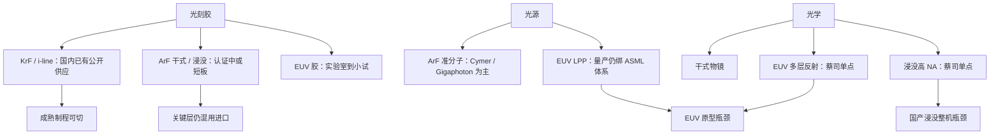

# 光刻供应链国产替代

扫描仪是集成结果；卡住量产的往往是胶的金属杂质、准分子或锡滴光源、以及高 NA 物镜与多层反射镜——整机许可之外，子系统各有自己的供应商单点。

<footer>—— 对照光刻胶、光源、镜头的公开供应商格局，以及国产替代仍按档位而不是按口号推进</footer>

光刻机出货数字好看，不等于一条产线能自主。抗蚀剂决定灵敏度、线宽粗糙度与缺陷；光源决定剂量与频谱；镜头或反射镜决定波前与杂散光。这三样在全球范围内都是高度集中的工业：DUV 胶长期由 JSR、东京应化（TOK）、信越等日系厂商主导；ArF 准分子激光来自 Cymer（现属 ASML）与 Gigaphoton；浸没投影物镜与 EUV 多层光学则与蔡司绑定在公开的 ASML 供应链叙述里。国产替代要按**档位**写：KrF / 干式 ArF 胶与光源已经有国内企业能供一部分成熟制程；浸没 ArF 胶、高 NA 物镜、EUV 胶与 LPP 光源仍是公开承认的短板。本篇只写公开的供应关系与工程含义，不编造某厂的合格名录或秘密配方。

## 问题

[EUV 整机许可](/llm/euv-export-control) 卡住的是扫描仪箱子。产线真实的卡点可以更窄：胶被禁运或提价，现有进口机也会停；光源模块不供货，浸没机只是一台精密机床；物镜无法复制，国产 [浸没 DUV](/llm/china-immersion-duv) 就永远停在样机。反过来，整机组装国产化率很高、但这三件仍进口，则许可打在零件税号上同样有效。所以「光刻国产化」必须拆成胶、光源、光学、工件台、计量、计算光刻多行，而不是一行整机百分比。

档位不能混。248 nm KrF 胶与 365 nm i-line 胶，国内已有北京科华、南大光电等公开产品服务成熟制程；这与 EUV 胶要求的金属杂质在 ppb 到 ppt、以及特定产酸剂体系，不是同一代化学。193 nm 干式与浸没胶对水、浸出物和折射率的要求又加一档。把「国产光刻胶已经量产」不加波长地写进先进逻辑，会高估成熟制程的成功、低估先进层的缺口。

### 三个单点为什么同时难

光刻胶是配方工业：树脂、光酸、溶剂、添加剂，杂质与批次稳定性直接进缺陷。客户认证以年计，晶圆厂不肯为了国产化在关键层上赌未知颗粒。光源是高压放电与光学薄膜：ArF 激光的频谱宽度必须匹配物镜色差；EUV 的 LPP 还要锡滴、红外驱动激光与收集镜。镜头是材料与镀膜：高 NA 浸没物镜用的氟化钙等材料、以及数十面镜片的装校，是蔡司一类厂商的核心工艺；EUV 多层膜是另一门。三门工艺的人才与设备几乎不互通，所以「集中力量做整机」不会自动把三门课一起考过。

计算光刻（OPC、SMO、拆图）是第四个常被漏掉的单点。没有与国产机光学特征匹配的模型，胶和镜头即使能供，设计规则也发不出去。它往往以软件许可的形式被管，而不是以一桶胶的形式。

## 方法

替代策略应按节点与层来采购，而不是按爱国百分比。成熟制程（90/55/40/28 nm 的非最关键层）可以优先切国产 KrF / 部分 ArF 胶，验证缺陷密度与批次。浸没关键层继续用已认证的进口胶，直到国产浸没胶跑完与具体机台、具体照明条件绑定的工艺窗口。光源上，国产准分子激光若能达到脉宽、能量稳定性与维护周期的工厂指标，可先配在国产机或作为进口机的备件实验，而不是立刻宣布全国替换 Cymer。光学上，干式低 NA 物镜与浸没高 NA、EUV 反射组要分成三个项目，验收标准分别是波前、热像差与反射率，而不是「镜头已经国产」。

认证方法必须跟晶圆厂走：同一配方在不同扫描仪照明、不同 BARC、不同显影条件下窗口不同。国产胶「在某研究所分辨率达标」不等于在 SMIC 或华虹的 28 nm 关键层达标。光源与镜头的认证更慢，因为要改机台配置。供应链安全的方法是双源：关键层维持进口库存与许可合规，同时让国产供应商在非关键层或新产线上积累批次数据。企图一刀切切换，会把良率事故写成爱国主义事故。

### 与整机、多重曝光、EUV 原型的接口

国产浸没整机若光源或物镜仍是进口单点，则 [28 nm 单次](/llm/china-immersion-duv) 的自主只做到总装。多重曝光把胶、光源稳定性、镜头热漂的要求全部收紧——次数一多，批次漂移会被放大，见 [多重曝光](/llm/china-duv-multipattern)。EUV 原型则把胶、LPP、多层镜同时推到全球最难的档，见 [国产 EUV 原型](/llm/china-euv-prototype)。子系统替代的优先级因此应是：先支撑国产浸没在 28 nm 单次上可维护，再支撑多重曝光的稳定性，EUV 胶与镜子作为长期项，不要用 EUV 胶新闻去填 28 nm 胶的缺口。

## 机制

缺陷机制：胶里的金属与颗粒在先进节点变成随机缺陷的主因之一。日系厂商的优势不完全是「会配树脂」，而是纯化、过滤、包装与全球物流的杂质控制。国产替代若只复制功能配方、不复制纯化产能，分辨率可以好看，良率仍然差。浸没胶还要抗水浸出，否则浸没头把污染物带到下一片。

剂量机制：光源功率与胶灵敏度相乘才是扫描速度。胶慢就要求光源更亮或台子更慢；光源不稳，CD 沿扫描方向条纹化。EUV 上这一乘更狠，因为光学链反射率连乘已经把光子预算吃光。所以光源与胶必须配对研发，不能两个项目各自报喜。

蔡司与 ASML 的光学关系是公开的长期独家合作，不是秘密协议编号。国产光学要追的是同等的镀膜与装校工业，而不是「再成立一家公司挂名镜头」。

许可机制：EAR 与各国清单不仅写整机。光刻胶配方技术、为 EUV 设计的胶涂显影设备、EUV 掩模坯料（公开 ECCN 如 3B001.j）都可以单独成为物项。替代的合规收益，只有当物项的技术来源与含量确实离开管辖时才成立。继续用受控技术在国内生产，可能仍落入再出口或技术控制，这是公开的管辖逻辑，具体分类要交给合规，不在本篇做法律意见。

## 边界与工程取舍

成熟制程胶的国产化成绩，不能外推到浸没关键层与 EUV。光源能点亮，不能外推到与蔡司物镜匹配的频谱与维护周期。研究所镜子的反射率百分点，不能外推到投影镜组在扫描热负载下的波前。每条供应链都有自己的认证年周期，整机媒体发布会改变不了这个周期。

也不要把日本、荷兰、美国的供应商写成永久不可替代。工业史里出现过第二源，只是第二源的时间以年计、以认证计。规划应假设：成熟制程可以逐步提高国产份额；先进 DUV 关键层长期双源；EUV 子系统与整机同级困难。Chiplet 与封装改变的是系统集成，不减少晶圆厂对胶和光源的消耗，见 [Chiplet 与先进封装](/llm/chiplet-packaging)。

「国产化率 85%」一类整机报道数字，若不算胶、光源模块、物镜与计量软件，会系统性高估自主程度。要把百分比拆到可停产的那几个零件。

取舍是库存与研发并行。许可风险高的进口胶与光源，用合规的库存与循环再出口规则去撑产线；研发预算按瓶颈瓦数与缺陷密度分配，而不是按题目是否时髦。EUV 胶很时髦，28 nm 浸没胶的批次稳定性可能对今年的出货更致命。

### 计量与涂显影不要留在整机盲区

胶换了，涂胶显影机的温度、排气与浸没配套要重认证；光源换了，剂量计与能量传感器的标定曲线要重做；镜头换了，波前仪与焦平面探针必须跟得上。这些计量与涂显设备自己也有供应商单点。国产替代若只盯三件「出名」的胶、光源、镜头，产线会在换胶后的第一批缺陷里发现涂显和量测还是进口、且备件同样受许可约束。供应链表应把涂显、CD-SEM、套刻量测单列，而不是算进「其他百分之十五」。

## 小结

- 光刻自主要拆成胶、光源、光学（再加计算光刻与计量），整机百分比不够用。
- KrF 等成熟档已有公开国产供应；浸没 ArF 与 EUV 档仍是短板，不能混称「胶已经国产」。
- ArF 光源与浸没/EUV 光学在全球是单点供应商格局；国产浸没与 EUV 原型分别卡在这些点上。
- 认证绑定机台与层，研究所分辨率不能代替晶圆厂良率。
- 许可可以打在子系统与技术上，不只打在扫描仪整机。
- 优先级应先支撑 28 nm 浸没可维护，再支撑多重曝光，EUV 子系统按十年尺度投入。
- 出处：各胶厂与光源厂的公开产品线；ASML/蔡司公开供应链叙述；EAR 3B001 对 EUV 掩模坯料等物项的公开列举；国产胶企业的公开成熟制程供应，不把未认证的先进胶写成量产。
