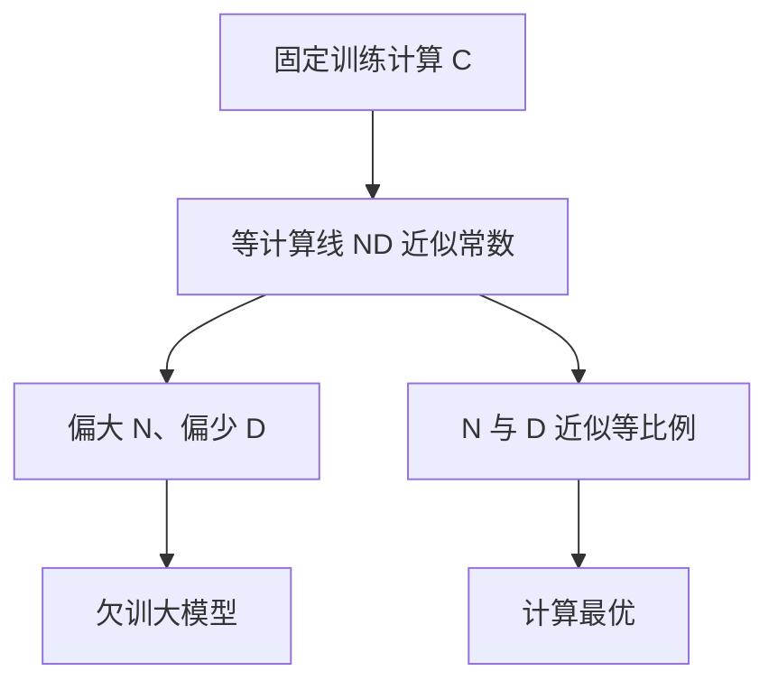

# Chinchilla 计算最优

    
给定训练计算，参数和 token 应近似同比例放大。更大却欠训的模型，往往打不过更小但看够数据的模型。

    <footer>—— Hoffmann et al., Training Compute-Optimal Large Language Models, 2022</footer>

Kaplan 已经给出损失随 $N$ 与 $D$ 下降的幂律，以及给定 FLOPs 时两者如何分割。Hoffmann 等人 2022 年用 Gopher 同一技术栈训练了 Chinchilla：70B 参数、约 1.4T token，计算量与当时 280B 的 Gopher 相当，但把预算从「更大的模型」挪到「更多的 token」。下游与语言建模损失都显示，这一分配优于同计算下过度偏大的模型。他们把计算最优写成清晰的经验规则：参数与数据近似等比例扩展，大约每个参数二十个 token。本篇讲这条规则如何从拟合里来、它修正了 Kaplan 的哪一步，以及「计算最优」并不等于「部署最优」。

## 问题

同样的训练 FLOPs，可以喂给一个很大、只看一遍很少数据的模型，也可以喂给一个中等、看很多数据的模型。Kaplan 的拟合偏向前者。若那个偏向来自日程与欠训，而不是来自真实的最优面，那么业界按 Kaplan 去堆参数，会系统性地把 token 看少。Hoffmann 等人要重新测量：在尽量相同的优化配方下，扫许多 $(N,D)$ 对，画出等计算曲线，看损失的最低点落在哪里。

这不是「数据永远越多越好」。$C\approx 6ND$ 仍然成立，多看 token 必须以缩小 $N$ 或增加总计算为代价。问题是等计算面上的谷底位置。谷底决定了：你下一张超算账单里，多少钱该买宽度，多少钱该买数据与步数。

### 等计算面而不是单条切片

只沿固定 $D$ 加 $N$，会得到「更大总是更好」；只沿固定 $N$ 加 $D$，会得到「多训总是更好」。两者都是切面。计算最优必须在 $ND$ 乘积近似常数的曲线上比较。Chinchilla 论文用三种独立方法估计这条谷底：对损失面做参数化拟合后求约束最优、在固定计算预算上直接比较不同大小、以及从每次运行的最后损失做插值。三种方法指向同一区域：最优处 $N$ 与 $D$ 几乎按同样的幂次随 $C$ 增长。「大约 20 token 每参数」是那一次拟合在稠密 Transformer、其数据与优化器上的读数，不是物理常数。换 MoE、换重复数据、换更长的推理友好过度训练，最优点会移动。它的用处是给稠密预训练一个可操作的起点，而不是给所有后续配方立法。

## 方法

损失被拟合成可分的三项式，一种常用写法是

$$
L(N,D)=E+\frac{A}{N^{\alpha}}+\frac{B}{D^{\beta}},
$$

其中 $E$ 是不可约损失（数据熵的下界经验代理），后两项分别是容量不足与数据不足。给定 $C\propto ND$，对 $N$ 求最优，得到 $N_{\mathrm{opt}}\propto C^{a}$、$D_{\mathrm{opt}}\propto C^{1-a}$，而 $a$ 接近 $1/2$。于是计算每涨十倍，参数与 token 都大约涨 $\sqrt{10}$ 倍量级，而不是参数涨得快、token 几乎不动。

Chinchilla 70B 按这一比例吃约 1.4T token，对比 Gopher 280B 用少得多的 token，前者在同样训练计算下更强。对业界的直接含义是：许多按 Kaplan 比例训练的大模型处于欠训区；把同一笔 FLOPs 分给较小的模型并拉长训练，损失更低。这一结论随后被其他稠密模型的复现性讨论广泛引用。

### 学习率日程必须按寿命排

Hoffmann 等人强调，余弦退火的终点应落在预定的训练长度上。若按短寿命排日程却中途停，或按长寿命排却提前结束，比较会不公平。Kaplan 偏大模型的一部分来源，正是大模型没有在与其 $N$ 相称的 token 数上走完退火。计算最优实验因此首先是一次实验设计：每条 run 的学习率寿命与 $D$ 对齐，再在等计算线上比损失。配方细节看起来琐碎，却决定谷底被测在哪里。

## 机制

三项式把「再加宽度」和「再加数据」写成可交换的两种降损方式。$\alpha$ 与 $\beta$ 接近时，最优处 $N$ 与 $D$ 同阶增长，这与 Kaplan 报告的 $0.73$ / $0.27$ 分割不同。机制上不必引入新的网络理论：只要承认大模型在短日程上的最后损失不能代表它在充分训练后的损失，等计算面的谷底就会向更大的 $D$ 移动。Chinchilla 是把这一测量做干净，而不是发现了一种新的损失函数。

不可约项 $E$ 提醒我们：数据分布本身有熵，损失不会随 $N,D$ 降到零。靠近 $E$ 时，同样比例的 $N$ 或 $D$ 增长换来的降幅变小，扩展律进入弯曲区。高质量去重、换领域，改的是 $E$ 与系数，不是幂律符号。计算最优只计算训练 FLOPs。推理时每次生成都要再付一遍 $N$ 相关的代价。若一个模型要被调用极多次，把训练推过 Chinchilla 点、换更小的 $N$，可能总体更省——这是过度训练那篇文章的主题。Chinchilla 回答的是：只关心训练预算时，谷底在哪。

### 与 $6ND$ 会计的关系

系数 6 来自稠密矩阵乘的前向加反向。MoE 的活跃参数小于总参数，会计应改用活跃 $N$ 或分开写总参数与 FLOPs。深度与宽度的拆分、序列长度、词表投影，都会轻微移动常数。Chinchilla 比例对「同一家族内、改 $N$ 与步数」最稳；跨架构比较时，应回到损失对 FLOPs 的曲线，而不是只比较参数个数。

## 边界与工程取舍

数据不够时，计算最优点可能落在你没有的 $D$ 上。此时要么重复数据（进入数据约束扩展），要么把预算改用于更大的 $N$ 或检索，而不能假装 20 token/参数仍然可达。上下文长度、批大小、词表，都会改变达到某一损失所需的 $D$，严格复现 Chinchilla 需要同一数据与同一损失定义。

「按 Chinchilla 训」在工业上常被当成起点：先用该比例估计一个 $N$，再因数据墙或推理成本往旁边挪。Llama 2/3 等后续报告明确写了超过计算最优点的 token 数。这并不推翻 Hoffmann 的等计算面，只是在面上选择了一个不是谷底、但对部署更便宜的点。不要用 Chinchilla 去否定更大模型的价值。给定无限数据和无限推理预算，更大的 $N$ 在充分训练后仍可更低损失。论文否定的是：在固定训练计算下，把预算几乎全部用于堆参数、让模型欠训。

拟合本身对失败 run 敏感。没有收敛的点若留在面里，会把 $E$ 和指数拉歪。公开复现时，应报告扫了哪些 $N$，以及等计算线上的最低损失，而不是只报一个 70B 的成功故事。

## 小结

- Chinchilla 表明：固定训练计算时，参数与 token 近似等比例放大优于偏大且欠训的模型。
- 经验规则大约是每个参数二十个 token，对应那一次稠密 Transformer 拟合。
- 损失三项式把容量不足与数据不足分开，等计算约束下最优落在 $N$ 与 $D$ 同阶增长处。
- 学习率余弦必须与预定训练长度对齐，否则会重现 Kaplan 式的偏大模型幻觉。
- 计算最优不等于推理最优；部署次数极多时，过训小模型可能更划算。
- 数据不足、MoE、重复数据都会移动谷底，不能把 20 当成常数。
- 出处：Hoffmann et al., *Training Compute-Optimal Large Language Models*, 2022。
