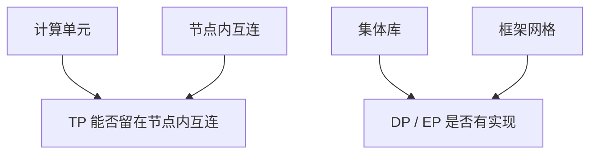

# 国产加速器谱系

谱系不是一张卡，是各自的互连、编译器和集体库。把它们写成「国产 CUDA」会在 All-Reduce 上当场失败。

<footer>—— 对照已公开的昇腾 / 寒武纪 / 海光 DCU / 摩尔线程等产品线文档；不编造未公布规格</footer>

[ROCm](/llm/amd-rocm-stack) 至少还能用 RCCL 去对 NCCL 的语义。本课把「NVIDIA 之外」收到国内加速器：**昇腾（CANN / HCCL）**、寒武纪、海光 DCU（偏 ROCm 近亲）、摩尔线程等已公开产品线。缺口是谱系如何划分——指令集、互连、软件栈三条轴——而不是列型号评测榜。后课对比方法给出共同尺子；本课禁止把某一代营销 FLOPS 抄成课程结论。

## 问题

每条产品线解决同一问题：稠密 GEMM + 分布式训练。分叉在：是否兼容 CUDA/HIP 源码；节点内互连是否有 NVLink 类平坦域；集体库是否实现 All-Reduce / All-to-All 的层次化；框架（MindSpore、PyTorch 插件）把并行网格钉到哪一层。迁移一个 Megatron 配置，失败点通常是集体与拓扑，不是矩阵乘峰值。

同名概念陷阱：「超节点」在昇腾文档与 NVIDIA NVL72 都存在，托盘数、带宽、软件可见域以各自文档为准，见 [Scale-Up](/llm/scale-up-vs-scale-out) 课已写的提醒。问题是 **读自家拓扑白皮书，重测 busbw**，不要翻译 NVIDIA 数字。

本课不排名、不发明未公开的互联带宽。产品名与栈名以厂商公开材料为准，随代际会变。课程要的是轴，不是今年的 SKU 表。

## 方法

每条产品线画同一张四格：计算单元、节点内互连、节点间网络、软件栈（编译器 + 集体库 + 框架）。然后只问两句：密通信（TP）能否留在节点内互连；DP / EP 在集体库里是否有可用实现。缺一格就标为风险，而不是用峰值补。

昇腾：CANN、HCCL、MindSpore / PyTorch 适配，超节点与柜间网络按华为公开架构。海光 DCU：往往更靠近 ROCm 生态，RCCL 路径可能部分可用。寒武纪、摩尔线程：推理与训练侧重点、CUDA 翻译层成熟度不同，要分开验收，不要「国产」一锅。

验收仍分层：单卡核 → 单节点集体 → 跨节点 → 目标模型。HCCL 或厂商 collective 的算法选择不要假设与 [NCCL 算法课](/llm/nccl-algorithms) 同一套环境变量。

## 机制

生态锁与 NVIDIA 对称：一旦并行网格绑在某集体库上，换栈等于重写通信。国产线内部也不互通——昇腾网格不能当 DCU 网格用。调度与故障码、液冷柜形态各写各的，[机群公平](/llm/cluster-fair-scheduling) 的拓扑标签要按机房真实设备插件来，不能抄 DGX 标签。

精度栈（FP16/BF16/FP8/INT8）支持矩阵决定压缩进阶课的哪些配方能落地。没有 INT4 核，[GPTQ](/llm/gptq) 只省内存不省算。这是谱系与下一课程的接口。

出口管制与供货是采购约束，不是算法。课程不展开政策，只提醒规划不能假设任意代际 NVIDIA 可买，因而谱系对比有工程必要性。

## 边界与工程取舍

不要用单一「国产 GPU」词比较。不要把未公开超节点带宽写进课。不要假设 PyTorch 官方主线覆盖所有插件。下一课给出对比方法：屋顶线、软件成熟度、TCO、集体微基准，用来打分上面这些格，而不是再增加厂商。

## 小结

- 国产加速器按计算、互连、集体库、框架四格分别验收。
- 超节点 / 带宽数字以各厂商文档为准，禁止抄 NVLink 规格。
- 迁移失败点多在集体与拓扑，不在单核 GEMM。
- 精度核存在与否决定后续量化课能否变成墙钟。
- 出处：各厂商已公开的 CANN/HCCL、ROCm 近亲 DCU、及其他产品线文档。
