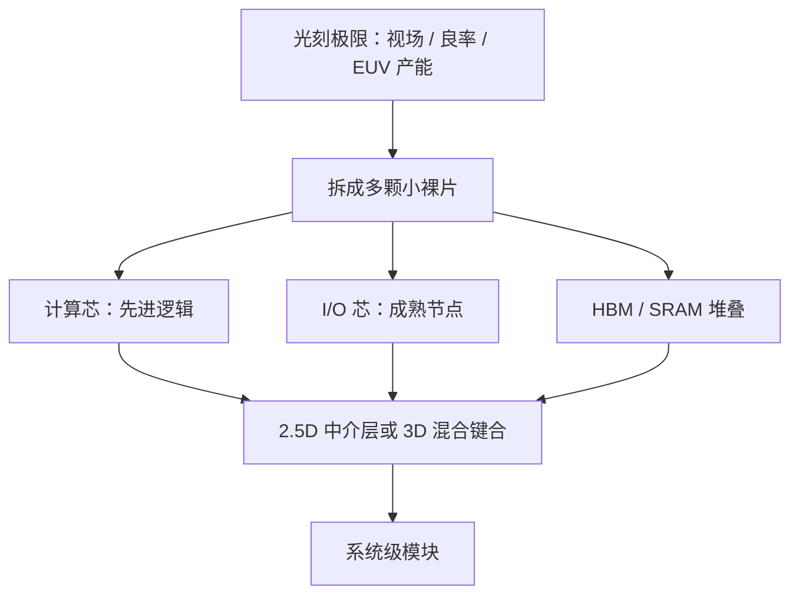

# Chiplet 与先进封装

单颗大裸片撞上光刻视场、良率与 EUV 产能三条硬墙时，把系统拆成多颗小裸片再用先进封装拼回去，是在光刻之外继续涨算力的路。

<footer>—— 对照 AMD Zen 小芯片、Intel Foveros、TSMC CoWoS / SoIC 与 UCIe 公开规范</footer>

先进逻辑的晶体管间距仍由光刻决定：193 nm 浸没加多重曝光，或 13.5 nm EUV（再往后是高数值孔径 EUV）。但「一块能出货的加速器」并不等于「一块能一次曝光完的最大芯片」。掩模视场大约 26 mm × 33 mm，再大就要拼接；面积一大，缺陷密度把良率按泊松打下来；EUV 机台又贵又少，关键层排队。Chiplet 与 2.5D / 3D 封装并不改写瑞利判据，它们改的是**系统怎么跨过多块硅**——计算裸片、I/O 裸片、SRAM 裸片、HBM 堆叠各用自己吃得消的节点，再用硅中介层、有机基板上的微凸点或混合键合连起来。对训练与推理集群，这已经是默认形态，而不是实验室选项。

## 问题

光刻给单颗裸片的上限，来自三条彼此独立的约束。第一条是光学：特征尺寸大致服从 $CD \approx k_1 \lambda / \mathrm{NA}$。浸没 ArF 把 $\lambda=193\,\mathrm{nm}$、$\mathrm{NA}$ 抬到约 1.35，单次曝光仍停在成熟逻辑常用的 28 nm 一类节点附近；更密的金属与鳍片要靠多重曝光或换成 EUV。第二条是掩模：一次扫描能覆盖的曝光场有限，超大加速器若做成单片，要么把关键层拆成多次拼接，要么直接做不出来。第三条是经济：同一缺陷密度下，裸片面积翻倍，好片比例近似按指数掉；EUV 扫描仪全球年出货以两位数计，不是所有层、所有产品都挤得进那条队列。

于是出现一种错觉：好像只要把 EUV 或高 NA 再推一档，加速器就会继续按面积线性变强。公开产业路径并不是这样。HBM 已经是堆叠 DRAM 加逻辑基片；训练加速器普遍把计算芯与 I/O 芯拆开，再通过 CoWoS 一类 2.5D 把多颗计算芯和多堆 HBM 排在同一中介层上。光刻仍决定**每一颗**能做到多密，封装决定**整颗模块**能集成多大带宽与多少计算。两条轴缺一不可。出口管制卡住的是前一条里最先进的那一截，见 [EUV 出口管制](/llm/euv-export-control)；后一条在成熟节点上仍然能涨，这也是为何先进封装产能本身变成瓶颈。

### 单片良率与视场，不是同一道题

视场限制是几何：再先进的镜头也照不亮无限大的场。良率限制是统计：缺陷随机落点，面积越大，至少中一枪的概率越高。Chiplet 同时缓解两者——每颗小片落在视场内、缺陷只毁掉那一颗——但引入新的测试、已知好片（KGD）分选、以及封装后的互连良率。把「切小」写成免费午餐，会漏掉后半截成本。

瑞利公式里的 $k_1$ 是工艺因子，不是自然常数。浸没单次曝光把 $k_1$ 用到接近量产下限之后，再降 CD 只能换波长、换 NA，或用多重图形化付套刻与成本。封装不进入这个公式。

## 方法

Chiplet 的工程对象是：把一块本该单片集成的 SoC，拆成功能边界清晰的多颗裸片，规定它们之间的协议、凸点节距、功耗与测试夹具，再选一种封装把延迟与带宽补到可接受。常见拆法不是随机切，而是按工艺需求切。

计算芯继续追求最先进逻辑，因为矩阵乘密度直接吃晶体管与 SRAM。I/O 与 SerDes 往往停在更成熟、高压更友好的节点，因为模拟电路并不跟着逻辑微缩线性变好。HBM 是另一家 DRAM 厂的堆叠，只通过中介层上的走线接到计算芯。缓存或 SRAM 芯片可以单独用适合密度的工艺。公开产品线里，AMD 的 Zen 把 CPU 芯与 I/O 芯分开；Intel 的 Foveros 走 3D 有源堆叠；台积电的 CoWoS 把多颗逻辑与 HBM 放在硅中介层上，SoIC / 混合键合把节距再往微米以下推。UCIe 则试图把裸片间接口从各家私有协议收成可互操作的标准，减少「只能和同一家的芯拼」的锁定。

先进封装本身分几档，不要混称。2.5D：裸片并排放在硅中介层或高密度有机基板上，用微凸点互连，HBM 与加速器的主流就是这一档。3D：裸片面对面或背对背堆叠，混合键合把凸点节距打到微米甚至亚微米，适合缓存上置、逻辑叠逻辑。扇出型封装把重新布线层做到晶圆或板级，成本与密度介于传统基板与硅中介层之间。选哪一档，看的是互连密度、热、可修复性，而不是名字听起来有多先进。

### 互连预算要写成字节与皮秒，而不是「很近」

封装给出的不是无限总线。中介层走线的节距、层数、长度决定了计算芯到 HBM 的带宽；混合键合的凸点密度决定了 3D 缓存能补多少容量。延迟上，经过中介层的 hop 仍远好于出封装走板级，但比单片上的金属层差一截。训练加速器能接受，是因为大块 GEMM 把延迟摊进吞吐；延迟敏感的 CPU 缓存一致性对同一套封装会更挑剔。设计 Chiplet 边界时，要把「哪些数据经常跨片」先钉死，再选协议与节距。

## 机制

光刻极限被封装「补」上的机制，是把摩尔定律拆成两半。半边仍是晶体管微缩：同一面积里放更多逻辑，靠 $\lambda$、$\mathrm{NA}$、多重曝光与 EUV。另半边是系统微缩：同一模块里放更多硅、更宽的内存壁，靠已知好片拼接。加速器的有效算力常常卡在 HBM 带宽而不是峰值 FLOPS，这时再买一档更先进的逻辑节点，不如再多堆一圈 HBM、或把计算芯从一颗加成两颗——后者正是 2.5D 在做的事。

良率机制是面积的指数。设缺陷密度 $D$、裸片面积 $A$，粗略良率 $\mathrm{e}^{-DA}$。切成 $n$ 颗面积 $A/n$ 的片，单片良率升高，再乘上封装与测试良率。只要封装良率不差到把红利吃光，经济上就站得住。这也解释了为何先进封装厂的产能与中介层、基板、键合机成为独立瓶颈：切得动，拼不完，系统仍然出不了货。

Chiplet 不能让 28 nm 逻辑芯「看起来像」5 nm。它允许 5 nm 计算芯旁边坐着成熟节点的 I/O 与别人家的 HBM。节点编号仍以每颗裸片的晶体管层为准，模块的「等效节点」没有物理定义。

热与供电是第三套机制。3D 堆叠把功耗密度叠起来，热点不再能只靠封装外壳摊；2.5D 的水平展开对散热更友好，但中介层面积贵。电源要从基板穿过大量凸点送进计算芯，IR drop 与去耦电容的位置变成布局约束。这些不是光刻问题，却会反过来限制你敢把多少先进逻辑塞进同一模块。

### 与光刻管制、国产工具链的分工

EUV 出不去，先进逻辑的单片密度被卡住，见 [EUV 出口管制](/llm/euv-export-control)。多重曝光可以把浸没 DUV 往更密的节点推，见 [国产 DUV 多重曝光](/llm/china-duv-multipattern)，代价是套刻、周期与成本。封装则是第三条轴：即便计算芯停在可量产的节点，模块级带宽仍能靠 HBM 与多芯拼接涨。三条轴解决的不是同一个方程。把「我们上了 Chiplet」写成「已经绕过光刻管制」，是类别错误。

## 边界与工程取舍

先进封装补的是集成度，不是晶体管微缩。关键层的栅极节距、金属间距，该用 EUV 还是浸没多重曝光，封装决定不了。单片上的 SRAM 密度、标准单元库，仍然跟节点走。若产品的瓶颈就是逻辑密度本身——例如必须在一颗手机 SoC 里塞下足够的 CPU/GPU——Chiplet 的拆分开销（接口面积、功耗、延迟）可能吃掉收益，这也是为何手机仍偏单片，而训练加速器偏多芯。

供应链上，中介层、基板、HBM、键合与测试是另一张地图，和光刻机、光刻胶、镜头不是同一批供应商。UCIe 降低的是协议锁定，不保证物理层与封装厂产能。已知好片策略要求每颗 Chiplet 在封装前可测、可分选；测不到的模拟与高速口，会把坏片带进昂贵的 2.5D 模块，损失被放大。

公开报道里的 CoWoS 产能紧张，说的是封装这一段，不是 EUV 扫描仪排队。两段可以同时紧，归因必须分开：一颗加速器出不了货，可能是光刻、可能是 HBM、可能是中介层，不能默认是同一原因。

实现上要对齐三件事。第一，Chiplet 边界必须落在带宽需求低、协议稳定的地方，而不是为了「看起来像小芯片」而切乱缓存层次。第二，测试向量与熔丝、修复资源要按颗设计，否则良率模型是假的。第三，软件栈要看见拓扑：多芯之间的内存一致性、集合通信走封装还是走板级，会改变训练框架该不该把一张「逻辑 GPU」映射成多颗裸片。这些是系统问题，写进光刻路线图里会错位。

## 小结

- Chiplet 与 2.5D/3D 封装补的是视场、良率与模块级带宽，不改写 $k_1\lambda/\mathrm{NA}$ 决定的晶体管间距。
- 计算芯、I/O 芯、HBM 按各自合适的节点制造，再在中介层或混合键合上拼成系统。
- 单片面积的良率近似随 $\mathrm{e}^{-DA}$ 变差，切小再封装是在付测试与互连成本之后买回出货量。
- 加速器往往卡在 HBM 与多芯拼接，而不是再买一档逻辑节点；手机 SoC 则仍可能是单片更划算。
- 光刻管制、多重曝光、先进封装是三条不同的轴，不能互相替代。
- UCIe 管协议互操作，不管中介层产能与热设计。
- 出处：各厂公开的 Chiplet / CoWoS / Foveros / HBM 产品说明，以及 UCIe 规范；光学极限用标准瑞利公式即可，不必另造论文。
