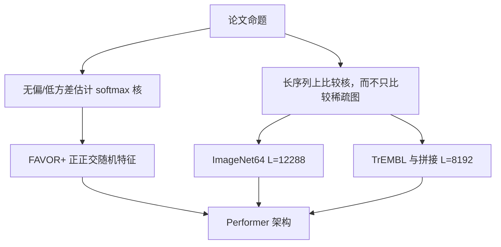

# Performer 原文

    
Performer 用可证明精度去估计满秩 softmax 注意力，却只要线性的时间与空间，并且不依赖稀疏或低秩先验。

    <footer>—— Choromanski 等，Rethinking Attention with Performers，ICLR 2021</footer>

Choromanski、Likhosherstov、Dohan、Song、Gane、Sarlós、Hawkins、Davis、Mohiuddin、Kaiser、Belanger、Colwell 与 Weller 的 ICLR 2021 论文，要回答的不是「核特征能不能让注意力线性」——[Katharopoulos 的线性 Transformer](/llm/katharopoulos-linear) 已经换过核——而是：**能否在期望上逼近真正的 softmax 核，并给出方差与一致收敛，使这项近似可以当科学研究的工具，而不只是又一种加速技巧。** FAVOR+（Fast Attention Via Positive Orthogonal Random Features）是他们为 softmax 核设计的随机特征；Performer 是套上这套特征的 Transformer。机制专文见 [Performer / FAVOR+](/llm/performer-favor)。本篇写原文作为一篇理论+系统论文交了什么实验、比了谁、没承诺什么。

## 问题

2020 年的高效注意力两条主流路都有先验。稀疏图（Longformer、BigBird、Reformer 的 LSH）假定重要边落在窗口、全局点或哈希桶里；低秩投影（Linformer）假定注意力矩阵有一个与长度无关的秩。两条路都能跑更长序列，但改变了模型类：不是在估计原来的 $A=\mathrm{softmax}(QK^\top/\sqrt{d})$，而是在另一个函数类里训练。论文要的是第三条：保持与常规 Transformer 兼容，注意力矩阵满秩可估，复杂度对长度线性，先验只来自随机特征的蒙特卡洛，不来自「哪些位置可以看」。

softmax 核 $\exp(q^\top k)$ 不是平移不变的高斯核，普通随机傅里叶特征会出负分量，归一化后权重可翻号。蛋白质、像素序列又把长度推到常规 Transformer 显存墙之外，使得「softmax 对其他核到底好不好」无法在同一尺度上比。作者需要一种正值、正交、对 softmax 无偏（或近无偏）的特征，才能第一次在 ImageNet64 与 TrEMBL 这种长度上把核当成自变量。

### 论文真正卖的是可证近似，不是「更快的 BERT」

标题 *Rethinking Attention* 针对的是注意力矩阵的定义，不是 GLUE 刷分。理论条款包括：注意力矩阵的无偏或近无偏估计、一致收敛、低估计方差。FAVOR+ 被写成也可用于其他可核化注意力，从而在大规模任务上比较 softmax 与 ReLU 等核。把这篇读成「工业界应用该立刻换 Performer」，会错过它作为核方法论文的合同：特征维 $m$ 是精度旋钮，实验必须报告 $m$，不能只报「线性注意力」。

先有 2020 年的蛋白质 MLM 预印本（*Masked Language Modeling for Proteins via Linearly Scalable Long-Context Transformers*），ICLR 终稿把方法收成 Performer / FAVOR+ 并补上 ImageNet64 与理论。引用会议版 2009.14794 / ICLR 2021，不要把两稿的层数表混用。

## 方法

实验跨像素预测、文本与蛋白质。机制上仍是正正交随机特征逼近 $\exp(q^\top k)$，再走线性注意力的结合律；公式与正交化步骤见专文。原文多出来的是对照协议。ImageNet64 无条件像素建模，长度 $L=12288$，常规 Transformer 不可行。各方法固定 $(n_{\mathrm{heads}},d_{\mathrm{ff}},d)=(8,2048,512)$，只变层数：Performer 6 层对上 Reformer 12 层，Performer 12 层对上 Reformer 24 层。作者还写：视 TPU / GPU 与 JAX 实现，Performer 可比 Reformer 快约 2×（无条件设定）。这是「同样宽度下用层数换近似核」的对照，不是 FLOPs 严格对齐。

蛋白质用 2019 年 1 月 TrEMBL，36 层，$(n_{\mathrm{heads}},d_{\mathrm{ff}},d)=(8,1024,512)$，16×16 TPU v2，batch 按显存最大化。对照 Reformer、Linformer。另做拼接蛋白质到 $L=8192$ 的相互作用玩具任务：常规 Transformer 在每芯片 batch=1 仍 OOM，基线被迫缩到宽度 256、至多 3 层；Performer 用标准 $(8,6,2048,512)$、每芯片 batch=8。小 Transformer 准确率停在约 19%，Performer 训到约 24%。这证明的是「线性近似让你能放下更大的模型」，不是 24% 已经解决蛋白质相互作用。

### 与 Reformer、Linformer、确定核线性注意力

Reformer 用 LSH 把相似查询键分桶，复杂度带大常数，短序列往往不快；它改变连通性。Linformer 把键值投影到固定长度，近似与内容无关，论文批评这会伤上下文。Katharopoulos 的 $\phi=\mathrm{elu}+1$ 是确定特征，不声称逼近 softmax。Performer 的对照轴是：在不能跑满 softmax 的长度上，随机特征是否仍接近「假如能跑 softmax 会得到的模型」，以及 ReLU 核 Performer 是否有时更好。后一点是原文明确写进贡献的：第一次有工具在超长任务上比核，而不是只能在短句上比。

## 机制

随机特征把 $\exp(q^\top k)$ 写成 $\mathbb{E}[\phi(q)^\top\phi(k)]$。有限 $m$ 下误差有两项：核值估计误差，以及 softmax 式行归一化带来的偏差——无偏针对的是核，不是行随机矩阵。正交化降低方向采样方差，使较小 $m$ 可用。这些机制专文已写；原文还强调 **均匀收敛**：要以高概率在所有查询–键对上同时控误差，才能保证整层注意力图不在某几个位置炸开。这对深层残差网是合同，对单层核回归则过于强。

兼容常规 Transformer 意味着：同一套 $Q,K,V$ 投影，只换注意力核的估计算子；可以插入已有 BERT/GPT 式堆叠。因果情形用前缀扫描，随机方向 $\omega$ 必须在训练与推理间冻结，否则状态错位——这是部署条款，原文用「与常规 Transformer 完全兼容」概括，工程上要自己固化种子。

论文写「不依赖稀疏或低秩先验」。实现上 $m\ll n$ 时估计矩阵的秩至多 $m$，看起来像低秩。先验指的是不对 $A$ 的支撑或谱做结构假设；有限特征的秩是蒙特卡洛的后果，不是 Linformer 那种与内容无关的投影设计。

### 蛋白质与像素为什么适合当主场

TrEMBL 序列长、局部化学与长程接触同时存在，稀疏窗口会切掉接触图，低秩投影不区分残基。像素栅格 $64\times 64\times 3$ 展成一万两千步，是当时 softmax 显存的刑具。语言建模短句上，Flash 式精确 softmax 后来把「线性」的墙钟优势吃掉；原文的实验年份里，对手是 Reformer 与 Linformer，不是 FlashAttention。读 2021 年的 2× Reformer，不要写成 2026 年相对 FA2 的加速。

## 边界与工程取舍

### $m$、尖峰任务与外推

特征维不够，近似核变平，针测与精确拷贝会输给真 softmax。原文主表不是针测。正交随机特征与 RoPE 叠用时，方向是在旋转后空间采的，长度外推误差可能被误诊为位置编码失败。混合精度下 $\exp$ 特征易溢出，需先按 $1/\sqrt{d}$ 缩放。短序列上 FAVOR+ 没有必要。把 Performer 当 BERT 替代而不调 $m$、不冻 $\omega$，是误用论文。

理论保证是随机特征误差，不是下游任务最优。ReLU 核在某些蛋白质设定更好，说明「必须逼近 softmax」并非实验结论；结论是「终于能在同一线性算法下比核」。工业检索、代码拷贝仍应默认精确 softmax，除非长度强迫换核并单独报召回。

出处：Choromanski et al.，*Rethinking Attention with Performers*，ICLR 2021，arXiv:2009.14794。算法细节见本目录 Performer / FAVOR+ 专文；不要两篇互相复制公式段。

## 小结

- ICLR 2021 的 Performer 用 FAVOR+ 在线性复杂度下估计满秩 softmax 注意力，并给出无偏性与方差条款。
- 主场是 ImageNet64（$L=12288$）与 TrEMBL / 拼接蛋白质；用层数与能否放下模型对照 Reformer，而不是对照后来的 Flash。
- 确定核线性注意力、LSH 稀疏、低秩投影是不同先验；原文要去掉的是后两种结构假设。
- 有限 $m$ 下权重仍有偏，尖峰任务不是卖点。
- 出处：Choromanski et al.，ICLR 2021。
