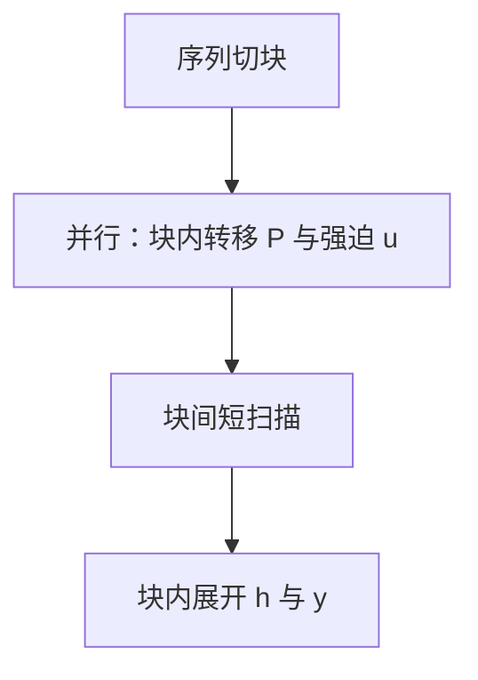

# 分块并行形式

线性递归只要算子结合，就可以按块先算局部转移，再沿块扫描；块内不必逐步串行到底。

<footer>—— 扫描的结合律是经典并行算法；在 SSM 与线性注意力上的用法见 Dao &amp; Gu, Transformers are SSMs, 2024</footer>

[上一课](/llm/hardware-aware-scan)在 SRAM 里对块做串行扫描，块间传状态。块一长，块内又变成串行瓶颈。本课把同一扫描写成**分块并行形式**：块内用结合律聚合成一块转移矩阵（或对角等价物），块间再扫描这些转移。这是 Mamba-2 / SSD 训练核的代数前提，也是[线性注意力](/llm/linear-attention)按块算的同一套路。下一课状态空间对偶会说明它和注意力形式何时是同一对象。

## 问题

逐步 $h_t=a_t h_{t-1}+b_t$ 看起来必须从左到右。并行前缀和（parallel prefix / scan）早就指出：若更新是结合的二元运算，存在 $\Theta(n)$ 工作、$\Theta(\log n)$ 跨度的算法。SSM 与线性注意力的状态更新恰好是仿射，可以写成矩阵作用的半群。缺口是把这套经典技巧接到深度学习核：**块内并行算局部 $\prod a$ 与局部强迫项，块间再串一次短扫描**。

硬件感知分块选择块长为了 SRAM；分块并行选择块长为了并行度与寄存器。两课互补：没有结合律，片上也只能逐步；没有分块，结合律只是复杂度论文。

非结合的更新（例如带归一化的 softmax 注意力）不能这样拆。这就是二次注意力难以变成一条短扫描的原因。

## 方法

把长度为 $n$ 的序列切成宽度 $c$ 的块。对块内下标，把

$$
h_{t}= \overline{A}_t h_{t-1}+\overline{B}_t x_t
$$

写成作用在扩张状态 $(h,1)$ 上的矩阵乘，连乘得到块转移 $P_{\mathrm{block}}$ 与块强迫 $u_{\mathrm{block}}$。所有块的 $P,u$ 互不依赖，可并行。然后对块索引做一次长度为 $n/c$ 的扫描，得到每块初值，再在块内用初值展开输出。$c$ 典型为 64 或 128，与 SRAM 块可以同一量级。

对角 $\overline{A}_t$ 时矩阵退化为逐通道标量连乘，更便宜。这是为何 Mamba-2 强调对角 SSM 与后课 SSD 对齐。

### 训练为何需要它

反向同样是结合扫描，可对同一分块结构实施。长序列上若只靠逐步，编译器与自动微分都会物化 $n$ 步图。分块形式把图的深度收到 $n/c+\log$ 量级的核内部，Python 层只看见几块张量。

## 机制

结合律来自仿射复合：先应用 $f$ 再应用 $g$ 仍是仿射。softmax 注意力的「先指数再按行除」打破仿射，分块必须引入在线 softmax 的额外统计量，那是 FlashAttention 的路，不是本课。线性注意力 $\phi(q)^\top\sum \phi(k)v^\top$ 的求和本身结合，分块就是块内求和再加起来，比 SSM 还简单。

数值：长链 $\prod \overline{A}$ 在衰减设定下趋于 0，这是稳定的；若某通道 $\overline{A}\approx 1$ 且 $c$ 很大，要用 log-space 或高精度存连乘。分块并不自动解决溢出，它只改并行形状。

块宽 $c$ 与头维、状态维一起决定核的占用。过大则块内又串行化；过小则块间扫描变长、启动开销涨。

## 边界

只有更新是半群才能用。门控若插在扫描内部破坏仿射，就要把门移到扫描外，或接受不能分块。实现错误的「伪并行」（块内仍逐步但 Python 做了切块）不会变快。下一课把这种分块扫描与分块注意力写成对偶，从而允许同一套核服务两类层。

## 小结

- 仿射状态更新结合，故可分块：块内聚合成转移，块间短扫描，再块内展开。
- 这是硬件感知扫描的代数版，也是长序列训练核的形状。
- Softmax 注意力不在此半群里；线性注意力的求和是更简单的结合。
- 连乘的数值仍要管；分块不是精度魔法。
- 出处：并行前缀扫描的经典结果；SSM 上的用法见 Dao & Gu, 2024。
