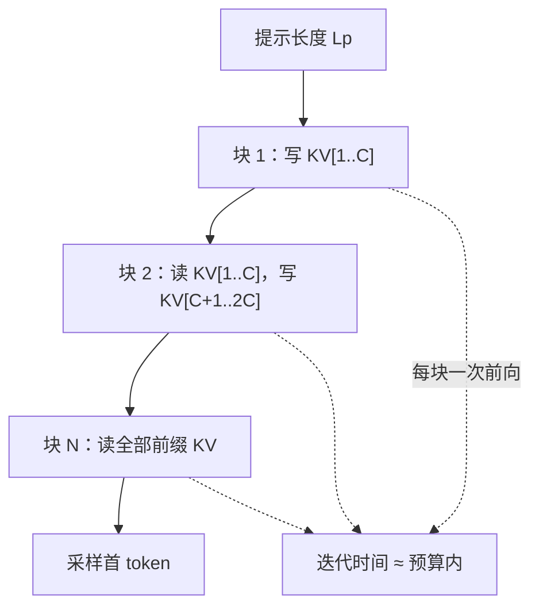

# chunked prefill

    
把一次过长的前填切成若干仍能喂饱计算单元的块，迭代时间才有上界，正在生成的请求才不必为新来的长提示让路到停顿。

<footer>—— Agrawal et al., Sarathi / Sarathi-Serve</footer>

标准解码器只服务把请求分成前填与解码：前填一次性吃完整提示、写下 KV，解码再逐步追加。提示只有几百 token 时，一次前填既短又算力密集，是好事。提示到数千乃至更长时，这次前填变成一次无界的计算作业：同卡上所有解码步都要等它结束，[ITL](/llm/tpot-itl) 出现 stall，新请求的 [TTFT](/llm/ttft) 也取决于队头那条提示有多长。Chunked prefill 的回答很具体：前填不再是原子的，按块跨多个迭代做完。它是混合批次与 stall-free 调度的前置机制，本身并不规定如何与解码拼批。

## 问题

原子前填的调度语义是：要么整段提示进入这一次前向，要么等下一次。连续批处理只能在迭代边界插入请求，插进来的若是长前填，下一次前向的耗时随 $n$ 二次上涨。Sarathi 把这种现象叫做 generation stall——不是解码公式坏了，是前填的粒度太大。

与此同时，GPU 并不需要整段提示才能饱和。前填是算力密集的：序列到数百 token 量级，张量核往往已经吃满。再继续加长，单次作业更重，但对「这一拍是否算满」帮助有限，对「这一拍要多久」伤害很大。于是存在一个窗口：块足够大以保持高算术强度，又足够小以使迭代时间落在 TBT 预算内。Chunked prefill 就是在这个窗口里切提示。

### 切块之后注意力还正确吗

第 $i$ 块处理提示的一段连续 token，长度为 $C$（最后一块可能更短）。这些新 token 的查询必须看见**已经写下的前缀 KV**（本请求更早的块）以及块内因果位置，而不能只看见块内。否则分块就改变了 [SDPA](/llm/sdpa) 的可见集合，表示会错。因此实现上第 $i$ 块是一次「短查询、长键」的前向：查询长度约 $C$，键长度约 $iC$。前馈、投影按 $C$ 计；注意力按累积前缀计。总 FLOPs 与一次整段前填同阶，只是被拆到多拍，并且每拍都要重新把已有 KV 读进核。

切块不是近似注意力，也不是滑窗。每一块仍对当前合法前缀做精确 softmax。改变的是时间轴上的粒度，不是连通性。若某实现为了省带宽只让块看见块内，那是另一种算法，不能再叫 chunked prefill。

## 方法

令提示长度 $L_p$、块长 $C$，则块数为 $\lceil L_p/C\rceil$。调度器每次迭代至多提交一块（或在 token 预算下提交若干块的总和不超过预算）。该请求的 KV 页随块追加；尚未做完前填之前，不采样输出 token——用户侧 TTFT 要等最后一块结束并采出首词。最后一块可以与解码 token 出现在同一前向里，那是 [SplitFuse / 混合批次](/llm/splitfuse) 的拼法；chunked prefill 只保证「允许部分前填」。

块长的选取有两端约束。太小：算术强度掉下去，前填从算力问题变成反复读权重的带宽问题，总时延上升，还可能比原子前填更慢。太大：单次迭代再次无界，stall 回来。Sarathi-Serve 的经验图像是：在其测量的设置下，前填吞吐大约在数百 token 长度就开始饱和，因此用几百 token 的块仍能喂饱 GPU，同时把单次迭代钉在 TBT SLO 附近。具体饱和点随模型宽、硬件和核实现而变，不能把某一个 $C=512$ 写成物理常数。

### 重复读 KV 的额外流量

整段前填时，每个键在注意力里被查询集合读过一轮，HBM 上 KV 写出一次。切成 $N$ 块后，第 $j$ 块的查询要读前 $j$ 块的 KV。粗算读次数随块下标累加，约 $O(N^2 C)$ 量级的 KV 流量，相对整段前填多出「后面的块反复扫前面的页」。$N$ 不大时这是常数级开销；把超长提示切成极多小块时，带宽税会变得可见。这是 DistServe 一类工作批评「切得过碎」的原因之一：为了保护 ITL 而过度切片，前填自己变慢，TTFT 与能耗一起坏。

## 机制

因果掩码在块之间自然延续：位置下标全局递增，块 $i$ 的 token 不得看见未来块。实现可以用块表或连续缓冲，只要逻辑下标正确。[PagedAttention](/llm/paged-attention) 与切块正交：每块追加若干 KV 页，不必预留整段连续显存。变长提示的最后一块不足 $C$，应用真实长度而不是 padding 到 $C$ 再打满注意力，否则既浪费又可能让 padding 位置漏进 softmax。

从屋顶线看，一块前填把一次前向从「$B$ 条解码、每条 1 个 token」拉到「再加 $C$ 个 token」。$C$ 足够时，这一拍从带宽区进入算力区，同批解码等于搭顺风车：它们本要为读权重付一次全价，现在与 $C$ 个前填 token 分摊。这是「切块不仅为了降 stall，有时还提高解码效率」的机制。代价是解码必须等这一拍的算力作业结束，ITL 基线高于纯解码批。

块边界与 tokenizer 无关，不必对齐句子。但和推测解码、工具调用的「必须整段可见才可决策」的边界要分开：chunked prefill 只切计算，不切用户可见的部分答案——答案仍在前填全部完成之后才开始吐。

### 与流水线并行的关系

流水线并行下，各 microbatch 的迭代时间若随提示长度剧烈波动，气泡会放大。块长固定后，每拍的 token 数更均匀，气泡缩小。这是 Sarathi 相对纯吞吐引擎多出来的系统动机：切块不仅为了单卡 TBT，也为了多卡流水线的可预测性。它不消除流水线本身的气泡，只消除「某一拍突然是 20k 前填、下一拍是 32 条解码」这种振幅。

## 边界与工程取舍

Chunked prefill 增加实现复杂度：部分完成的前填要作为请求状态保存，调度器要区分「还在前填」和「已在解码」，注意力核要接受「查询短、KV 长、页表不连续」。预算过小伤害 TTFT 与总吞吐；预算过大回到 stall。MoE 上每块可能再次触发专家加载，切得越碎，冷专家搬运越频繁。分离式服务把前填放到另一池，切块的动机变弱，但仍可能在前填池内部用来平滑作业尺寸。

不要宣称切块降低了注意力复杂度。总计算仍是对长度 $L_p$ 的二次前填，只是时间上分期。也不要把「vLLM 默认开启 chunked prefill」写成论文结果：那是引擎版本选择，随发布而变。评测对比必须写 $C$ 或 token 预算，否则分块与不分块不在同一 SLA 下。

超长上下文再叠加切块，KV 反复加载会接近二次流量。若产品同时要极低 TTFT 和极低 ITL，切块可能两边都不够好，需要前填/解码分离或检索把有效 $n$ 降下来。切块是调度工具，不是长上下文算法。

## 小结

- Chunked prefill 把原子前填改成分期写入 KV，使单次迭代的计算量有上界。
- 每一块的查询必须看见本请求已完成的前缀 KV，公式仍是精确因果注意力。
- 块长需同时满足：足够大以饱和算力，足够小以落入 TBT 预算。
- 切块会重复读取已有 KV，块数很多时带宽税上升；总 FLOPs 不降阶。
- 它是混合批次与 stall-free 调度的前提，但本身不等于已经与解码融合。
- 与分页 KV、连续批处理正交，常一起出现在现代引擎里。
- 出处：Agrawal 等，Sarathi 与 Sarathi-Serve（OSDI 2024）；机制上亦被 DeepSpeed-FastGen 的 SplitFuse 采用。
