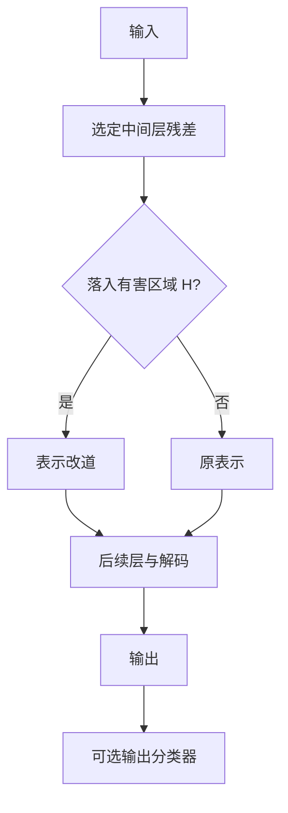

# Circuit Breaker 消融有害方向

与其只教模型说出拒答话术，不如在内部表示一旦进入有害区域时把该表示打断或改道，使后续层失去继续生成危害内容的激活前提。

<footer>—— Zou et al., Improving Alignment and Robustness with Circuit Breakers, 2024</footer>

Zou 等人提出 Circuit Breaker（电路断开 / Representation Rerouting）：对齐失败常常是因为有害行为在残差流里仍有完整、可继续解码的表示，拒答只是表层 logits 上的一个模式，可被[GCG](/llm/gcg-suffix)、角色扮演与短[预填充](/llm/prefill-jailbreak)掀翻。电路断开在训练里加入一项表示级目标：当激活接近「有害电路」时，把它推离该区域、改道到拒答或无害方向，使有害续写在内部就断路。本篇写与拒答 SFT 的差别、改道目标、以及评测；不给出用于提取有害方向的提示对，不给出可复现的攻击对照表。

## 问题

常规安全 SFT 与偏好优化改变 $p_\theta(y \mid x)$ 的开场，不保证中间层表示与「未对齐模型在配合时」的表示正交。红队一再显示：表层拒答很脆，一旦条件变化，同一套权重仍能走出有害轨迹。需要一种干预，作用点在激活，而不是只在输出词上打补丁。这与直接反学习（unlearning）也不同：反学习想抹掉知识，电路断开假定知识仍在，但**通往有害使用的内部路径被掐断**。产品上往往更想要后者：模型仍能讨论新闻与安全机理，但不能把表示组织成可执行危害步骤。

问题化为：能否定义「有害表示」的集合 $\mathcal{H}$，在训练时对进入 $\mathcal{H}$ 的激活施力，使其落到补集，同时尽量不扰动无害任务的表示。

### 表层拒答为何不够

拒答话术是短、高似然、易被梯度对准的序列。对抗后缀优化的正是与这段话术竞争的开场。Many-shot 用上下文任务向量盖过它。只要 $\mathcal{H}$ 在中间层完好，解码器随时能从 $\mathcal{H}$ 读出教程。Circuit Breaker 的主张是：把 $\mathcal{H}$ 变成高损失区，使优化攻击与上下文攻击都更难找到仍能解码的路径。

「断开」不是把某几条注意力头物理删掉。它是训练出来的动态改道：特定激活模式触发，表示被重写。名字来自电路被短路或跳闸的类比，不是可解释性里定位到的一条固定边。

## 方法

先用对比数据构造有害与无害（或有害与拒答）条件下的激活。在选定层上读残差，得到方向或区域的估计。训练时，对有害条件下的激活加损失，使其远离该区域（例如推向正交、推向拒答条件的激活、或推向随机噪声中的安全区——具体形式以原文 Representation Rerouting 为准），同时用保留损失（蒸馏或普通语言建模）钉住无害输入上的表示。实现上常用低秩适配器，以免全量破坏通用能力。推理时不需要额外提示：前向经过适配器，有害方向被动态改道。

这与推理时给激活加向量（见[表示工程抑制](/llm/repeng-refusal)）互补：RepE 常是推理期加性控制；Circuit Breaker 把控制写进权重（或适配器），对所有输入默认生效，攻击者不能靠「不加向量」绕过。评测应在不加任何推理期补丁的默认前向下进行。

### 选层与保留能力

过浅的层：语义未成形，$\mathcal{H}$ 与无害主题纠缠，改道会过拒绝。过深的层：有害内容已经写进即将输出的 logits，打断太晚，且可能只影响话术不影响计划。原文在中后层选点，工程上应对层做扫描，用无害基准（常识、代码、数学）与安全基准一起看。保留损失的系数是主旋钮：太大则电路不断，太小则万能模型变哑巴。应报成对数字，而不是只报越狱率下降。

## 机制

把残差流想成一条总线。有害生成需要总线上出现一组可被后续 MLP 与注意力读懂的特征（步骤结构、对象、手段）。电路断开在总线上加了一个对 $\mathcal{H}$ 敏感的非线性：进入则改写。GCG 一类输入优化若仍能成功，必须找到**不经过 $\mathcal{H}$ 却仍能解码出危害**的另一条电路，或把 $\mathcal{H}$ 的定义拟合坏。这提高了优化难度，不是使成功概率数学上为零。故评测仍要用标准化攻击器，见 [HarmBench](/llm/wildguard-harmbench)。

与分类器门的差别：分类器在序列两端看字符串；电路断开在每层 token 上看激活，对[预填充](/llm/prefill-jailbreak) 造成的内部状态同样生效——只要前缀把表示推进 $\mathcal{H}$。若有害内容以模型未见过的编码进入，可能不进 $\mathcal{H}$，此时仍需[输出分类器](/llm/llama-guard)。多层防御的意义正在于此。

若构造 $\mathcal{H}$ 时只用了狭窄的危害类别，断开的是那几类的方向，其它类仍通。类别覆盖是数据问题，不是损失公式问题。

### 防御评测

至少：HarmBench 或同等协议上的攻击成功率；无害能力基准；过拒绝集；针对表示攻击的对照（推理期反向加向量，看是否仍能恢复有害行为）。若反向加向量轻易恢复，说明断开只是平移了均值，方向仍在，需要更强的改道或噪声化。消融：只 SFT 拒答、只 Circuit Breaker、两者叠加、再叠加宪法分类器。报告适配器秩、作用层、保留损失系数。不要用「我们内部的越狱列表成功率零」代替公开协议。

## 边界与工程取舍

Circuit Breaker 不提供形式化保证，对白盒攻击者仍可能被重新优化。它也可能把合法的安全讨论、小说、历史战争叙述推进 $\mathcal{H}$，表现为过拒绝或内容空洞。医疗与化学教学尤其敏感：表示上与滥用接近，条款必须在构造 $\mathcal{H}$ 时纳入允许集。多语言模型上，$\mathcal{H}$ 可能是英文主、其它语言漏；评测要分语言。

与 Llama Guard、[宪法分类器](/llm/constitutional-classifiers) 相比，电路断开更新政策更慢（要重训适配器），但对「已经绕过字符串门」的内部轨迹更直接。生产宜：分类器热更新政策，电路断开抗优化攻击。本篇不描述如何采集有害激活所用的原文提示。开源发布适配器等于公开 $\mathcal{H}$ 的对偶，攻击者可研究如何绕过；这是开源安全的固有权衡，评测应假设适配器权重已知。

名字容易让人以为可以像保险丝一样给出认证切断。实际是统计学习出的改道，温度、采样、新越狱族都会移动有效性。把它当保险丝，会漏检。

## 小结

- Circuit Breaker 在中间表示上打断或改道有害区域，而不是只优化拒答开场。
- 它针对表层对齐的脆弱性，提高 GCG 等优化攻击的难度，但不给出零泄漏证明。
- 与推理期表示加向量相比，改道写进权重/适配器，默认对所有请求生效。
- 评测必须同时报攻击成功率、无害能力与过拒绝，并扫描作用层与保留损失。
- 类别与语言覆盖取决于构造 $\mathcal{H}$ 的数据；未覆盖即未断开。
- 宜与异构输出分类器叠用；开源适配器应假设白盒。
- 出处：Zou et al., *Improving Alignment and Robustness with Circuit Breakers*, 2024。
