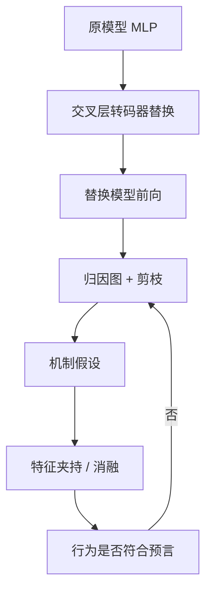

# Circuit Tracing 电路追踪

我们用一种方法揭示语言模型行为背后的机制：在替换模型里逐步追踪计算，为感兴趣的提示生成图描述。

<footer>—— Ameisen, Lindsey, Pearce, Gurnee, Turner et al., Circuit Tracing: Revealing Computational Graphs in Language Models, Transformer Circuits Thread, 2025-03-27</footer>

电路追踪（circuit tracing）是 Anthropic 在 2025 年公开的一套方法，用来把一次前向拆成可可视化、可干预的计算图。它不是某一类注意力头的名字，而是一条流水线：训练更可解释的替换组件、在替换模型上归因、剪枝成图、再用夹持实验验证。配套的生物学论文把同一套工具打到 Claude 3.5 Haiku 上，展示多步推理、语言混合、诗歌与拒答等行为的内部路径。归因图是这条流水线的产物；本篇写流水线本身，以及它相对手工电路分析的取舍。

## 问题

手工电路分析在 GPT-2 small 的 IOI 任务上证明了可行性，却难以搬到前沿模型。障碍有三。MLP 神经元多义，几乎不能当节点；注意力头在大模型里功能混杂；搜索空间随层数与宽度组合爆炸。稀疏自编码器改善了「方向可命名」，但默认只解释残差里有什么，不解释这些方向怎样一步步写成输出。

电路追踪要的是可扩展的机制发现：对任意感兴趣的提示，自动提出「中间步骤假设」，并提供验证接口。它承认不能无损还原原模型，于是显式引入替换模型，把不可解释的 MLP 换成稀疏特征计算，在可解释的代理上做追踪。

### 为何必须替换而不是只读原 MLP

原 MLP 是稠密非线性，特征叠加（superposition）让单个神经元没有稳定语义。转码器或交叉层转码器学习用稀疏潜变量重建残差更新，潜变量更接近「一个方向一个概念」。追踪发生在这个代理里。代价是代理误差：凡是重建不好的计算，都会逃出特征账本。方法论文把误差做成一等公民，而不是事后道歉。

电路追踪与 Meng 等人的因果追踪同名不同物。后者在原模型激活上做修补，定位哪一层、哪个 token 位置介导了事实回忆。前者先换掉 MLP，再在特征图上走归因。两者都是干预式解释，但对象分别是位置/层与稀疏特征通路。

## 方法

流水线分四段。

第一，训练交叉层转码器，使一组稀疏特征能够解释多层 MLP 的输出。跨层是为了让同一概念不必被复制进每一层的字典。第二，对目标提示运行替换模型，记录活跃特征、残差、注意力输出与重建误差。第三，以目标 logit（或 logit 差）为根，计算节点间线性效应，得到归因图，再按贡献剪枝。第四，根据图提出机制假设，用特征夹持、消融、或把特征激活到对照提示的值，看输出是否按预言变化。

### 验证工具与可视化

方法论文配套了交互式可视化：按贡献排序的边、按位置展开的特征、误差占比。验证不是看图讲故事，而是做扰动。若图说某特征是「计划输出首都」的中介，把它压到零，首都应掉；把它升到对照值，输出应偏向对照。Lindsey 等人在 Haiku 上对多类行为重复这一循环。后续 Kamath 等人补上注意力 QK 归因，使「为何看那个上下文位置」也能进入同一套追踪。

这套工具对 18 层研究模型先跑通，再应用到生产级 Haiku。顺序本身说明：追踪依赖替换质量，替换质量依赖能训得动的转码器；前沿模型不是从零手工找头，而是先有字典再有图。

## 机制

追踪能成立，靠的是局部线性化。替换模型在给定激活模式附近是分段线性的，于是从输出反推的一阶贡献可加。稀疏性保证同时亮的特征不多，图才剪得动。交叉层则让「同一特征在不同层被读」显示为跨层边，而不是被误认成许多无关神经元。

### 假设-干预闭环

图上的路径是相关结构。闭环把它升级成因果声明：干预特征 $\rightarrow$ 下游特征与 logits 按边的符号移动。失败模式很具体。干预有效但图上没有对应边，说明线性化漏了通路；图上有边但干预无效，说明边是相关不是介导。生物学论文里多次出现并行路径与「内部冲突」（例如同时激活助答与拒答特征），这正是闭环要暴露的：模型不是单一故事线。

替换模型上的因果，不等于原模型上的因果。夹持的是转码器特征，不是原 MLP 神经元。若要把结论迁回原模型，应用等价的残差方向做修补，看行为是否同向。两套干预不一致时，应报替换误差，而不是只信图。

与早期 Circuits 工作相比，追踪降低了对「找到一组固定头」的依赖，改成「每次前向生成一张图」。代价是机制的单位变成特征字典里的编号，跨模型、跨训练检查点难以对齐。可扩展性换来了可移植性的损失。

## 边界与工程取舍

电路追踪的计算成本高：转码器训练、逐提示归因、交互式剪枝。它目前适合案例研究，不适合对每次用户请求做在线解释。字典完备性是硬上限——没有的特征不会出现在图上，只会漏进误差节点。长上下文、工具调用、多轮对话会让图爆炸，现有演示以短文本行为为主。

安全与政策解读尤其要克制。图上出现「欺骗」或「拒答」相关特征，只说明这次前向用了这些方向，不能外推成稳定意图。正确用法是：追踪提供可证伪的内部故事，故事必须在原模型干预与行为评测上站住。

不要把电路追踪理解成自动反向工程。自动的是图的生成；命名、合并同义特征、判断是否算「同一算法」，仍然是人在做。工具加速的是假设吞吐，不是把解释责任交给模型自己。

## 小结

- 电路追踪是「替换模型 + 归因图 + 干预验证」的流水线，用来为单条提示生成可检验的机制假设。
- 交叉层转码器把 MLP 换成稀疏特征计算；重建误差必须进入追踪，不能丢掉。
- 验证靠夹持与消融，而不是靠可视化叙事；图与干预不一致时以干预与误差报告为准。
- 它补上了 SAE「有特征无通路」的缺口，但机制绑定字典，跨检查点对齐困难。
- 与激活修补式因果追踪互补：一个定位层与位置，一个定位特征通路。
- 出处：Ameisen et al., *Circuit Tracing: Revealing Computational Graphs in Language Models*, Transformer Circuits, 2025；Lindsey et al., *On the Biology of a Large Language Model*, 2025。
