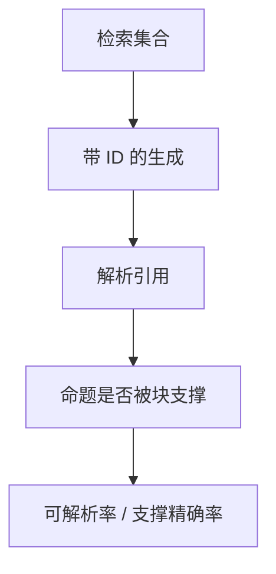

# 引用与归因

检索到了不等于回答忠于检索。引用必须能解析到块，并且命题能被该块支撑，否则只是学术文风。

<footer>—— Gao 等 ALCE；主干 [诚实与引用](/llm/honesty-citations)</footer>

[上一课](/llm/multi-hop-retrieval)让证据链变长，张冠李戴的机会变多。主干诚实课已区分虚构引用；本课把 RAG 场景的归因钉进评测进阶的检索单元。缺口是：**出处可点击且支撑命题**，不是脚标长得像论文。后课 RAGAS 会把忠实度收成自动指标，本课先定义要测什么。

## 问题

三种失败：无引用；引用了未检索的编号；检索了块但命题来自参数记忆或另一块。Gao 等人的 ALCE 把自动引用评测做成可复核：引用是否指向真实文档、句子是否被引用支撑。与幻觉分类课的「归因幻觉」是同一对象在 RAG 管道里的名字。

强制「每句都要有标」会诱发随机贴标。应要求：需核验的命题有标，寒暄无标；评测分列覆盖率与精确率。

块太大，一条引用等于「整页都算」；块太小，一条命题要跨多个标。切分课的粒度就是归因粒度。

## 方法

生成时只允许引用检索集合内的 ID。事后：解析标号；对每个带标命题做支撑判断（NLI 或人）。报告：可解析率、支撑精确率、无支撑率。多跳要按跳对齐：桥接命题应引用第一跳块。禁止用未校准法官只打「看起来有出处」。

## 机制

语言模型有「像论文」的先验，会补全括号与作者年。RAG 若不把 ID 当作闭集约束（受限解码或后处理过滤），先验会压过检索集合。支撑失败来自参数与上下文混合：窗口里有块，模型仍用记忆填细节。忠实性训练与约束解码改的是这条混合，不是再加一个更强的检索器。

## 边界

本课不做法学意义上的出处保证。下一课 RAG 评测把归因、相关性、上下文利用收成套件（RAGAS 一类）。

## 小结

- 归因 = 可解析 ID + 块支撑命题；分列覆盖与精确。
- 引用闭集约束，防止虚构脚标。
- 切分粒度决定引用粒度。
- 出处：Gao 等 ALCE；诚实与引用课；幻觉分类课。
