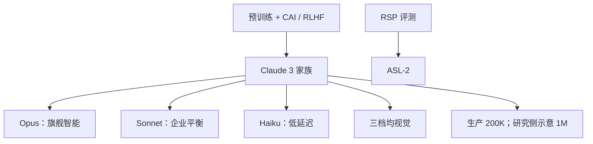

# Claude 3 模型卡

    
我们引入 Claude 3 多模态家族：Opus 最强，Sonnet 平衡技能与速度，Haiku 最快最便宜；全部能处理图像。灾难性风险评测未显示越界，故全部定为 ASL-2。

    <footer>—— Anthropic，The Claude 3 Model Family: Opus, Sonnet, Haiku，2024-03</footer>

2024 年 3 月 Anthropic 发布 Claude 3 模型卡与家族博文。三档 **Opus / Sonnet / Haiku** 全部带视觉；生产上下文窗口 **200K** token，卡片与博文同时写模型**有能力**接受超过 1M 的输入，当时生产只提供 200K，1M 仅考虑给特定客户。对齐沿用 Constitutional AI：在 RL 里用成文原则（含联合国人权等来源），Claude 3 新增一条来自 Collective Constitutional AI 的残障权利原则。能力表上 Opus 在 GPQA、MMLU、MMMU 等当时公开对比中领先；Haiku 在多数纯文本任务上达到或超过 Claude 2。本篇只写模型卡与发布博文，**不编参数量**。

## 问题

Claude 2.x 的公开短板是：无害拒答过宽（无害提示也被拒）、长上下文中间丢失、视觉缺失、以及相对 GPT-4 的推理/编码差距。企业侧还需要同一套 API 里按延迟与价格选档，而不是只有一个旗舰。模型卡因此同时交三份：智能、速度、成本，并用同一套安全与 RSP 评估。

RSP（Responsible Scaling Policy）要求在部署前做灾难性风险评测并赋予 ASL。Claude 3 评估三类：生物能力、网络能力、自主复制。ASL-3 的预警阈值写得很具体（例如生物题集相对 Claude 2.1 提升 25%、网络专家级漏洞利用的通过率规则）。卡片结论：无灾难性风险指标，**三档均为 ASL-2**；并强调评测科学本身未完成，方法仍在改进。

### 200K 生产窗口不是 1M 能力声明的同义词

针测（NIAH）上 Opus 在最长 200K 的文档里近乎完美召回（卡片写超过 99%，200K 处平均召回约 98.3%）。Sonnet 与 Haiku 在短于 100K 时优于 Claude 2.1，更长时大致打平 2.1。1M 的损失曲线出现在图 14 一类分析里，用来说明继续拉长在训练上可行；当时用户默认拿不到 1M。把「能力达到 1M」写成「API 已是 1M」，与卡片当时句矛盾。

价格在发布博文里按百万 token 列出：Opus $15/$75，Sonnet $3/$15，Haiku $0.25/$1.25（输入/输出）。这是产品档位，不是参数量的代理。不要用价格反推层数。

## 方法

预训练：大规模多样数据上的词预测。后训练：人类反馈 + Constitutional AI 原则。部分人类反馈数据此前已随 RLHF 与红队研究公开。上线后 Trust and Safety 用分类器持续监控提示与输出。安全基础设施：双人控制、最小权限、渗透测试等，卡片有独立安全节，与能力无关。

评测协议值得单独写。GPQA Diamond：0-shot CoT 上 Opus 50.4%，Maj@32 的 5-shot CoT 到 59.5%（选项顺序随机化，后者还对迭代取平均）。MMLU：Opus 5-shot 86.8%，5-shot CoT 88.2%；Sonnet 79.0%/81.5%；Haiku 75.2%/76.7%。MATH、GSM8K、HumanEval、多语言与视觉（科学图、VQA、图上定量推理）分列。GRE 等人类考试有官方练习卷设定。内部拒答集区分「无害被拒」与「有害应拒」：相对 Claude 2，Claude 3 更少误拒无害请求，同时仍识别真实伤害。

视觉与文本一样走同一模型，不是外挂 OCR 管道——卡片用图表理解加多步推理的例子（如读 Pew 图再结合 G7 知识做算术）说明需要跨图文绑定，而不是只做 caption。

### 多数票是测试时计算

GPQA 与 MATH 上的 Maj@32 把采样宽度写进分数。与 greedy 或 0-shot 比时必须分列，否则把 [测试时计算](/llm/test-time-scaling) 偷运进「基座智能」。模型卡自己提供了多列，引用时不要只抄最高列。多语言：卡片承认低资源语言较弱，并给出评测节，不能用 Opus 的英语 MMLU 代表所有语种。

## 机制

Constitutional AI 把「应当如何」写成可在 RL 里查询的原则列表，而不是只靠标注员两两比较。新增残障权利原则是 Collective Constitutional AI 公共意见流程的产物，说明宪法可修订。这不消除幻觉：卡片写模型仍会错，HHH（有用、无害、诚实）是进行中的目标。更少误拒来自更细的伤害边界，不是更松的 AUP——AUP 仍划定不可用的用途。

长上下文机制在卡片里用针测与「中间丢失」文献对照：参数更大的档（Opus vs Haiku）在检索特定信息上更好。这是经验观察，没有公开位置编码公式。视觉机制是原生多模态前向，输出仍是文本（与当时 GPT-4 报告同类）。灾难性风险评测用简化环境与较少试验次数来**排除**过线：反复零进展就停，这是阈值测试，不是能力上限测量。

ASL-2 的部署缓解包括权重防机会主义攻击、CBRN/网络相关提示的自动检测。卡片请用户把令人担忧的生物/网络/自主复制回复发到 usersafety@anthropic.com。这是运营机制，不是模型结构。

### 与 GPT-4 报告的对照方式

两边都拒绝公开参数。GPT-4 报告强调可预测扩展与 RBRM；Claude 3 卡片强调宪法、三档产品与 RSP 阈值。GPQA 等表上的「当时 SOTA」是 2024 年 3 月的横截面，随后被 3.5 超过。不要把卡片里的 GPT-4 列当成 OpenAI 后来快照的分数。

## 边界与工程取舍

没有层表、没有 MoE 声明（不要把后来的传闻写进 Claude 3）。1M 在 2024 年 3 月不是一般可用功能。Haiku 晚于 Opus/Sonnet 几天到 API，博文已说明。评测排除或未对齐 o1 一类「先想很久」的模型——3.5 增补卡以后会显式排除 o1 家族，因为预响应计算不可比；读 Claude 3 原卡时同样不要用后来的推理模型去打当时的表。

污染、提示敏感性、图像分辨率与长图策略，卡片无法支持精确复现。企业合规应读 AUP 与当时 SLA，而不是只读 GPQA。后续 3.5 / 3.7 是新检查点与新系统卡，能力与计算机使用不要倒填。

出处：Anthropic，*The Claude 3 Model Family: Opus, Sonnet, Haiku*（模型卡 PDF，2024-03）；*Introducing the next generation of Claude*。参数量未公开。

## 小结

- Claude 3：Opus / Sonnet / Haiku 三档多模态；生产 200K 上下文；CAI + 人类反馈。
- Opus 在 GPQA/MMLU 等当时对比中领先；须分列 0-shot 与 Maj@32。
- 针测上 Opus 近乎完美；1M 仅作能力示意，当时未作默认产品窗口。
- RSP 评测后三档均为 ASL-2。
- 出处：Anthropic 2024 年 3 月模型卡。不编参数量。
