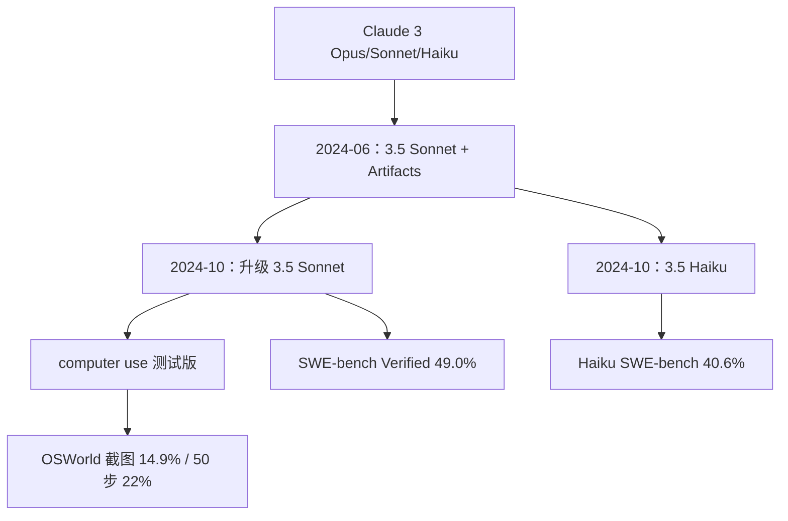

# Claude 3.5 Sonnet / Haiku

    
3.5 Sonnet 以中档的速度与价格超过当时的 Opus；升级档把 SWE-bench Verified 从 33.4% 拉到 49.0%，并首次把「看屏幕、点鼠标」以公开测试版交给开发者。

    <footer>—— 综合 Anthropic 2024-06-21 与 2024-10-22 博文，以及 Model Card Addendum: Claude 3.5 Haiku and Upgraded Claude 3.5 Sonnet</footer>

Claude 3.5 不是一张卡里的一个检查点。2024 年 6 月 21 日发布的 **Claude 3.5 Sonnet** 是 3.5 家族的第一枪：研究生级推理（GPQA）、本科知识（MMLU）、编码（HumanEval）上刷新当时公开对比，并在 claude.ai 上线 **Artifacts**——代码、文档、网页设计出现在对话旁的专用窗，可即时编辑。2024 年 10 月 22 日的增补卡与博文给出 **升级版 3.5 Sonnet**（`claude-3-5-sonnet-20241022`）与 **Claude 3.5 Haiku**：升级档在智能体编码与工具上再跳一截，并公开测试 **computer use**；Haiku 在许多评测上追平旧旗舰 Opus，速度仍接近上一代 Haiku。上下文默认仍是 200K 量级。本篇按两份公开材料分列检查点，**不编参数量**。

## 问题

3 月的 [Claude 3](/llm/claude-3-card) 把智能峰值放在 Opus 上，中档 Sonnet 留给企业吞吐量。三个月后 Anthropic 要证明：中档可以在智能上超过旧旗舰，从而把「日常编码与分析」的默认模型从 Opus 换下来，降低延迟与账单。6 月卡要交的是语言、视觉、编码与写作语调，而不是桌面智能体。

10 月要交的是智能体闭环。SWE-bench Verified 测的是真实仓库 issue：读代码、改补丁、过测试。τ-bench 测的是带工具的多步任务（航司、零售）。OSWorld 测的是只看截图、在真实桌面应用里点选。人在 OSWorld 约 72% 成功；当时其他模型的截图-only 分数很低。computer use 把模型输出定义成鼠标键盘动作，错误会变成真实副作用，安全评测必须单独做。

### Artifacts 是产品表面，不是新模态

Artifacts 把模型生成的代码与页面从气泡里拆出来，变成可迭代的工作区。它不改变 tokenizer，也不等于视觉输入。6 月的能力跃迁在模型检查点；Artifacts 改变的是人如何消费输出。写 3.5 时不要把侧栏写成「多模态架构」。

6 月公开数字（Anthropic 发布口径）：GPQA Diamond 59.4%，SWE-bench Verified 33.4%，HumanEval 92.0%。10 月升级档 SWE-bench Verified **49.0%**；3.5 Haiku SWE-bench **40.6%**，超过 6 月的 3.5 Sonnet。τ-bench 航司 52%→62%、零售 62%→69%（升级档相对原 3.5 Sonnet）。引用必须钉日期戳。

## 方法

6 月材料几乎不谈训练配方，沿用 Claude 3 的 CAI / 反馈叙事，强调评测与产品。10 月增补卡给出 computer use 的操作定义：模型解释截图，生成 GUI 命令（移动光标、点击、键入），完成跨应用工作流。评测只给截图，不用 OSWorld 可选的无障碍树文本。标准 15 步预算下升级 3.5 Sonnet 平均成功率 **14.9%**；把步数放到 50、并优化提示后到 **22%**，说明一部分失败是交互预算而不是单步感知。人类 72.36%。工具使用另测 SWE-bench 与 τ-bench；Haiku 知识截止写为 2024 年 7 月。

安全：computer use 放在 **ASL-2** 框架下，卡片称未发现灾难性风险指标。新增第一方与独立第三方的多模态红队。增补卡明确**不把 OpenAI o1 家族列入对比表**，因为大量预响应计算与「普通前向」不可比。越狱、提示注入在控制电脑时变成「按恶意页面指示点按钮」，缓解必须含环境沙箱与权限，而不仅是拒答。

### 屏幕动作是工具，不是「模型有一双手」

API 把 computer、文本编辑器、shell 等定义成工具 schema；执行层由开发者搭。模型只提议动作，真实点击发生在用户的沙箱虚拟机里。OSWorld 的 14.9% 是在这一接口上的任务成功率，远低于人，博文也写早期笨拙、易错。50 步预算提高成功，同时提高被注入与失控循环的暴露面。不要把演示视频里的流畅操作外推成基准满分。

## 机制

6 月 3.5 Sonnet 的机制主张是**同一价格档的能力上移**：发布材料写它比 Claude 3 Opus 更快约一倍量级、价格同中档，同时在 GPQA/MMLU/HumanEval 上刷新。这改变默认路由：多数对话不必上 Opus。视觉与写作语调（幽默、细指令）被写成同期改善，没有公开新的视觉编码器公式。

10 月的机制主张是**视觉-动作闭环**：截图 → 语言/坐标动作 → 环境 → 新截图。价值信号在评测里是任务脚本的成功与否，训练侧未公开是否用了这些环境做 RL。Haiku 3.5 表明「小档」可以吃到上一旗舰的编码与推理，使延迟敏感路径不必回退到 Claude 3 Haiku 的智能水平。知识截止与视觉（Haiku 曾先以文本上线、图像稍后）以当时博文为准，不要假设三档功能集时刻对齐。

computer use 的坐标与分辨率、滚动、延迟点击，都是工程接口问题。模型卡评的是「在给定工具下能否完成 OSWorld 任务」，不是操作系统驱动。换一套桌面或只给 DOM，分数会变。

### 与 3.7 的边界

[Claude 3.7](/llm/claude-37) 把「延长思考」做成显式模式；3.5 升级档仍是普通前向（可多步工具循环，但没有 budget_tokens 思维块）。用 3.7 的 SWE-bench 去比较 3.5 时，必须声明思考预算。本篇停在 2024 年 10 月增补卡。

## 边界与工程取舍

两份材料均无参数。SWE-bench 对脚手架极度敏感，Anthropic 报的 33.4/49.0/40.6 是他们的 pass@1 设定。computer use 应在隔离环境、低风险任务上试，官方自己这样建议。Artifacts 只在 claude.ai 一类产品表面，API 用户要自己做工作区。3.5 Sonnet 后来有过更多快照与下线，引用生产系统须写模型 ID。不要把 2025 年 Sonnet 4 的 1M 窗口写进 3.5。

提示注入、恶意网页、凭据页面，是 computer use 的一等风险，增补卡单独讨论。只开「能点鼠标」而不做域名白名单，等于把 ASL-2 评测环境换成开放互联网。3.5 Haiku 的定位是把旧 Opus 级的部分智能放到低延迟档，用来承接客服、审核与分类，而不是替代升级档 Sonnet 的仓库级智能体；两档共用 3.5 家族名，评测与工具权限仍应分开选。

出处：Anthropic，*Introducing Claude 3.5 Sonnet*（2024-06-21）；*Introducing computer use, a new Claude 3.5 Sonnet, and Claude 3.5 Haiku*（2024-10-22）；*Model Card Addendum: Claude 3.5 Haiku and Upgraded Claude 3.5 Sonnet*。参数量未公开。

## 小结

- 2024-06：3.5 Sonnet 超过当时 Opus 的多项智能指标，并上线 Artifacts。
- 2024-10：升级 Sonnet SWE-bench 49.0%，Haiku 40.6%；computer use 截图版 OSWorld 14.9%（50 步 22%）。
- 安全分级仍为 ASL-2；对比表排除 o1 类长思考模型。
- 检查点必须用日期戳区分；无公开参数量。
- 出处：上述 Anthropic 博文与增补模型卡。
