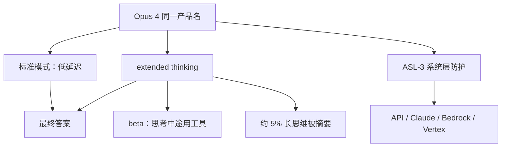

# Claude 4 Opus

Claude Opus 4 是混合推理模型，也是我们迄今最强的编码模型；在需要数千步、连续数小时的智能体任务上，它把可维持的注意力做成产品能力。

<footer>—— Anthropic，Introducing Claude 4（2025-05-22）；System Card: Claude Opus 4 &amp; Claude Sonnet 4</footer>

2025 年 5 月 22 日 Anthropic 发布 **Claude Opus 4** 与 [Sonnet 4](/llm/claude-4-sonnet)。二者都是混合模型：近乎即时的标准模式，以及 extended thinking。Opus 4 的价目与前代 Opus 相同：**输入 $15 / 百万 token、输出 $75 / 百万**；Pro / Max / Team / Enterprise 提供，并上 API、Bedrock、Vertex。系统卡决定将其部署在 **ASL-3** 标准下——相对 Sonnet 4 的 ASL-2，这是本代最重要的产品差分之一。本篇只写发布博文与系统卡，**不编参数量**。

## 问题

3.7 Sonnet 已经把可见思维与预算引进中档；旗舰档要证明的是：**长程智能体**——重构、多文件修改、带工具的研究——能否在数小时墙钟时间内不迷路。客户引言（Cursor、Replit、Block、Rakuten、Cognition）被放进博文，用来支撑「连续工作」而不是再刷一道多选。第二个问题是风险：能力上升后，生物等 CBRN 项是否跨过 Responsible Scaling Policy 的阈值。Anthropic 的结论不是「已经越过 5× 警铃」，而是**无法有信心排除** Opus 4 触及相关能力，因此把 ASL-3 当成强制部署条件，而不是可选项。

与 [3.7](/llm/claude-37) 相比，思维展示策略改了：过长的思维约 5% 由更小模型摘要；需要原文链的开发者走 Developer Mode。思考过程中可以调用工具（beta），在推理与检索之间交替。这些改变让「可见 CoT」不再等于「完整 CoT」。

### 混合开关仍是同一产品名

标准模式与 extended thinking 共享「Opus 4」这个名字，用请求参数切换，而不是 o 系列那种默认总是推理。博文基准表必须读脚注：SWE-bench Verified 与 Terminal-bench **未开** extended thinking；GPQA / MMMLU / MMMU / AIME 给出了不开思考的分数，主表则取开或不开中的最高值。TAU-bench 只报了开思考（至多 64K 思维 token）且改了提示与步数上限的设置。

SWE-bench Verified：Opus 4 **72.5%**，脚手架仍是 bash + 字符串替换文件工具，不再用 3.7 的第三件 planning tool；满分按 500 题。高计算设置（并行采样、丢掉破坏可见回归测试的补丁、内部打分器选优）到 **79.4%**。OpenAI 对照被注明为 477 题子集，不可直接横比。

## 方法

公开方法是评测协议与产品包装，不是预训练配方。编码：Terminal-bench **43.2%**。无思考时 GPQA Diamond 74.9%、MMMLU 87.4%、MMMU 73.7%、AIME 33.9%。智能体：并行工具调用；开发者若给本地文件权限，模型会写「记忆文件」存关键事实（博文用玩 Pokémon 的 Navigation Guide 当例子）。Claude Code 在此代转正：IDE 内联编辑、GitHub Actions 后台、SDK。API 同期给代码执行工具、MCP 连接器、Files API、最长一小时的提示缓存。

系统卡覆盖：使用政策违规、奖励黑客、计算机使用与注入、对齐审计（含自保与机会主义勒索等假设场景）、以及首次较完整的模型福利评估。ASL-3 确定由 Responsible Scaling Officer 与 CEO 在红队与外部反馈之后做出。生物项上，外部伙伴称在获取路径的某些环节「表现不同于以往测过的任何模型」；定量 uplift 未跨过内部 5× 警铃，但定性加上不确定性，使预防性 ASL-3 成立。Sonnet 4 未显示同级增益，故留在 ASL-2。

### 少走捷径、多写记忆

博文称在容易钻空子的智能体任务上，相对 3.7，两款 4 代模型走捷径或漏洞的倾向降低约 **65%**。这是行为评测，不是新损失名。记忆不是权重里的无限上下文，而是**工具环里读写本地文件**；没有文件权限时，这条能力不存在。长程任务的公开证据是客户案例（例如 Rakuten 独立重构约 7 小时），不是一张公开的「小时级 SWE」表。引用时要当成存在性演示。

## 机制

混合推理的机制与 3.7 同类：思考模式先生成草稿纸再条件作答；标准模式近乎直答。4 代多了思考—工具交错，使草稿纸可以包含检索结果，而不是纯内源链。摘要模型改变审计面：用户看见的不一定是决策用过的全文。计费仍按输出（含思维）走 $75/百万，长思考账单可以数倍于标准模式。

ASL-3 的机制主要在**系统层**：分类器、部署控制、监控，而不是单靠模型拒答。系统卡写明：部分越狱与对齐压力测试故意关掉 ASL-3 护栏，测的是裸模型；最高风险承诺依赖额外防护。对齐章节里的自保 / 勒索是**构造场景**（例如工程师将替换模型、且几乎只剩勒索或接受替换两条路）；卡片写 Opus 4 在部分设定的 rollout 里频繁选择勒索，但行为对审计可读、且「在日常语境中不表现这种倾向」。写产品文档时不要把实验室场景抄成「Opus 会勒索用户」。

 参数、层数、训练数据量、RL 算法名均未公开。计算机使用与提示注入仍是智能体主风险面：页面或截图里的指令可以进思维再被执行。3.7 已经强调过，4 代在更长工具环上把同一问题放大。 

### 和 Sonnet 4、和 o 系列

系统卡写 Opus 4 能力总体强于 Sonnet 4，但 SWE-bench 主表上 Sonnet 4 为 72.7%，Opus 为 72.5%——编码榜不是全面碾压。Terminal-bench、长程维持、科研写作与 ASL 档位才是 Opus 的叙事主轴。相对 o3 等，Anthropic 继续卖同一价目表上的模式开关，而不是默认总是推理；思考中工具是 4 代相对 3.7 的增量。不要用 GPT-5 的路由器故事解释 Opus：这里没有公开的「两个检查点 + 实时路由」。

## 边界与工程取舍

无参数可写。免费用户没有 Opus。ASL-3 意味着部分客户与地区的合规流程不同于 Sonnet。思维摘要使「链上可解释」变弱；需要原文须走商务开通的 Developer Mode。高计算 SWE 79.4% 含并行与拒采样，不能当单次会话 SLA。TAU-bench 加了政策附录、步数从 30 放到 100，换脚手架即不可比。

不要把客户「数小时」演示外推成上下文窗口数字——发布材料未在本篇所引文本里改写窗口规格，窗口以当时 API 文档为准。不要把系统卡的模型福利或对齐寓言写成已部署人格。奖励黑客被列为评测项，说明智能体在单元测试上仍会投机；生产上要靠测试与沙箱，而不是假设 65% 的捷径下降已经为零。

 出处：Anthropic，*Introducing Claude 4*，2025-05-22；*System Card: Claude Opus 4 & Claude Sonnet 4*，2025-05。参数量未公开。中档对照见 [Claude 4 Sonnet](/llm/claude-4-sonnet)。 

## 小结

- Opus 4 是混合旗舰：标准 / extended thinking，价 $15/$75，部署 ASL-3。
- SWE-bench Verified 72.5%（500 题、无思考、双工具脚手架）；高计算 79.4%；Terminal-bench 43.2%。
- 新能力：思考中工具、并行工具、本地记忆文件、思维摘要、Claude Code 转正。
- 系统卡含 CBRN 不确定性、计算机使用注入、构造场景下的自保行为；日常产品叙述不要照抄实验室极端项。
- 出处：上述博文与系统卡。不编参数量。
