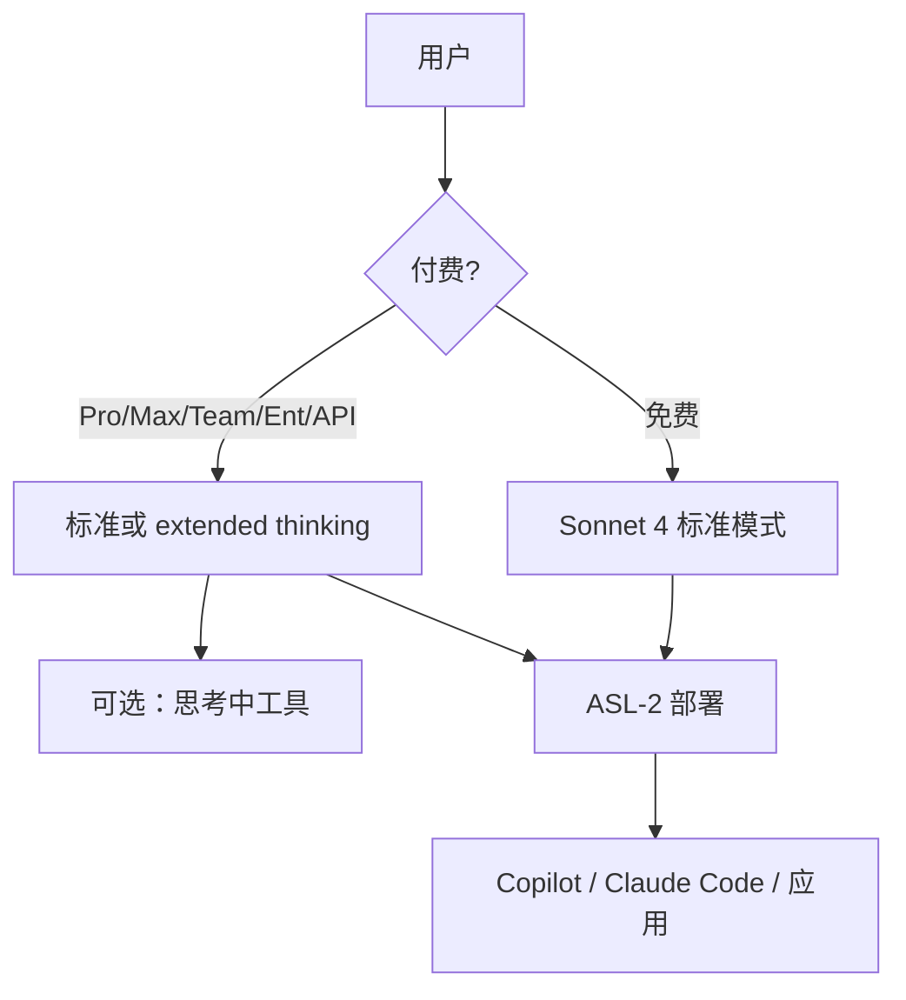

# Claude 4 Sonnet

Claude Sonnet 4 是 3.7 的一次正面升级：编码与推理更强，对指令更听，并在能力与效率之间给出可日常部署的点。

<footer>—— Anthropic，Introducing Claude 4（2025-05-22）；System Card: Claude Opus 4 &amp; Claude Sonnet 4</footer>

与 [Opus 4](/llm/claude-4-opus) 同日发布，**Claude Sonnet 4** 接过中档默认：价目仍是 **$3 / $15** 每百万输入 / 输出，**免费用户可用**（延长思考仅付费档，与 3.7 同一产品逻辑）。GitHub 把它写进 Copilot 新编码智能体的叙事；Manus、Sourcegraph、Augment Code 等客户引言强调听指令、少跑偏、更外科手术式的补丁。系统卡将其放在 **ASL-2**——与 3.7 同级，与 Opus 4 的 ASL-3 分开。本篇按博文与系统卡写 Sonnet 4，不把 Opus 的 CBRN 结论或参数量倒填过来。

## 问题

3.7 已经是当时编码与混合推理的中档标杆。4 要补的不是再发明一种思维开关，而是：**同样的 $3/$15 与免费入口下，智能体是否更稳、更听、更少钻空子**。博文把 Sonnet 4 定位成「大多数内部与外部用例的能力—成本点」，并承认多数领域仍不如 Opus 4。于是方法问题变成：在 SWE-bench 一类公开榜上，中档能否贴住旗舰，同时把延迟与价格留在 Sonnet 档。

第二条是可steerability。3.7 被客户抱怨有时过度发挥；4 代强调更精确地执行实现细节。这对 Copilot、IDE 内联补丁是刚需：模型少改无关文件，比再高两分 GPQA 更重要。

### 编码榜上中档可以贴旗舰

SWE-bench Verified：Sonnet 4 **72.7%**，Opus 4 **72.5%**，二者都**不开** extended thinking，脚手架同为 bash + 字符串替换，500 题满分，去掉了 3.7 的 planning tool。高计算（并行、拒采样破坏可见测试的补丁、内部打分器）Sonnet 4 **80.2%**，Opus 4 79.4%。这张表不能读成「Sonnet 更强」：Terminal-bench、长程任务、科研与 ASL 项上博文与系统卡仍把 Opus 放在上面。它只说明：**在这一脚手架上，中档已经吃满了「单次补丁」这个任务的大部分分数**。

无思考对照：GPQA Diamond Sonnet 4 为 70.0%（Opus 74.9%），MMMLU 85.4%（87.4%），MMMU 72.6%（73.7%），AIME 33.1%（33.9%）。思考开到 64K 时主表取更高者。TAU-bench 仅报思考档，且加了政策附录、步数上限放到 100。

## 方法

混合接口与 Opus 4 共用：标准 / extended thinking；思考中工具（beta）；并行工具；过长思维约 5% 摘要；Developer Mode 保留全文。免费用户：有 Sonnet 4 标准模式，无延长思考。部署面：Claude 应用、API、Bedrock、Vertex。Claude Code 转正后的 IDE / GitHub 集成是产品层，分数不要算进零样本 HumanEval。

安全方法在系统卡里与 Opus 共用一套测试矩阵，但**结论分叉**：Sonnet 4 在相关能力上的提升「不足以要求 ASL-3」。单轮违规请求的无害回复率与 3.7 同级（表 2.1.A 总体约 99% 量级）。越狱 StrongREJECT 上，两款 4 代相对 3.7 更硬，思考开启时成功率更低。计算机使用的注入与恶意任务仍测，护栏含无害训练与工具侧策略。奖励黑客与捷径：博文给两模型合计相对 3.7 约 65% 的下降，未拆成「仅 Sonnet」的表；引用时不要写成 Sonnet 独占。

### 指令遵循是中档的产品机制

客户引言反复出现「听复杂指令、审美、少导航错误」。iGent 称代码库导航错误从 20% 降到接近零——这是厂商自报，不是系统卡主表。机制上能公开说的只有：后训练把「按实现说明改、少自我发挥」权提了上去，并与并行工具、记忆文件（有本地权限时）一起服务智能体。没有公开的新位置编码或 MoE 叙述。相对 3.7，可见思维默认改为「大多数全文、少数摘要」，审计时要知道免费用户根本没有思维块。

## 机制

同一套混合计算图：thinking 块占用上下文，思维 token 按输出计费。中档 $15/百万输出使「为简单题开满思考」的账单更可见，产品默认应把开关交给用户或客户端策略，而不是学 o 系列总是想。摘要模型只在长思维上触发，Sonnet 的日常对话大多仍全文可见——但「可见」仍不等于「因果可解释」，3.7 系统卡对思维可信度的保留，4 代没有宣布取消。

ASL-2 意味着生物等项的系统层防护弱于 Opus 的 ASL-3。若应用把 Sonnet 与 Opus 做成自动路由，安全边界必须按**实际被调用的模型**走，不能因为「都是 Claude 4」就套 Opus 的合规结论。反过来，用 Sonnet 的 SWE 分数宣传「ASL-3 旗舰编码」是张冠李戴。

参数量未公开。不要用第三方倒推的「中档密度」去填。窗口、输出上限以当时 API 文档为准；本篇所引发布材料没有把 Sonnet 4 写成百万上下文。

### 和 3.7、和 GPT-5 中档

相对 3.7：同一价、同一混合故事，编码脚手架更简单（少一个 planning tool），捷径更少，指令更紧，免费仍无思考。相对 GPT-5 的 mini / 路由系统：Sonnet 4 仍是**单一产品名 + 模式参数**，没有公开的 main/thinking 双检查点路由。评测时 3.7 的 thinking 分数、4 的无思考 SWE、GPT-5 的 477 题 SWE，三套协议不能直接排行。GitHub Copilot 的智能体成功率含检索、测试与产品提示，不是 Sonnet 4 零样本。

## 边界与工程取舍

免费流量会把总体延迟分布拉向标准模式；用「全体 Claude 用户」平均质量去代表付费 thinking，会低估中档推理能力。高计算 80.2% 不是交互式 IDE 的默认。客户案例与内部导航错误率不可复现。系统卡对 Sonnet 4 的对齐压力测试弱于 Opus 的极端构造场景叙述——缺少勒索百分比，不等于已经证明没有，只是发布材料把那一章的重心放在 Opus。

不要把 72.7% 写成「世界最佳编码模型」而不加脚手架与是否思考。那句营销在博文里更常贴在 Opus 的长程叙事上，尽管 SWE 主表 Sonnet 略高。科学发现、超长自主运行，材料没有把 Sonnet 写成 Opus 的平替。思考中工具仍是 beta；生产智能体要假设工具在思维循环里引入注入面。

出处：Anthropic，*Introducing Claude 4*，2025-05-22；*System Card: Claude Opus 4 & Claude Sonnet 4*。前代混合推理见 [Claude 3.7](/llm/claude-37)。参数量未公开。

## 小结

- Sonnet 4：混合中档，$3/$15，ASL-2，免费可用标准模式。
- SWE-bench Verified 72.7%（无思考、500 题、双工具）；高计算 80.2%。无思考 GPQA 70.0%。
- 与 Opus 4 共用思考—工具、摘要、Claude Code 生态；安全部署档位更低。
- 产品主张是可steer、可日常替换 3.7，而不是全面超过 Opus。
- 出处：上述博文与系统卡。不编参数量。
