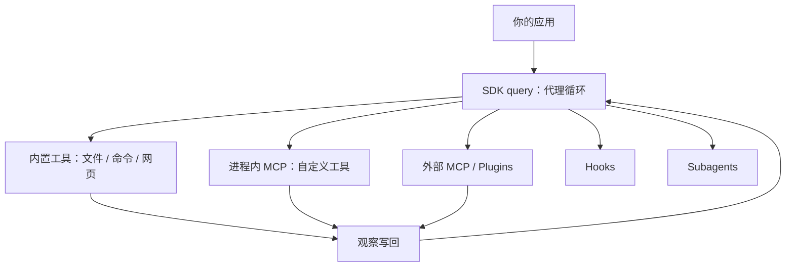

# Claude Agent SDK

    
把 Claude Code 的工具、循环与上下文管理做成库：你在自己的进程里跑代理，而不必再手写「模型—工具—观察」那一层。

    <footer>—— Anthropic，Claude Agent SDK Overview（code.claude.com/docs/en/agent-sdk）</footer>

Messages API 给你一次补全；Claude Code CLI 给你一个人机终端。两者中间缺的是：**在应用里嵌入同一条编程代理循环**，并自己控制权限、会话与品牌。**Claude Agent SDK**（Python / TypeScript）就是这条循环的库形态。Managed Agents 则是托管 REST，沙箱与会话由 Anthropic 跑。本篇按官方文档写选型、能力面与自定义工具合同。不写把 SDK 接到未授权系统或绕过权限的步骤；第三方产品也不得冒充 Claude Code 或转售 claude.ai 登录额度。

## 问题

手写工具循环意味着：解析工具调用、执行、把结果写回、处理截断与重试、自己做压缩与记忆。Claude Code 已经把读改文件、壳命令、网页搜索、MCP、Hooks、子代理与技能加载做成稳定行为。若每个内部工具都从零复制，行为会与员工日常用的 CLI 分叉。SDK 的主张是同一套 harness，可编程。

选型表把四条路写死。要代理、但不想实现工具循环：Agent SDK。要日常交互或一次性终端任务：Claude Code CLI。要自己实现每一跳、直接打 Anthropic API：Client SDK。要长跑/异步、不想自己管沙箱与会话基础设施：Managed Agents。SDK 只提供 Py/TS；其他语言用 CLI 子进程 `-p --output-format json` 驱动同一循环。把 CLI 的 TUI 当 API 来刮，不属于合同。

### 认证与品牌是产品约束，不只是礼貌

除非事先批准，Anthropic 不允许第三方在自己的产品里提供 claude.ai 登录或把该档位额度转给最终用户，包括用 Agent SDK 做的代理。Quickstart 要求 API Key 一类认证。品牌：允许「Claude Agent」、在已标明 Agents 的菜单里写「Claude」、或「{你的代理名} Powered by Claude」；不允许「Claude Code」「Claude Code Agent」，也不允许模仿 Claude Code 的 ASCII 艺术。你的产品应保持自有品牌。许可证走商业服务条款，向你的客户提供服务时同样适用。

包名从「Claude Code SDK」迁到 Agent SDK，见官方 Migration guide。TypeScript 包可作为可选依赖捆绑对应平台的原生 Claude Code 二进制；Python 包要求 3.10+。Bedrock / Vertex 用环境变量切换，代码侧循环不变，模型 id 格式不同。

## 方法

Quickstart：安装、设密钥、写一个在现有代码里找 bug 并修的代理。`query()`（名称以当前 SDK 参考为准）跑循环。内置工具：读、写、编辑文件，跑命令，搜网页。Hooks 挂在生命周期点。Subagents 做专注子任务。MCP 接外部工具。Permissions 控制哪些工具自动跑、哪些要批。Sessions 可恢复或 fork。Skills、斜杠命令与记忆从项目 `.claude/` 与 `~/.claude/` 加载，行为对齐 CLI。Plugins 用本地路径打包技能、代理、hooks 与 MCP。

自定义工具不走「再发明一套 function calling」，而走**进程内 MCP 服务器**：用 `@tool` / `tool()` 声明名字、描述、schema 与 handler，再 `create_sdk_mcp_server` / `createSdkMcpServer` 包起来，经 `mcpServers` 传给 `query`。字典键成为全名里的 `{server_name}`，工具全名为 `mcp__{server}__{tool}`；列入 `allowedTools` 以免每次弹审批。服务器在应用进程内，不是另起一个 MCP 子进程。可返回图、资源与结构化数据；也可用 annotations 标记并行安全性。

### 配置加载与 CLI 对齐，直到你关掉它

默认 `setting_sources` 会像 CLI 一样加载 user / project / local 设置；`CLAUDE.md` 与项目规则在包含 `"project"` 时生效。设成空列表等于关掉全部，这是「为什么我的说明书没被读」的常见原因。权限模式可在运行中改，例如先 `plan` 再 `acceptEdits`。Python 的 `interrupt()` 或 TypeScript 的 `AbortController` 可停下一次运行。这些是把 CLI 里的人机控制搬进库 API，而不是新的模型能力。

示例仓库提供本地开发用的 demo agents。Agent harness design 文档描述 Claude Code 团队如何用动态工作流编排许多子代理——读它是为了抄编排模式，不是为了改模型权重。

## 机制

SDK 把「决定下一步」留在模型，把「执行与政策」留在宿主。内置工具与 CLI 同义，减少「员工用 Code 能做、产品里的代理不能做」的裂谷。进程内 MCP 让自定义逻辑与模型工具表共享同一协议，却不必付进程隔离与 stdio 帧的成本；代价是崩溃域与应用在一起，handler 必须自己做超时与权限。`allowedTools` 是默认批准列表，不是沙箱：未列出的工具仍可能出现在模型上下文里，除非你用 `tools` 数组收窄内置集合。

会话把多轮工具轨迹变成可恢复对象，fork 用于分支探索。Skills 的渐进披露在 SDK 里仍然发生在文件系统上：没有把技能目录挂到工作区，代理就读不到。机制上，Agent SDK = Claude Code harness − TUI + 你的进程与品牌。Client SDK 则是 harness 也不给，只给 token。

Managed Agents 是另一产品：托管 REST，Anthropic 跑代理与沙箱。适合不想运维隔离环境的长任务。不要把 Managed Agents 的 SLA 写进自托管 SDK 的运行手册。

### 权限必须在宿主实现，模型不会替你收口

官方 Permissions 文档要求你决定自动、审批还是拒绝。生产里这通常接到你们自己的 ACL、密钥保险库与网络出口。SDK 提供钩子与模式切换，不提供「已经对任意企业数据安全」的证明。自定义工具的 handler 里不要默认信任模型填的路径或 URL；校验应写在工具实现里。本篇不讨论如何削弱这些校验。

## 边界与工程取舍

只有 Py/TS 一等支持；其他语言用 CLI 子进程会损失部分库 API（hooks 的进程内回调、类型化流）。捆绑原生二进制使 TS 安装变重，也让「SDK 版本」与「harness 行为」耦合——升级要读两边 changelog。设置源一旦配错，会出现「和 CLI 表现不一致」的假 bug。第三方若把产品画成 Claude Code，违反品牌指南。

相对直接 Messages API：你失去逐 token 的完全控制，换来文件工具与压缩策略。相对只跑 CLI：你得到嵌入、自定义工具与权限回调，但要自己做多租户隔离。评测「SDK 代理」必须冻结 SDK 版本、允许工具集、是否加载项目 skills、权限模式。不要用员工笔记本上的 `~/.claude` 当生产配置。

出处：Anthropic，Agent SDK overview、Quickstart、Migration、Agent loop、Custom tools、Permissions、Python/TS 参考，https://code.claude.com/docs/en/agent-sdk/ 。条款见 Commercial Terms of Service。Issue 分别打到 TypeScript / Python SDK 的 GitHub。

## 小结

- Agent SDK 把 Claude Code 的循环做成 Py/TS 库；CLI、Client SDK、Managed Agents 是不同合同。
- 自定义工具走进程内 MCP，全名 `mcp__server__tool`，用 allowedTools 预批准。
- 默认加载与 CLI 相同的 `.claude` 设置与 skills；空 `setting_sources` 会关掉说明书。
- 认证用 API Key；不得擅自提供 claude.ai 登录。品牌上禁止冒充 Claude Code。
- 权限与隔离由宿主实现；SDK 不是安全边界本身。
- 出处：code.claude.com Agent SDK 文档。
