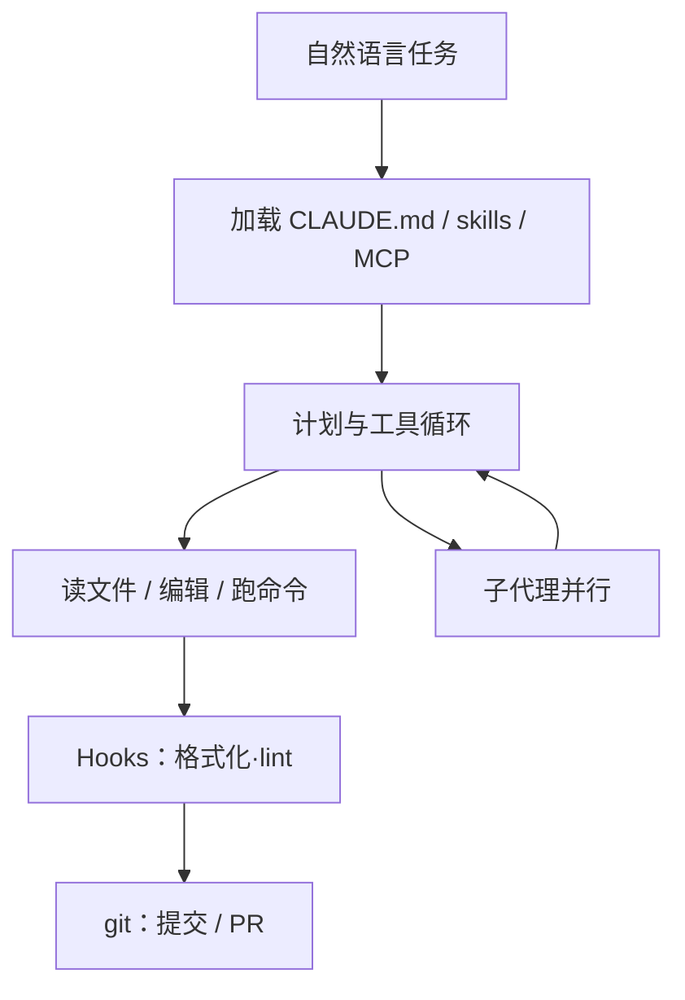

# Claude Code

    
在仓库里读文件、改文件、跑命令，并把 git、MCP 与项目说明书接进同一条智能体循环——终端只是这条循环最先露出的表面。

    <footer>—— Anthropic，Claude Code 官方文档 Overview 与 CLI reference（code.claude.com）</footer>

Claude Code 是 Anthropic 的编程智能体产品：不是聊天框里贴一段补丁，而是带工具循环的代理，能在你的项目上计划、编辑、执行与提交。官方把它铺到终端 CLI、IDE 扩展、桌面应用与浏览器；底层是同一套引擎，所以 `CLAUDE.md`、设置与 MCP 服务器可以跨表面复用。本篇按官方文档写 CLI 合同与工作流组件，默认场景是开发者在自己的仓库里改功能与测试。不写越权扫描、攻击载荷或绕过权限的步骤。

## 问题

IDE 补全一次只动光标附近。Chat 窗口没有「仓库是工作区」的状态：模型看不见测试是否红、git 是否脏、上一步编辑是否可编译。把整个循环交给无审批的脚本，失败时又难以把责任钉到某一次工具调用。Claude Code 针对的是**有工具、有项目记忆、可脚本化**的代理：读代码库、跨文件编辑、跑命令、处理 git，并用自然语言当入口。

第二个问题是同一代理要出现在多种界面。若 CLI 与 VS Code 各搞一套提示与权限，团队无法把规范写进仓库。官方选择：多表面、单引擎。终端是完整 CLI；VS Code / Cursor / JetBrains 提供内联 diff 与对话；桌面端并排多会话与定时任务；Web 与手机负责不在本机仓库上的长任务。会话可以用 `--teleport`、`/desktop`、Remote Control 在表面之间搬，而不是复制粘贴上下文。

### Unix 组合子，而不是只能交互

官方强调可组合：把日志管道进 `claude -p`，在 CI 里翻译字符串并开 PR，或把 `git diff` 的文件列表交给它做审查。`-p` 走 SDK 查询然后退出；`-c` 继续当前目录最近一次对话；`-r` 按会话 ID 或名字恢复。这把代理从「一个 TUI」变成可以嵌进 make / GitHub Actions 的过滤器。交互模式仍是日常主路径，无头模式是同一循环的批处理接口。

安装以官方文档为准：macOS/Linux 推荐 `curl` 安装脚本，也可用 Homebrew cask；Windows 用 PowerShell 脚本或 WinGet。npm 全局包已弃用。Homebrew / WinGet 不自动升级，需手动 `upgrade`。原生安装会在后台更新。

## 方法

在项目目录运行 `claude`，首次登录 Claude 订阅或 Anthropic Console；若已设 `ANTHROPIC_API_KEY`，则跳过登录、改为确认密钥。终端、VS Code 与 JetBrains 还支持第三方模型提供方。典型任务：为模块补测试并修到绿、按症状追 bug、写提交说明与开 PR。CI 里可用 GitHub Actions 或 GitLab CI 做自动审查与 issue 分流。

项目说明书是 `CLAUDE.md`：放在仓库根，每次会话开始时读取，用来写编码规范、架构决策、首选库与审查清单。Claude 还会在工作中积累自动记忆。可复用流程打成 **Skills**（例如 `/review-pr`）；**Hooks** 在编辑前后跑 shell——官方例子是编辑后格式化、提交前 lint。MCP 把 Drive、Jira、Slack 或自建工具接进来。需要并行时，主代理可派生子代理，或用后台代理并排跑多个完整会话。完全自定义的编排走 Agent SDK，而不是在 CLI 里重写循环。

### CLI 作为自动化接口

CLI reference 把「开会话、管道、恢复、更新」收成命令表。`claude "query"` 带初始提示进入交互；`cat file | claude -p "query"` 处理管道内容；`claude -c -p` 在无头续写。`--output-format json` 方便脚本解析。`claude mcp` 管理 MCP 服务器。企业侧另有 `claude gateway`，在 Bedrock 或 Google Cloud Agent Platform 前加 SSO 与策略（需配置文件，版本门槛以文档为准）。`claude --help` 列不全所有开关：缺席不等于不存在，完整列表看 CLI reference。

官方工作流还包括例行任务：云端 Routines（机器关机仍跑，可被 API 或 GitHub 事件触发）、桌面定时任务（碰得到本机文件）、会话内 `/loop` 轮询。这些是产品能力，不是把代理暴露成对任意主机的巡检器；权限与网络范围仍由设置与用户批准约束。

## 机制

循环与 [ReAct](/llm/react-prompting) 同类：模型在「读—改—跑—观察」里更新信念，直到判定完成或要人。`CLAUDE.md` 把团队规范从对话里搬到文件系统，使每次会话的先验相同。Skills 按需加载程序知识，避免把全部手册塞进系统提示。Hooks 把确定性步骤（格式化、lint）固定在工具生命周期上，减少「模型忘记跑 formatter」的方差。MCP 把外部系统变成工具表上的名字，而不是让模型去猜 HTTP。

git 是状态外置：提交与 PR 让代理的工作可审查、可回退，失败不必依赖会话记忆。管道与 `-p` 把同一循环接到非 TTY，使 CI 与本地共用提示词。多表面共享引擎，则是把「规范写在仓库里」变成可执行的：手机上续做的任务仍受同一套 `CLAUDE.md` 约束。

JetBrains 插件依赖单独安装的 CLI。Web 与桌面的云会话碰不到你的 `~/.claude` 本机技能目录，只加载账户里启用的技能与仓库内 `.claude/skills/`。写部署时要声明技能从哪一层文件系统来。

### 权限模型是产品，不是事后补丁

工具能跑任意命令，默认就有真实破坏半径。官方把确认、计划模式、允许列表与 MCP 作用域当作一等配置，而不是「先 YOLO 再后悔」。本篇只指出合同：敏感操作应保持人在环；企业用 gateway 与策略文件收口提供方。不要把文档里的自动化例子理解成关闭审批的许可。第三方登录与额度不得被未批准的产品拿去转售——这条在 Agent SDK 文档里写得更硬，CLI 集成同样适用。

## 边界与工程取舍

Claude Code 是产品，版本与开关会变；复现质量必须写文档日期与 `claude` 版本。npm 安装路径已弃用，教程若还写 `npm i -g @anthropic-ai/claude-code`，以官网为准。Homebrew 的 `claude-code` 跟踪稳定通道（大约落后一周、跳过严重回退），`claude-code@latest` 跟踪最新通道，两者升级策略不同。

相对 [Aider](/llm/aider)：Aider 更窄、git 提交节奏更硬、编辑格式是一等公民；Claude Code 工具面更宽（MCP、子代理、多表面）。相对 Codex CLI / Gemini CLI：三者都是终端代理，但脚手架、权限默认、项目说明书文件名与开源许可都不同，基准数字不可互换。Agent SDK 把同一循环嵌进你的进程；只想交互时用 CLI，不要为了「可编程」强行解析 TUI。

出处：Anthropic，Claude Code Overview、CLI reference、Skills / Hooks / MCP 文档，https://code.claude.com/docs 。安装与故障排除以 Setup 页为准。本篇不引用第三方「命令大全」作为规范。

## 小结

- Claude Code 是带工具循环的编程代理，终端、IDE、桌面与 Web 共用引擎。
- 项目合同写在 `CLAUDE.md`；Skills、Hooks、MCP 分别提供流程、确定性钩子与外部工具。
- CLI 的 `-p` / 管道 / JSON 输出把它变成 Unix 组合子；`-c` / `-r` 恢复会话。
- 多表面搬迁靠官方传送与 Remote Control，不是复制聊天记录。
- 默认在自有仓库、人在环；权限与企业网关是合同的一部分。
- 出处：code.claude.com 官方文档。
